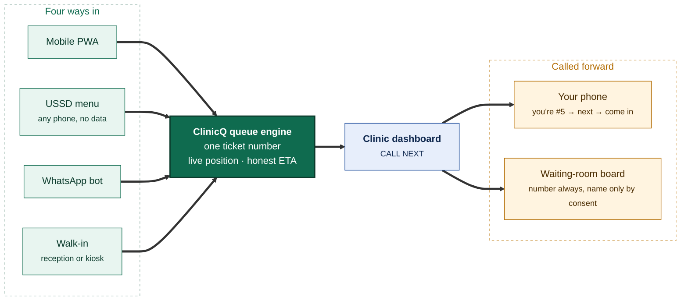

<h1 align="center">ClinicQ</h1>

<p align="center">
  <strong>Find a clinic. Hold your place. Watch your number come up.</strong><br>
  Clinic discovery and digital queue management for public and private clinics: from a phone, a USSD
  menu, WhatsApp, or the web.
</p>

<p align="center">
  <a href="docs/PLAN/IMPLEMENTATION_PLAN.md">Implementation plan</a> ·
  <a href="docs/GITHUB/README.md">Milestones &amp; issues</a> ·
  <a href="docs/TEAM/WORKLOAD_SPLIT.md">Workload split</a> ·
  <a href="docs/PRODUCT/README.md">Product docs</a> ·
  <a href="https://raw.githack.com/Billykat7/rgit-capstone2026/main/docs/DEMO/index.html">Visual demo</a>
</p>

---

**Richfield Graduate Institute of Technology** · BSc IT (Distance Learning) · **Capstone Project 2026**

## The problem

You take a morning off work, travel to your nearest clinic, and join a queue with no idea whether the
wait is twenty minutes or five hours. Nobody can tell you. There is no number, no board, no message:
just a bench and a paper list. Digital queue management has existed abroad for over a decade; most
South African clinics, especially public ones, still run paper-and-shout queues.

## What ClinicQ does

Find a nearby clinic, public or private, by geolocation, join its digital queue **before you leave
home**, and watch your ticket number count down on the clinic's own waiting-room display, while staff
run the whole line from one dashboard.



<p align="center"><em>Same queue, same ticket number, no matter which door you came in.</em></p>


## Features

### For patients

| | Feature |
|---|---|
| 📍 | **Find clinics near you:** PostGIS distance search, filtered by public, private or both, with live queue length and an honest wait range |
| 🎟️ | **Join from anywhere:** a ticket number and live position before you leave home |
| 📱 | **Four ways in:** mobile PWA, **USSD on any phone with no data**, WhatsApp bot, or plain web |
| 🔔 | **Get told when it's your turn:** push, SMS or WhatsApp saying "you're #5", "you're next", "come in now" |
| 🗓️ | **Book an appointment:** scheduled slots that turn into a queue ticket automatically |
| 🧾 | **Check in at the door:** scan a QR at the kiosk instead of queueing to talk to reception |
| 👨‍👩‍👧 | **Book for someone else:** a parent for a child, a daughter for her mother |
| 💊 | **Chronic medication reminders:** a nudge and a one-tap join for your collection |
| 🚗 | **Virtual waiting room:** wait nearby; we call you forward accounting for your travel time |
| 🌍 | **Five languages:** English, isiZulu, isiXhosa, Afrikaans and Sesotho, across menus, messages and announcements |

### For clinic staff

| | Feature |
|---|---|
| 🖥️ | **One dashboard:** every active queue side by side, live, with one enormous *Call Next* |
| 🚶 | **Walk-in intake in under 10 seconds:** same sequence as remote joins, one fair queue |
| 🏥 | **Multi-room queues:** triage → doctor → pharmacy, with transfers that don't send patients to the back |
| ⚖️ | **Clinical priority overrides:** two taps, a reason code, and a full audit trail |
| 📺 | **Waiting-room display board:** number, time, and privacy-gated name or comment, with an audio call-out |
| 🔒 | **Privacy by default:** every new clinic starts number-only; names and reasons are opt-in and audited |
| ⚙️ | **Run your own clinic:** hours, holidays, queues, services, staff, display mode, all self-service |
| 📊 | **Reports that sell themselves:** wait times, no-show rate, channel mix, busiest-hour heatmap |

### For the platform

RBAC across five roles · hard multi-tenant isolation · append-only, tamper-evident audit log · POPIA
consent capture and withdrawal · automatic data retention and purge · data-subject access and erasure ·
anonymised district-level dashboards for health-department planning.

## Tech stack

| Layer | Choice |
|-------|--------|
| Language | **Python 3.14** |
| API + web | **FastAPI** (ASGI) with **Jinja2** templates |
| Interactivity | **htmx** + small modules in `src/static/js/` + **SSE**, no separate JS build |
| Styling | Hand-written **CSS design tokens**: one set for the patient, dashboard and board layouts, light and dark, fonts self-hosted (decision 2) |
| Database | **PostgreSQL 18** with **PostGIS** |
| ORM / migrations | **SQLAlchemy 2.x** (sync sessions by default, async for streams; decision 5) + **Alembic** |
| Cache / jobs | **Redis** + `arq` |
| Channels | USSD gateway (Africa's Talking-class) · WhatsApp Business Cloud API · SMS · Web Push |
| Packaging / infra | **pip** + `requirements.txt` · **Docker Compose** · **GitHub Actions** |

One Python codebase renders the patient pages, the clinic dashboard and the display board. For a
six-person team that is the difference between one thing to debug and three, and the `/api/*` surface
is there from day one, which is exactly what the USSD and WhatsApp adapters consume.

## Project documentation

| Document | What's in it |
|----------|--------------|
| **[Implementation plan](docs/PLAN/IMPLEMENTATION_PLAN.md)** | The whole project on one page: architecture, sequence, features added beyond the brief, how we'll know it works |
| **[Milestones & issues](docs/GITHUB/README.md)** | 14 milestones, 109 tracked issues, conventions, release tags, pipeline strategy |
| **[Workload split](docs/TEAM/WORKLOAD_SPLIT.md)** | Six roles, sprint-by-sprint lanes, **who blocks whom and what to do about it**, risk register |
| **[Engineering non-negotiables](docs/guideline.md)** | Five rules enforced by guard tests |
| **[Product docs](docs/PRODUCT/README.md)** | 14 numbered docs: discovery, queue, display, dashboard, channels, devices, topology, pricing, business plan, marketing, upscaling, tech, benchmark |
| **[Visual demo](docs/DEMO/index.html)** | A one-page walkthrough of the finished product, for the team and the showcase |

## Delivery at a glance

| | Milestone | Issues | Sprints | Tag | Progress |
|---|-----------|--------|---------|-----|----------|
| 1 | [Foundation & Local CI](docs/GITHUB/MILESTONES/M1_foundation_local_ci.md) | 1–8 | 1–2 | `v0.1.0` | 🟩🟩🟩🟩🟩🟩🟩🟩🟩🟩 **100%** (8/8 issues) |
| 2 | [CI/CD & Team Workflow](docs/GITHUB/MILESTONES/M2_cicd_environments.md) | 9–14 | 2 | `v0.2.0` | 🟩🟩🟩🟩🟩🟩🟩🟩🟩🟩 **100%** (6/6 issues) |
| 3 | [Identity, Auth, RBAC & Consent](docs/GITHUB/MILESTONES/M3_identity_auth_rbac.md) | 15–22 | 3–4 | `v0.3.0` | 🟩🟩🟩🟩🟩🟩🟩🟩🟩🟩 **100%** (8/8 issues) |
| 4 | [Clinics, Queues & Configuration](docs/GITHUB/MILESTONES/M4_clinics_queues_config.md) | 23–30 | 4–5 | `v0.4.0` | ⬜⬜⬜⬜⬜⬜⬜⬜⬜⬜ **0%** (0/8 issues) |
| 5 | [Discovery & Geolocation](docs/GITHUB/MILESTONES/M5_discovery_geolocation.md) | 31–38 | 5–6 | `v0.5.0` | ⬜⬜⬜⬜⬜⬜⬜⬜⬜⬜ **0%** (0/8 issues) |
| 6 | [**Queue Engine Core**](docs/GITHUB/MILESTONES/M6_queue_engine_core.md) ⚠️ critical path | 39–47 | 6–7 | `v0.6.0` | ⬜⬜⬜⬜⬜⬜⬜⬜⬜⬜ **0%** (0/9 issues) |
| 7 | [Clinic Dashboard](docs/GITHUB/MILESTONES/M7_clinic_dashboard.md) | 48–55 | 8–9 | `v0.7.0` | ⬜⬜⬜⬜⬜⬜⬜⬜⬜⬜ **0%** (0/8 issues) |
| 8 | [Display Monitor](docs/GITHUB/MILESTONES/M8_display_monitor.md) | 56–62 | 9 | `v0.8.0` | ⬜⬜⬜⬜⬜⬜⬜⬜⬜⬜ **0%** (0/7 issues) |
| 9 | [Notifications & Patient PWA](docs/GITHUB/MILESTONES/M9_notifications_patient_pwa.md) | 63–71 | 9–10 | `v0.9.0` | ⬜⬜⬜⬜⬜⬜⬜⬜⬜⬜ **0%** (0/9 issues) |
| 10 | [USSD & WhatsApp Channels](docs/GITHUB/MILESTONES/M10_ussd_whatsapp_channels.md) | 72–79 | 10–11 | `v0.10.0` | ⬜⬜⬜⬜⬜⬜⬜⬜⬜⬜ **0%** (0/8 issues) |
| 11 | [Appointments & Check-in](docs/GITHUB/MILESTONES/M11_appointments_checkin_patient_care.md) | 80–87 | 11–12 | `v0.11.0` | ⬜⬜⬜⬜⬜⬜⬜⬜⬜⬜ **0%** (0/8 issues) |
| 12 | [Reporting & Analytics](docs/GITHUB/MILESTONES/M12_reporting_analytics.md) | 88–94 | 12 | `v0.12.0` | ⬜⬜⬜⬜⬜⬜⬜⬜⬜⬜ **0%** (0/7 issues) |
| 13 | [Security, Privacy & POPIA](docs/GITHUB/MILESTONES/M13_security_privacy_compliance.md) | 95–101 | 12–13 | `v0.13.0` | ⬜⬜⬜⬜⬜⬜⬜⬜⬜⬜ **0%** (0/7 issues) |
| 14 | [Production, Pilot & Go-live](docs/GITHUB/MILESTONES/M14_production_pilot_golive.md) | 102–109 | 13–14 | `v0.14.0` | ⬜⬜⬜⬜⬜⬜⬜⬜⬜⬜ **0%** (0/8 issues) |
| ⭐ | **First official release:** every issue 1–109 closed | - | end of 14 | **`v1.0.0`** | 🟩🟩⬜⬜⬜⬜⬜⬜⬜⬜ **20%** (22/109 issues) |

## Team

| Code | Role | Name | GitHub | Owns |
|---|------|------|--------|------|
| A | Backend Lead | | | Domain core, **queue engine**, appointments |
| B | Backend / Integrations | | | Notifications, SMS, WhatsApp, USSD, i18n |
| C | Frontend / Patient | | | Discovery, map, ticket page, PWA, kiosk, accessibility |
| D | Frontend / Clinic | | | Dashboard, waiting-room display board |
| E | DevOps / QA Lead | | | Repo, CI/CD, security, production, pilot rollout |
| F | Data & Research Lead | | | Analytics, compliance, translations, UAT, capstone deliverables |

Each role has a **named backup** who reviews their PRs and picks up their work if they are unavailable;
see the [workload split](docs/TEAM/WORKLOAD_SPLIT.md#1-the-six-roles).

## Quickstart

From a fresh clone to a running app in about ten minutes, on Windows, macOS or Linux.

### 1. Install the prerequisites

| | What | Why | Check it |
|---|---|---|---|
| 🐍 | **Python 3.14** | the app, the tests, Alembic | `python3.14 --version` |
| 🐳 | **Docker Desktop** (or Docker Engine) with **Compose v2.24+** | PostgreSQL 18 + PostGIS and Redis, without installing either | `docker compose version` |
| 🌿 | **Git** | | `git --version` |
| 🔨 | **make** | every command below is a `make` target | `make --version` |
| 🐙 | **GitHub CLI** (`gh`) | raising pull requests, syncing labels and rulesets | `gh --version` |

<details>
<summary><strong>Windows</strong> — use WSL2, and run everything inside it</summary>

Docker Desktop, `make` and the shell scripts in `scripts/` all assume a Unix shell. WSL2 is the
supported path; Git Bash alone will not run the `make` targets.

```powershell
wsl --install -d Ubuntu          # then reboot, and open the Ubuntu terminal
```

Install **Docker Desktop for Windows** and turn on *Settings → Resources → WSL integration* for your
Ubuntu distribution. Everything from here runs **inside the Ubuntu shell**, not PowerShell:

```bash
sudo add-apt-repository ppa:deadsnakes/ppa && sudo apt update
sudo apt install -y python3.14 python3.14-venv git make gh
```

Clone into the Linux filesystem (`~/code/...`), **not** `/mnt/c/...`: builds and file watching are
several times slower across the Windows mount.

</details>

<details>
<summary><strong>macOS</strong> — Homebrew</summary>

```bash
brew install python@3.14 git make gh
brew install --cask docker        # then launch Docker Desktop once, to finish setup
```

`make` ships with the Xcode command line tools (`xcode-select --install`) if you would rather not
use Homebrew's. **Apple Silicon:** `postgis/postgis` publishes amd64 images only, so the database
container runs under emulation — it works, and the first start is slower.

</details>

<details>
<summary><strong>Linux</strong> — Debian/Ubuntu, Fedora, Arch</summary>

```bash
# Debian / Ubuntu
sudo add-apt-repository ppa:deadsnakes/ppa && sudo apt update
sudo apt install -y python3.14 python3.14-venv git make gh docker.io docker-compose-plugin

# Fedora
sudo dnf install -y python3.14 git make gh docker docker-compose-plugin

# Arch
sudo pacman -S python git make github-cli docker docker-compose
```

Then add yourself to the `docker` group so the compose targets do not need `sudo`:

```bash
sudo usermod -aG docker "$USER" && newgrp docker
```

</details>

### 2. Run it locally

Five commands, from a fresh clone:

1. Create the virtual environment and install the dependencies:

   ```bash
   python3.14 -m venv .venv && source .venv/bin/activate && pip install -r requirements.txt
   ```

2. Point the app at the local stack. `.env.example` lists every setting the app reads, each with
   its description and default; only `DATABASE_URL` and `REDIS_URL` are active, matching the compose
   defaults. What differs in staging and production, and what the app refuses to start with there,
   is in [`docs/CICD/ENVIRONMENTS.md`](docs/CICD/ENVIRONMENTS.md):

   ```bash
   cp .env.example .env
   ```

3. Start PostgreSQL 18 with PostGIS, and Redis. The command returns once both health checks pass:

   ```bash
   make db-up
   ```

4. Create the schema (the `clinicq` schema, with PostGIS enabled):

   ```bash
   make migrate-up
   ```

5. Run the app with auto-reload:

   ```bash
   make run
   ```

Then open `http://127.0.0.1:8000` for the landing page, `http://127.0.0.1:8000/docs` for the API, and
`http://127.0.0.1:8000/health/ready`, which should report the database and migrations as `ok`.
After the first time, `make dev` does steps 3 and 5 in one go.

**To sign in**, seed the roles and a development admin, then sign in as `admin@btk.com` with the
password you chose:

```bash
make seed-rbac && ./scripts/db/seed-dev-user.sh --password 'choose-a-password'
```

**For demo data**, `make seed-dev-data` adds one staff account per ClinicQ role (printed with their
development password) and reports the demo clinics, queues and ticket history in
`scripts/db/demo_dataset.py`: eleven real Gauteng and KwaZulu-Natal clinics, written to the database
as their tables land (Issues 23, 25 and 39). It is idempotent, and refuses any database that is not
a local development one.

### 3. Make a change: branch, commit, pull request

One issue, one branch, one pull request. The names are checked by CI, so they are not a matter of
taste — the **Conventions** job fails a branch, a commit or a description that does not follow this.

```bash
# 1. Start from an up-to-date main
git checkout main && git pull

# 2. Branch: Issue/<number>/<short-slug>, five words at most
git checkout -b Issue/39/tickets-model-sequence

# 3. Work, then commit. Every commit subject starts "Issue <number>: "
git commit -m "Issue 39: Add the concurrency-safe ticket sequence"

# 4. Run the same gate CI runs, before you push
make check

# 5. Write the description, then open the pull request with it
#    docs/GITHUB/PR/M6/PR_39_DESCRIPTION.md — ending in "Closes #39"
git push -u origin Issue/39/tickets-model-sequence
gh pr create --base main \
  --title "Issue 39: Tickets model and daily sequence" \
  --body-file docs/GITHUB/PR/M6/PR_39_DESCRIPTION.md \
  --milestone "Milestone 6: Queue Engine Core" --assignee @me
```

What the checks expect, and why:

| Rule | Example | Checked by |
|---|---|---|
| Branch `Issue/<N>/<slug>` (or `Release/v<X.Y.Z>`) | `Issue/39/tickets-model-sequence` | `scripts/check_pr_conventions.py` |
| Every commit subject starts `Issue <N>: ` | `Issue 39: Add the ticket sequence` | same — merge commits are skipped |
| The description ends with `Closes #<N>` | `Closes #39` | same |
| A screenshot when `src/templates/` or `src/static/` changed | an image in the body | same |
| **The milestone's progress is updated in the same PR** | `make milestone-progress` | [CONTRIBUTING.md](CONTRIBUTING.md#branches-commits-and-pull-requests) |
| The CI gate is green, and a code owner approves | | branch ruleset on `main` |

Write the description **before** opening the pull request, in
`docs/GITHUB/PR/M<milestone>/PR_<issue>_DESCRIPTION.md`, and prove each acceptance criterion by
demonstration — real command output, a before/after failure — rather than by describing the code.
[`PR_1_DESCRIPTION.md`](docs/GITHUB/PR/M1/PR_1_DESCRIPTION.md) is the model.

### Troubleshooting

If something is already using a port: `DB_PORT=5433 make db-up` starts the database on another port
(put the same port in `DATABASE_URL`), `REDIS_PORT` does the same for Redis (and `REDIS_URL`), and
`make run PORT=8001` moves the app. To keep a port for every `make` target, put `DB_PORT=5433` (and
`REDIS_PORT`, `HTTP_PORT`) in `infra/docker/.env` instead: it is git-ignored and Compose reads it on
every command. Set `DATABASE_URL` itself rather than the separate `DB_HOST` / `DB_USER` /
`DB_PASSWORD` / `DB_NAME` settings: those are only combined into a URL when `DATABASE_URL` is not a
plain `postgresql://` URL, so on their own they are ignored. If you pass `--email` to the seed
script, use a real-looking domain: the sign-in API rejects reserved ones such as `.local`.

### The local Docker stack

`infra/docker/docker-compose.yml` is one compose project, `clinicq`. It includes the database and
Redis from `infra/docker/docker-compose.db.yml` and adds the API container behind nginx:

| Service | Image | On the host | Data |
|---------|-------|-------------|------|
| `db` | `postgis/postgis:18-3.6` (PostgreSQL 18, PostGIS 3.6) | `127.0.0.1:5432` (`DB_PORT`) | volume `clinicq_pgdata` |
| `redis` | `redis:8-alpine` | `127.0.0.1:6379` (`REDIS_PORT`) | volume `clinicq_redisdata` |
| `app` + `nginx` | built from `infra/docker/Dockerfile` | `http://localhost:8000` (`HTTP_PORT`) | |

- `make db-up` / `make db-down` start and stop `db` and `redis` (from `infra/docker`, plain
  `docker compose up -d db redis` does the same). Stopping keeps the data; it is in the volumes.
- `make docker-up` runs everything in containers, API included. The container is given the same
  `DATABASE_URL` and `REDIS_URL` as `.env.example` with the host changed to `db` and `redis`, and
  `make migrate-up` from the host migrates the same database.
- **Wipe and recreate from scratch** (deletes all local data in both volumes):

  ```bash
  make db-reset
  ```

  It runs `down -v --remove-orphans` on the compose project, then `make db-up`. Follow it with
  `make migrate-up`.
- **Coming from PostgreSQL 16:** the stack used to run `postgis/postgis:16-3.4` as a project named
  `clinicq-db`, whose data PostgreSQL 18 cannot open. The new stack starts in a new, empty volume and
  leaves the old one alone. Local data is rebuilt by `make migrate-up` and the seeds, so once you
  have nothing to keep, remove the old container and volume with `docker compose -p clinicq-db down -v`.
  Until you do, the old container restarts with Docker and holds port 5432, so `make db-up` reports
  the port as taken.
- **Apple Silicon:** `postgis/postgis` publishes amd64 images only, so the compose file asks for
  `linux/amd64` and Docker Desktop runs it under emulation. It works; the first start is slower.

**Before every push**, run the same gate CI runs:

```bash
make check
```

`make check-compose` adds a smoke test of this stack (PostGIS and Redis answer, `/health/live` is
up), in a separate compose project on other ports so it never touches your local data.

The pull request then runs the same gate in GitHub Actions against real PostgreSQL + PostGIS and
Redis, and cannot merge until its **CI gate** check is green
([`docs/CICD/PIPELINES.md`](docs/CICD/PIPELINES.md)). A few kernel guard tests still wait for files a
later issue creates (the deploy and scan workflows, `docs/SECURITY/`); they run as strict expected
failures (`PENDING_ON_LATER_ISSUES` in `tests/conftest.py`), so `make test` is green meanwhile.

## Contributing (team workflow)

- Branch: `Issue/<N>/<short-slug>`, e.g. `Issue/39/tickets-model-sequence`
- Commit: `Issue 39: add concurrency-safe ticket sequence`
- PR description in `docs/GITHUB/PR/M<MS>/PR_<N>_DESCRIPTION.md`, ending with `Closes #N`
- One issue, one PR, merged within 3 days. Rebase daily.
- New screens extend a layout in `src/templates/layouts/` and use the component macros; with
  `make run`, [`/dev/components`](http://127.0.0.1:8000/dev/components) shows them all (development only).
- Review within 24 hours on a weekday, or the backup reviewer may merge.

Before every push: `make check` (the same gates as CI, in under three minutes). The setup, the
pre-push workflow, running one module's tests and what to do when a commit is blocked for a secret
are in [CONTRIBUTING.md](CONTRIBUTING.md).

Full detail: [engineering non-negotiables](docs/guideline.md) and
[workload split](docs/TEAM/WORKLOAD_SPLIT.md).

## Status

**Phase:** planning complete. Implementation begins at M1.

- [x] Idea finalised (**ClinicQ**, selected from the shortlist)
- [x] Requirements gathered ([product docs](docs/PRODUCT/README.md))
- [x] Architecture agreed ([implementation plan](docs/PLAN/IMPLEMENTATION_PLAN.md))
- [x] Milestones and issues defined (14 milestones, 109 issues)
- [x] Workload split and dependency analysis ([workload split](docs/TEAM/WORKLOAD_SPLIT.md))
- [ ] Repo structure set up (M1)
- [ ] CI/CD pipeline running (M2)
- [ ] MVP complete (M8)
- [ ] Pilot clinic live (M14)
- [ ] Demo-ready

---

## Project shortlist (history)

This repository began as the team's capstone shortlist. **ClinicQ**, shortlisted as *ClinicQueue*, was
selected. The other five ideas are kept for reference in
[`docs/PROJECTS/`](docs/PROJECTS/Top_6_Final_Year_Project_Ideas.md):
CivicConnect, EduAttend, KasiMarket, CommunityNet, IsangoPass.

## Licence

See [LICENSE](LICENSE).
