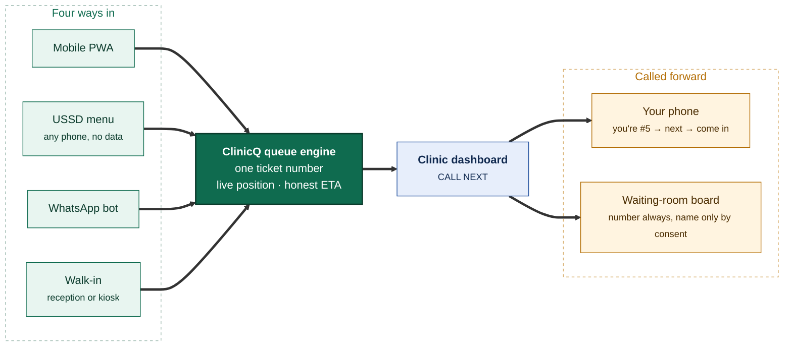

<h1 align="center">ClinicQ</h1>

<p align="center">
  <strong>Find a clinic. Hold your place. Watch your number come up.</strong><br>
  Clinic discovery and digital queue management for public and private clinics: from a phone, a USSD
  menu, WhatsApp, or the web.
</p>

<p align="center">
  <a href="docs/QUICKSTART.md"><strong>Quickstart</strong></a> ·
  <a href="docs/PLAN/IMPLEMENTATION_PLAN.md">Implementation plan</a> ·
  <a href="docs/GITHUB/README.md">Milestones &amp; issues</a> ·
  <a href="docs/TEAM/WORKLOAD_SPLIT.md">Workload split</a> ·
  <a href="docs/PRODUCT/README.md">Product docs</a> ·
  <a href="https://raw.githack.com/Billykat7/rgit-capstone2026/main/docs/DEMO/index.html">Visual demo</a>
</p>

---

**Richfield Graduate Institute of Technology** · BSc IT (Distance Learning) · **Capstone Project 2026**

## The problem

You take a morning off work, travel to your nearest clinic, and join a queue with no idea whether the
wait is twenty minutes or five hours. Nobody can tell you. There is no number, no board, no message:
just a bench and a paper list. Digital queue management has existed abroad for over a decade; most
South African clinics, especially public ones, still run paper-and-shout queues.

## What ClinicQ does

Find a nearby clinic, public or private, by geolocation, join its digital queue **before you leave
home**, and watch your ticket number count down on the clinic's own waiting-room display, while staff
run the whole line from one dashboard.



<p align="center"><em>Same queue, same ticket number, no matter which door you came in.</em></p>


## Features

### For patients

| | Feature |
|---|---|
| 📍 | **Find clinics near you:** PostGIS distance search, filtered by public, private or both, with live queue length and an honest wait range |
| 🎟️ | **Join from anywhere:** a ticket number and live position before you leave home |
| 📱 | **Four ways in:** mobile PWA, **USSD on any phone with no data**, WhatsApp bot, or plain web |
| 🔔 | **Get told when it's your turn:** push, SMS or WhatsApp saying "you're #5", "you're next", "come in now" |
| 🗓️ | **Book an appointment:** scheduled slots that turn into a queue ticket automatically |
| 🧾 | **Check in at the door:** scan a QR at the kiosk instead of queueing to talk to reception |
| 👨‍👩‍👧 | **Book for someone else:** a parent for a child, a daughter for her mother |
| 💊 | **Chronic medication reminders:** a nudge and a one-tap join for your collection |
| 🚗 | **Virtual waiting room:** wait nearby; we call you forward accounting for your travel time |
| 🌍 | **Five languages:** English, isiZulu, isiXhosa, Afrikaans and Sesotho, across menus, messages and announcements |

### For clinic staff

| | Feature |
|---|---|
| 🖥️ | **One dashboard:** every active queue side by side, live, with one enormous *Call Next* |
| 🚶 | **Walk-in intake in under 10 seconds:** same sequence as remote joins, one fair queue |
| 🏥 | **Multi-room queues:** triage → doctor → pharmacy, with transfers that don't send patients to the back |
| ⚖️ | **Clinical priority overrides:** two taps, a reason code, and a full audit trail |
| 📺 | **Waiting-room display board:** number, time, and privacy-gated name or comment, with an audio call-out |
| 🔒 | **Privacy by default:** every new clinic starts number-only; names and reasons are opt-in and audited |
| ⚙️ | **Run your own clinic:** hours, holidays, queues, services, staff, display mode, all self-service |
| 📊 | **Reports that sell themselves:** wait times, no-show rate, channel mix, busiest-hour heatmap |

### For the platform

RBAC across five roles · hard multi-tenant isolation · append-only, tamper-evident audit log · POPIA
consent capture and withdrawal · automatic data retention and purge · data-subject access and erasure ·
anonymised district-level dashboards for health-department planning.

## Tech stack

| Layer | Choice |
|-------|--------|
| Language | **Python 3.14** |
| API + web | **FastAPI** (ASGI) with **Jinja2** templates |
| Interactivity | **htmx** + small modules in `src/static/js/` + **SSE**, no separate JS build |
| Styling | Hand-written **CSS design tokens**: one set for the patient, dashboard and board layouts, light and dark, fonts self-hosted (decision 2) |
| Database | **PostgreSQL 18** with **PostGIS** |
| ORM / migrations | **SQLAlchemy 2.x** (sync sessions by default, async for streams; decision 5) + **Alembic** |
| Cache / jobs | **Redis** + `arq` |
| Channels | USSD gateway (Africa's Talking-class) · WhatsApp Business Cloud API · SMS · Web Push |
| Packaging / infra | **pip** + `requirements.txt` · **Docker Compose** · **GitHub Actions** |

One Python codebase renders the patient pages, the clinic dashboard and the display board. For a
six-person team that is the difference between one thing to debug and three, and the `/api/*` surface
is there from day one, which is exactly what the USSD and WhatsApp adapters consume.

## Project documentation

| Document | What's in it |
|----------|--------------|
| **[Quickstart](docs/QUICKSTART.md)** | Set up on Windows, macOS or Linux; run the stack; branch, commit and raise a pull request |
| **[Implementation plan](docs/PLAN/IMPLEMENTATION_PLAN.md)** | The whole project on one page: architecture, sequence, features added beyond the brief, how we'll know it works |
| **[Milestones & issues](docs/GITHUB/README.md)** | 14 milestones, 111 tracked issues, conventions, release tags, pipeline strategy |
| **[Workload split](docs/TEAM/WORKLOAD_SPLIT.md)** | Six roles, sprint-by-sprint lanes, **who blocks whom and what to do about it**, risk register |
| **[Engineering non-negotiables](docs/guideline.md)** | Five rules enforced by guard tests |
| **[Product docs](docs/PRODUCT/README.md)** | 14 numbered docs: discovery, queue, display, dashboard, channels, devices, topology, pricing, business plan, marketing, upscaling, tech, benchmark |
| **[Visual demo](docs/DEMO/index.html)** | A one-page walkthrough of the finished product, for the team and the showcase |

## Delivery at a glance

| | Milestone | Issues | Sprints | Tag | Progress |
|---|-----------|--------|---------|-----|----------|
| 1 | [Foundation & Local CI](docs/GITHUB/MILESTONES/M1_foundation_local_ci.md) | 1–8 | 1–2 | `v0.1.0` | 🟩🟩🟩🟩🟩🟩🟩🟩🟩🟩 **100%** (8/8 issues) |
| 2 | [CI/CD & Team Workflow](docs/GITHUB/MILESTONES/M2_cicd_environments.md) | 9–14 | 2 | `v0.2.0` | 🟩🟩🟩🟩🟩🟩🟩🟩🟩🟩 **100%** (6/6 issues) |
| 3 | [Identity, Auth, RBAC & Consent](docs/GITHUB/MILESTONES/M3_identity_auth_rbac.md) | 15–22 | 3–4 | `v0.3.0` | 🟩🟩🟩🟩🟩🟩🟩🟩🟩🟩 **100%** (8/8 issues) |
| 4 | [Clinics, Queues & Configuration](docs/GITHUB/MILESTONES/M4_clinics_queues_config.md) | 23–30 | 4–5 | `v0.4.0` | 🟩🟩🟩🟩🟩🟩🟩🟩🟩🟩 **100%** (8/8 issues) |
| 5 | [Discovery & Geolocation](docs/GITHUB/MILESTONES/M5_discovery_geolocation.md) | 31–38 | 5–6 | `v0.5.0` | 🟩🟩🟩🟩🟩🟩🟩🟩🟩🟩 **100%** (8/8 issues) |
| 6 | [**Queue Engine Core**](docs/GITHUB/MILESTONES/M6_queue_engine_core.md) ⚠️ critical path | 39–47 | 6–7 | `v0.6.0` | 🟩🟩🟩🟩🟩🟩🟩🟩🟩🟩 **100%** (9/9 issues) |
| 7 | [Clinic Dashboard](docs/GITHUB/MILESTONES/M7_clinic_dashboard.md) | 48–55 | 8–9 | `v0.7.0` | 🟩🟩🟩🟩🟩🟩🟩🟩🟩🟩 **100%** (8/8 issues) |
| 8 | [Display Monitor](docs/GITHUB/MILESTONES/M8_display_monitor.md) | 56–62 | 9 | `v0.8.0` | 🟩🟩🟩🟩🟩🟩🟩🟩🟩🟩 **100%** (7/7 issues) |
| 9 | [Notifications & Patient PWA](docs/GITHUB/MILESTONES/M9_notifications_patient_pwa.md) | 63–71, 200 | 9–10 | `v0.9.0` | 🟩🟩🟩🟩🟩🟩🟩🟩🟩🟩 **100%** (10/10 issues) |
| 10 | [USSD & WhatsApp Channels](docs/GITHUB/MILESTONES/M10_ussd_whatsapp_channels.md) | 72–79 | 10–11 | `v0.10.0` | ⬜⬜⬜⬜⬜⬜⬜⬜⬜⬜ **0%** (0/8 issues) |
| 11 | [Appointments & Check-in](docs/GITHUB/MILESTONES/M11_appointments_checkin_patient_care.md) | 80–87 | 11–12 | `v0.11.0` | 🟩🟩🟩🟩🟩🟩🟩🟩🟩🟩 **100%** (8/8 issues) |
| 12 | [Reporting & Analytics](docs/GITHUB/MILESTONES/M12_reporting_analytics.md) | 88–94 | 12 | `v0.12.0` | ⬜⬜⬜⬜⬜⬜⬜⬜⬜⬜ **0%** (0/7 issues) |
| 13 | [Security, Privacy & POPIA](docs/GITHUB/MILESTONES/M13_security_privacy_compliance.md) | 95–101 | 12–13 | `v0.13.0` | ⬜⬜⬜⬜⬜⬜⬜⬜⬜⬜ **0%** (0/7 issues) |
| 14 | [Production, Pilot & Go-live](docs/GITHUB/MILESTONES/M14_production_pilot_golive.md) | 102–109, 197 | 13–14 | `v0.14.0` | 🟩⬜⬜⬜⬜⬜⬜⬜⬜⬜ **11%** (1/9 issues) |
| ⭐ | **First official release:** every tracked issue closed | - | end of 14 | **`v1.0.0`** | 🟩🟩🟩🟩🟩🟩🟩⬜⬜⬜ **74%** (86/116 issues) |

## Team

| Code | Role | Name | GitHub | Owns |
|---|------|------|--------|------|
| A | Backend Lead | | | Domain core, **queue engine**, appointments |
| B | Backend / Integrations | | | Notifications, SMS, WhatsApp, USSD, i18n |
| C | Frontend / Patient | | | Discovery, map, ticket page, PWA, kiosk, accessibility |
| D | Frontend / Clinic | | | Dashboard, waiting-room display board |
| E | DevOps / QA Lead | | | Repo, CI/CD, security, production, pilot rollout |
| F | Data & Research Lead | | | Analytics, compliance, translations, UAT, capstone deliverables |

Each role has a **named backup** who reviews their PRs and picks up their work if they are unavailable;
see the [workload split](docs/TEAM/WORKLOAD_SPLIT.md#1-the-six-roles).

## Quickstart

**Full guide, per platform: [`docs/QUICKSTART.md`](docs/QUICKSTART.md)** — what to install on
Windows, macOS or Linux, how to run the stack, and how to take a change from a branch to a merged
pull request.

If you already have **Python 3.14**, **Docker** (Compose 2.24+) and **make**, it is five commands:

```bash
python3.14 -m venv .venv && source .venv/bin/activate && pip install -r requirements.txt
cp .env.example .env
make db-up        # PostgreSQL 18 + PostGIS and Redis, up when their health checks pass
make migrate-up   # the clinicq schema
make run          # http://127.0.0.1:8000 · /docs · /health/ready
```

Then `make seed-rbac && ./scripts/db/seed-dev-user.sh --password 'choose-a-password'` to sign in, and
`make seed-dev-data` for demo staff and clinics. After the first time, **`make dev`** brings the
stack up and runs the app in one command. **Before every push:** `make check`, the same gate CI runs.

## Contributing (team workflow)

- Branch: `Issue/<N>/<short-slug>`, e.g. `Issue/39/tickets-model-sequence`
- Commit: `Issue 39: add concurrency-safe ticket sequence`
- PR description in `docs/GITHUB/PR/M<MS>/PR_<N>_DESCRIPTION.md`, ending with `Closes #N`
- One issue, one PR, merged within 3 days. Rebase daily.
- New screens extend a layout in `src/templates/layouts/` and use the component macros; with
  `make run`, [`/dev/components`](http://127.0.0.1:8000/dev/components) shows them all (development only).
- Review within 24 hours on a weekday, or the backup reviewer may merge.

Before every push: `make check` (the same gates as CI, in under three minutes). The setup, the
pre-push workflow, running one module's tests and what to do when a commit is blocked for a secret
are in [CONTRIBUTING.md](CONTRIBUTING.md).

Full detail: [engineering non-negotiables](docs/guideline.md) and
[workload split](docs/TEAM/WORKLOAD_SPLIT.md).

## Status

**Phase:** building. **Sprints 1–5 of 14 complete**, sprints 6 to 12 under way (semester 2). **81 of 111
issues closed**. `v0.2.0` is the only tag cut so far; the notes for `v0.1.0` and `v0.3.0`–`v0.9.0` are
written and their tags are still to cut, in order. M6, the queue engine, is done: one fair sequence per
queue joined from every channel, a strict lifecycle, honest wait ranges, recall and no-show timers,
cancellation, transfers and audited priority overrides, with its contract, concurrency, property and
rush-hour tests. M7, the clinic dashboard, is done: the shell every staff screen lives in, with
navigation from each person's grants at their clinic and a switcher for staff at two clinics (issue 48),
the live front desk that says when it is not live (issue 49),
Call next and the patient buttons that answer at once, never act twice and undo a mistaken call (issue 50),
walk-in intake in a name and one key, with a ticket stub for a 58 mm printer (issue 51),
moving a patient forward with a reason, a staff-only badge and the trail the manager reads (issue 52),
a nurse's room view with encrypted private visit notes (issue 53),
the clinic manager's settings screens (issue 54), and
a dashboard that says when it is offline, keeps what was pressed until it can be sent, and is covered by
browser tests in CI (issue 55). M8, the waiting-room display, is done: the server-side privacy
projection every board response passes through, with no name or reason key in a number-only payload and
consent read afresh on every update (issue 58), and the kiosk board page, legible at 5 metres on a
32-inch screen in every layout from one queue to a page of four (issue 56), and the live stream that puts a
call on the board within 2 seconds and heals itself after a dropped connection or a restart (issue 57), and
the accessibility pass (WCAG 2.2 AA contrast in dim, bright and high-contrast themes, a shape for every status,
reduced motion) (issue 59), and kiosk screens that pair with a six-character code, stop at once when
removed and alert the team when they go quiet (issue 61), and call announcements (a chime, then the
number and the room in the clinic's language, one at a time, never a name) (issue 60), and a board that keeps
its last numbers when the clinic cannot be reached, says how old they are, starts from its own cache after a
power cut and is current again within 30 seconds of the network returning (issue 62). M9, the patient app
and notifications, is done: the queue tells a patient "you are next" and "please come in now" through one
call, recorded with the move and delivered after it commits, on their preferred transport, then free ones,
then SMS, so a provider outage can never hold or undo a call (issue 63), and a patient follows their ticket on a
page anyone they share its unguessable link with can open, live, with "you are next" impossible to miss and the
data's age always shown (issue 68), and a patient who presses a button on that page (never asked on load) is told
by web push, encrypted so only their phone can read the ticket number and clinic, with SMS when they decline
(issue 64), and SMS goes through a sandbox-first gateway whose per-clinic and per-patient daily caps and kill switch
stop the spend and alert the team, with every message fitted to one segment and its cost recorded (issue 65), and every message's words are a numbered version in a per-language registry with an
editor that refuses a broken template before it is published, each send naming the version it used (issue 66, English
only until the translations land), and a patient sets quiet hours, mutes a message or stops them all from the ticket page's link
with no account, while an SMS STOP reply stops every channel at once and only "come now" messages cross quiet hours (issue 67), and the ticket pages install as an app, offered only to the patient who joined,
that shows the last place in line it saw, and how long ago, when there is no signal, and picks up a new release on its next launch (issue 69), and every ticket carries one QR and short code, on the page, offline and on the
stub, that reception scans or types to open that exact ticket, today only, at that clinic only (issue 70), and the notifications surface is a checked contract whose every failure path, re-tested with the real
adapters, ends in a terminal status, with one message per queue event however it is replayed, a delivery-rate panel per transport and a
team alert when a transport's failure rate crosses its threshold (issue 71), and a patient signs in with their phone number
and joins a clinic's queue from its page, or signs in inside the installed app to find a ticket joined in another browser
(issue 200). M11, appointments, has begun: a clinic manager sets a queue's weekly appointment windows and
one-date overrides, generates bookable slots that skip public holidays, closures and closed hours, and
blocks a range for a staff absence, while booked places and walk-ins share the queue's one daily limit,
held by the database even when the last place is booked from two sessions at once (issue 80), and a clinic
can run a virtual waiting room, where a patient who joined by phone waits at home, is told once to leave
when the wait they see comes down to their own trip plus ten minutes, and taps "On my way" for the front
desk to see, never losing their place for not answering (issue 86), and after a completed visit a patient who
agreed is asked once how it went, answered with one tap on the web or one digit by SMS, with any comment
screened for phone numbers, e-mail addresses and ID numbers before it is stored, and a clinic report of scores
and response rates per queue and staff member (issue 87), and a patient books a time on the web, moves or
cancels it (the old time free at once), and shortly before the time the booking becomes a ticket from the same
counter as walk-ins, exactly once however often the sweep runs, with a late patient never silently dropped
(issue 81), and a booked patient is reminded the day before and two hours before through the notification
service, answers CONFIRM or CANCEL by SMS or with a button on the push notification without opening anything,
a cancellation giving the time back in the same request, no reminder for a patient already in the queue, and
each clinic's attendance counted by how many reminders were sent (issue 82), and a tablet at the clinic's
door, paired like a waiting-room screen, takes a patient's arrival from one scan, turning a booking into a
ticket there and then, clearing itself after twenty seconds and saying "please see reception" rather than
failing silently when the network is down (issue 83), and one phone can serve a household: a parent joins or
books for a child, a daughter for her mother, with the ticket and the board entry belonging to the person
being seen, the messages going to the phone that exists, a code to that person's own number before any link
to it is made, and every action naming both people in the audit trail (issue 84), and a patient on chronic medication is
reminded when their collection is due, on the first day the clinic actually opens, with one word or one tap
taking their place in the collection queue, exactly one follow-up if they do not come, and the clinic's own
list of who is due (issue 85).

- [x] Idea finalised (**ClinicQ**, selected from the shortlist)
- [x] Requirements gathered ([product docs](docs/PRODUCT/README.md))
- [x] Architecture agreed ([implementation plan](docs/PLAN/IMPLEMENTATION_PLAN.md))
- [x] Milestones and issues defined (14 milestones, 111 issues)
- [x] Workload split and dependency analysis ([workload split](docs/TEAM/WORKLOAD_SPLIT.md))
- [x] Repo structure set up (M1, `v0.1.0` to cut)
- [x] CI/CD pipeline running (M2, `v0.2.0`)
- [x] Identity, RBAC, site scoping, audit and consent (M3, `v0.3.0` to cut)
- [x] Clinics and queues configurable (M4, `v0.4.0` to cut)
- [x] Patients find nearby clinics by GPS or suburb, on a list or a map (M5, `v0.5.0` to cut)
- [x] Queue engine running (M6, `v0.6.0` to cut) ⚠️ critical path
- [x] Staff run the day from the clinic dashboard (M7, `v0.7.0` to cut)
- [x] MVP complete (M8, `v0.8.0` to cut)
- [x] Patients told and following their ticket (M9, `v0.9.0` to cut)
- [ ] Pilot clinic live (M14)
- [ ] Demo-ready

---

## Project shortlist (history)

This repository began as the team's capstone shortlist. **ClinicQ**, shortlisted as *ClinicQueue*, was
selected. The other five ideas are kept for reference in
[`docs/PROJECTS/`](docs/PROJECTS/Top_6_Final_Year_Project_Ideas.md):
CivicConnect, EduAttend, KasiMarket, CommunityNet, IsangoPass.

## Licence

See [LICENSE](LICENSE).
