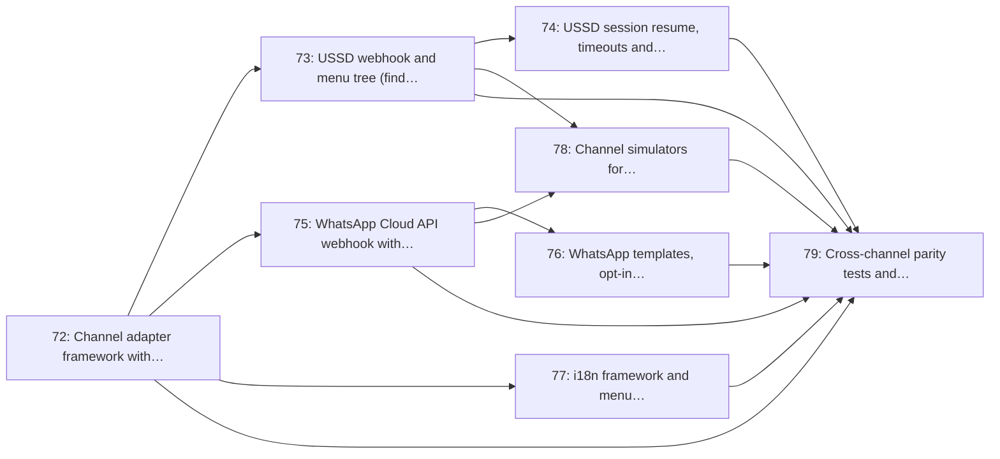

# Milestone 10: USSD & WhatsApp Channels

> **In short:** A feature phone with no data (USSD) and WhatsApp become full doors into the same queue, in five languages.

| | |
|---|---|
| **Status** | 📋 Planned |
| **Sprints** | 10–11 (weeks 19–22), semester 2. The sprint plan spreads its issues over sprints 7–11: some start early against stubs (see the table) |
| **Release tag** | `v0.10.0` |
| **Primary owner** | B, Integrations |
| **Who does the work** | B: 7 issues · F: 1 issue (see each issue for the backup) |
| **Issues** | 72–79 (8 issues, about 20 person-days of estimates) |
| **Depends on** | [M5](M5_discovery_geolocation.md), [M6](M6_queue_engine_core.md), [M9](M9_notifications_patient_pwa.md) |
| **Blocks** | None |

## Goal

Open the two doors that reach the patients a smartphone app never will: a USSD menu that works on any phone with no data, and a WhatsApp bot in the app most people already have open, both calling the same discovery and queue services as the web.

## Why this milestone exists

This is the feature that separates ClinicQ from every global queue vendor. Qminder, Qless, Qmatic and
the NHS App all assume a smartphone with data. In this market that assumption excludes a large share
of exactly the public-clinic population the product is for.

The engineering rule that keeps it affordable is **thin adapters, shared services**: a channel adapter
may translate a menu keypress into a service call and format the reply, and nothing else. If a channel
needs business logic, that logic belongs in the service layer where all four channels get it. The
parity test suite exists to enforce that rule mechanically.

## Scope

- Channel adapter framework with Redis-backed session state and a shared intent router
- USSD webhook: menu tree for find clinic → select → join → check status → cancel
- USSD session resume, timeout handling and gateway signature verification
- WhatsApp Business Cloud API webhook with quick-reply buttons and list messages
- WhatsApp template registration, opt-in capture and 24-hour session-window handling
- i18n framework and menu translations: English, isiZulu, isiXhosa, Afrikaans, Sesotho
- Offline simulators (`simulate_ussd.py`, `simulate_whatsapp.py`) so development needs no gateway credentials
- Cross-channel parity tests and channel-mix analytics

## Issues

| # | Issue | Owner | Estimate | Sprint | Needs first (this milestone) |
|---|-------|-------|----------|--------|------------------------------|
| [72](../ISSUES/M10/ISSUE_72_channel_adapter_framework.md) | Channel adapter framework with Redis session state | B | 3 days | 7 | nothing |
| [73](../ISSUES/M10/ISSUE_73_ussd_menu_tree.md) | USSD webhook and menu tree (find, join, status, cancel) | B | 3 days | 8 | [72](../ISSUES/M10/ISSUE_72_channel_adapter_framework.md) |
| [74](../ISSUES/M10/ISSUE_74_ussd_sessions_security.md) | USSD session resume, timeouts and gateway signature verification | B | 2 days | 9 | [73](../ISSUES/M10/ISSUE_73_ussd_menu_tree.md) |
| [75](../ISSUES/M10/ISSUE_75_whatsapp_webhook_quick_replies.md) | WhatsApp Cloud API webhook with quick-reply flows | B | 3 days | 10 | [72](../ISSUES/M10/ISSUE_72_channel_adapter_framework.md) |
| [76](../ISSUES/M10/ISSUE_76_whatsapp_templates_optin.md) | WhatsApp templates, opt-in capture and session-window handling | B | 2 days | 10 | [75](../ISSUES/M10/ISSUE_75_whatsapp_webhook_quick_replies.md) |
| [77](../ISSUES/M10/ISSUE_77_i18n_menu_translations.md) | i18n framework and menu translations (5 languages) | F | 3 days | 8 | [72](../ISSUES/M10/ISSUE_72_channel_adapter_framework.md) |
| [78](../ISSUES/M10/ISSUE_78_channel_simulators.md) | Channel simulators for credential-free local development | B | 2 days | 7 | [73](../ISSUES/M10/ISSUE_73_ussd_menu_tree.md), [75](../ISSUES/M10/ISSUE_75_whatsapp_webhook_quick_replies.md) |
| [79](../ISSUES/M10/ISSUE_79_channel_parity_tests.md) | Cross-channel parity tests and channel-mix analytics | B | 2 days | 11 | [72](../ISSUES/M10/ISSUE_72_channel_adapter_framework.md), [73](../ISSUES/M10/ISSUE_73_ussd_menu_tree.md), [74](../ISSUES/M10/ISSUE_74_ussd_sessions_security.md), [75](../ISSUES/M10/ISSUE_75_whatsapp_webhook_quick_replies.md), [76](../ISSUES/M10/ISSUE_76_whatsapp_templates_optin.md), [77](../ISSUES/M10/ISSUE_77_i18n_menu_translations.md), [78](../ISSUES/M10/ISSUE_78_channel_simulators.md) |

## Order of work

Arrows point from an issue to the issues that need it. Start with the ones on the left; anything not connected by an arrow can run in parallel.

**Start here:** [Issue 72](../ISSUES/M10/ISSUE_72_channel_adapter_framework.md).

**Needed from other milestones** (merged, or stubbed by agreement, before the issues that use them start):

- [Issue 31](../ISSUES/M5/ISSUE_31_clinics_nearby_postgis_search.md) (M5): `GET /api/clinics/nearby`: PostGIS radius search with distance and ETA; needed by 72
- [Issue 40](../ISSUES/M6/ISSUE_40_join_queue_service_api.md) (M6): Join-queue service and API (all channels), with abuse guards; needed by 72
- [Issue 66](../ISSUES/M9/ISSUE_66_notification_templates_i18n.md) (M9): Multi-language notification templates and admin editor; needed by 76

## Exit criteria

- [ ] A feature phone can find a clinic and hold a ticket number entirely over USSD, with no data
- [ ] A WhatsApp user can join, check position and cancel using buttons only, never free text
- [ ] A dropped USSD session resumes at the same step within the session timeout
- [ ] Unsigned or replayed gateway webhooks are rejected
- [ ] The parity suite proves all four channels produce identical ticket state for the same input
- [ ] The whole channel layer can be developed and tested locally with no gateway account

## Demo at the end of the milestone

What the team shows at the sprint review to prove the milestone is done:

- Using the simulators, a patient finds a clinic and joins over USSD, then over WhatsApp.
- The parity suite shows all four doors produce identical tickets.
- The same flow runs in isiZulu.

---

**Navigation:** [GitHub docs index](../README.md) · [How to read a milestone](README.md) · [Implementation plan](../../PLAN/IMPLEMENTATION_PLAN.md) · [Workload split](../../TEAM/WORKLOAD_SPLIT.md) · [Issues](../ISSUES/M10/)
