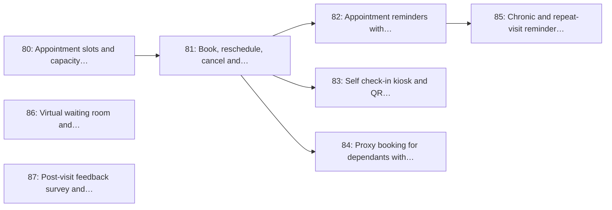

# Milestone 11: Appointments, Check-in & Patient Care Extras

> **In short:** Booked appointments, arrival check-in, booking for family members, chronic reminders, a virtual waiting room and post-visit feedback.

| | |
|---|---|
| **Status** | 📋 Planned |
| **Sprints** | 11–12 (weeks 21–24), semester 2. The sprint plan spreads its issues over sprints 8–12: some start early against stubs (see the table) |
| **Release tag** | `v0.11.0` |
| **Primary owner** | A, Backend Lead · C, Frontend/Patient |
| **Who does the work** | A: 4 issues · B: 2 issues · C: 1 issue · F: 1 issue (see each issue for the backup) |
| **Issues** | 80–87 (8 issues, about 19 person-days of estimates) |
| **Depends on** | [M6](M6_queue_engine_core.md), [M9](M9_notifications_patient_pwa.md) |
| **Blocks** | None |

## Goal

Extend the queue into the features UK and US patients already expect: booked appointment slots that convert into tickets automatically, self check-in at the door, booking on behalf of a dependant, chronic-medication reminders, a virtual waiting room, and a post-visit feedback survey.

## Why this milestone exists

Benchmarking against the NHS App and e-Referral Service, Solv, Zocdoc and Qmatic's kiosk products
surfaces six things a pure walk-in queue lacks, all of which are cheap to add on top of a working
ticket engine and all of which markedly raise the capstone's assessed scope:

- **Scheduled appointments** (NHS App, Zocdoc): for chronic and follow-up patients who should not queue at all.
- **Self check-in kiosk / QR arrival** (Qmatic, NHS outpatient kiosks): removes the reception bottleneck at 07:30.
- **Proxy booking** (NHS App 'linked profiles'): a daughter books for her mother; a parent books for a child.
- **Chronic repeat reminders:** the single highest-value nudge in primary care.
- **Virtual waiting room** (Solv, US urgent care): 'wait in your car / nearby', call-forward aware of travel time.
- **Post-visit feedback** (NHS Friends & Family Test): the metric a clinic manager can show their district.

## Scope

- Appointment slot and capacity model per service and room, with a booking horizon
- Book, reschedule and cancel, plus automatic conversion into a ticket near the slot time
- Reminders at 24 hours and 2 hours with confirm/cancel by reply on every channel
- Self check-in kiosk and QR arrival check-in at the clinic door
- Proxy/dependant booking with recorded consent and a clear acting-on-behalf-of trail
- Chronic and repeat-visit reminder schedules (medication collection)
- Virtual waiting room: wait nearby, travel-time-aware call-forward, 'on my way' acknowledgement
- Post-visit feedback survey with a simple satisfaction score and free-text, reported per clinic

## Issues

| # | Issue | Owner | Estimate | Sprint | Needs first (this milestone) |
|---|-------|-------|----------|--------|------------------------------|
| [80](../ISSUES/M11/ISSUE_80_appointment_slots_capacity.md) | Appointment slots and capacity model | A | 3 days | 8 | nothing |
| [81](../ISSUES/M11/ISSUE_81_booking_reschedule_auto_ticket.md) | Book, reschedule, cancel and auto-convert an appointment into a ticket | A | 3 days | 9 | [80](../ISSUES/M11/ISSUE_80_appointment_slots_capacity.md) |
| [82](../ISSUES/M11/ISSUE_82_appointment_reminders_reply.md) | Appointment reminders with confirm/cancel by reply | B | 2 days | 11 | [81](../ISSUES/M11/ISSUE_81_booking_reschedule_auto_ticket.md) |
| [83](../ISSUES/M11/ISSUE_83_kiosk_self_checkin.md) | Self check-in kiosk and QR arrival check-in | C | 3 days | 9 | [81](../ISSUES/M11/ISSUE_81_booking_reschedule_auto_ticket.md) |
| [84](../ISSUES/M11/ISSUE_84_proxy_dependant_booking.md) | Proxy booking for dependants with recorded consent | A | 2 days | 10 | [81](../ISSUES/M11/ISSUE_81_booking_reschedule_auto_ticket.md) |
| [85](../ISSUES/M11/ISSUE_85_chronic_repeat_reminders.md) | Chronic and repeat-visit reminder schedules | B | 2 days | 11 | [82](../ISSUES/M11/ISSUE_82_appointment_reminders_reply.md) |
| [86](../ISSUES/M11/ISSUE_86_virtual_waiting_room.md) | Virtual waiting room and travel-time-aware call-forward | A | 2 days | 10 | nothing |
| [87](../ISSUES/M11/ISSUE_87_post_visit_feedback.md) | Post-visit feedback survey and satisfaction reporting | F | 2 days | 12 | nothing |

## Order of work

Arrows point from an issue to the issues that need it. Start with the ones on the left; anything not connected by an arrow can run in parallel.

**Start here:** [Issue 80](../ISSUES/M11/ISSUE_80_appointment_slots_capacity.md), [Issue 86](../ISSUES/M11/ISSUE_86_virtual_waiting_room.md), [Issue 87](../ISSUES/M11/ISSUE_87_post_visit_feedback.md).

**Needed from other milestones** (merged, or stubbed by agreement, before the issues that use them start):

- [Issue 17](../ISSUES/M3/ISSUE_17_patient_identity_otp.md) (M3): Patient identity: phone-first records with OTP verification; needed by 84
- [Issue 25](../ISSUES/M4/ISSUE_25_queues_model_multiroom.md) (M4): `queues` model: multi-room, multi-service queues per site; needed by 80
- [Issue 26](../ISSUES/M4/ISSUE_26_services_catalogue_service_times.md) (M4): Services catalogue with expected service times; needed by 80
- [Issue 41](../ISSUES/M6/ISSUE_41_ticket_lifecycle_state_machine.md) (M6): Ticket lifecycle state machine and illegal-transition rejection; needed by 87
- [Issue 42](../ISSUES/M6/ISSUE_42_wait_time_estimation.md) (M6): Wait-time estimation service and `wait_time_samples`; needed by 86
- [Issue 63](../ISSUES/M9/ISSUE_63_notification_service_adapters.md) (M9): Notification service, transport adapters and delivery log; needed by 82, 85, 87
- [Issue 68](../ISSUES/M9/ISSUE_68_patient_ticket_page.md) (M9): Patient ticket page: live position, ETA countdown, cancel; needed by 86
- [Issue 70](../ISSUES/M9/ISSUE_70_qr_ticket_code.md) (M9): QR ticket code for kiosk check-in and reception lookup; needed by 83

## Exit criteria

- [ ] A booked appointment becomes a live ticket automatically at the configured lead time
- [ ] A patient can confirm or cancel a reminder by replying, without opening any app
- [ ] Kiosk check-in moves a booked patient into the waiting state without reception involvement
- [ ] A proxy booking records who booked for whom, with consent, and is visible in the audit log
- [ ] The virtual waiting room warns a patient early enough to arrive, based on their stated travel time
- [ ] Feedback scores roll up per clinic and per queue in the M12 reports

## Demo at the end of the milestone

What the team shows at the sprint review to prove the milestone is done:

- A booked appointment turns into a ticket automatically and the patient checks in by scanning a QR at the kiosk.
- A parent books for a child; the reminders go to the parent's phone.
- After the visit, a one-tap feedback question arrives.

---

**Navigation:** [GitHub docs index](../README.md) · [How to read a milestone](README.md) · [Implementation plan](../../PLAN/IMPLEMENTATION_PLAN.md) · [Workload split](../../TEAM/WORKLOAD_SPLIT.md) · [Issues](../ISSUES/M11/)
