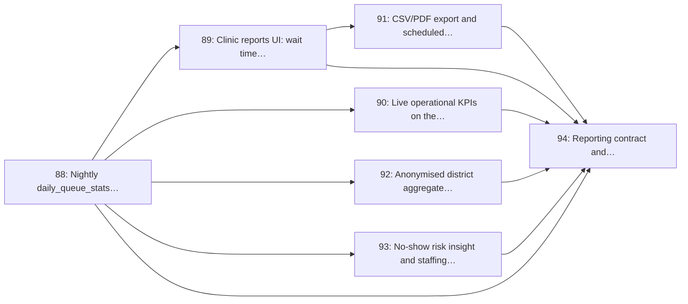

# Milestone 12: Reporting, Analytics & District Dashboards

> **In short:** The numbers a clinic manager takes to their district: wait times, no-shows, channel mix and busiest hours, all checked against hand calculations.

| | |
|---|---|
| **Status** | 📋 Planned |
| **Progress** | ⬜⬜⬜⬜⬜⬜⬜⬜⬜⬜ **0%** (0/7 issues) |
| **Sprints** | 12 (weeks 23–24), semester 2. The sprint plan spreads its issues over sprints 9–12: some start early against stubs (see the table) |
| **Release tag** | `v0.12.0` |
| **Primary owner** | F, Data & Research |
| **Who does the work** | F: 7 issues (see each issue for the backup) |
| **Issues** | 88–94 (7 issues, about 18 person-days of estimates) |
| **Depends on** | [M6](M6_queue_engine_core.md), [M7](M7_clinic_dashboard.md) |
| **Blocks** | None |

## Goal

Turn the queue's exhaust into the evidence that sells the product: wait-time trends, no-show rates, channel mix, a busiest-hours heatmap, exports, and an anonymised district-level view for health-department planning.

## Why this milestone exists

The queue-length heatmap is the single easiest "why should we pay for this" chart for a clinic
manager, and the district aggregate is the one that opens a provincial conversation later. Both are
also the natural home for the capstone's data-analysis marks.

The engineering constraint is that **reports must never query the live ticket table across a date
range**. A nightly aggregation into `daily_queue_stats` keeps the dashboard fast at pilot scale and
keeps a heavy report from ever competing with a Call Next.

## Scope

- Nightly `daily_queue_stats` aggregation worker with idempotent re-runs and catch-up
- Clinic reports UI: average wait, no-show rate, channel mix, queue-length heatmap (Chart.js)
- Live operational KPIs on the manager dashboard (today vs the 4-week average)
- CSV and PDF export plus a scheduled emailed weekly report
- Anonymised district/provincial aggregate dashboard with a small-cell suppression rule
- No-show risk insight and a simple staffing recommendation
- Reporting contract plus figure-accuracy tests against a fixed fixture dataset

## Issues

| # | Issue | Owner | Estimate | Sprint | Needs first (this milestone) |
|---|-------|-------|----------|--------|------------------------------|
| [88](../ISSUES/M12/ISSUE_88_daily_stats_worker.md) | Nightly `daily_queue_stats` aggregation worker | F | 3 days | 9 | nothing |
| [89](../ISSUES/M12/ISSUE_89_clinic_reports_ui.md) | Clinic reports UI: wait time, no-show, channel mix, heatmap | F | 3 days | 10 | [88](../ISSUES/M12/ISSUE_88_daily_stats_worker.md) |
| [90](../ISSUES/M12/ISSUE_90_live_operational_kpis.md) | Live operational KPIs on the manager dashboard | F | 2 days | 10 | [88](../ISSUES/M12/ISSUE_88_daily_stats_worker.md) |
| [91](../ISSUES/M12/ISSUE_91_exports_scheduled_reports.md) | CSV/PDF export and scheduled weekly email report | F | 2 days | 11 | [89](../ISSUES/M12/ISSUE_89_clinic_reports_ui.md) |
| [92](../ISSUES/M12/ISSUE_92_district_aggregate_dashboard.md) | Anonymised district aggregate dashboard with small-cell suppression | F | 3 days | 11 | [88](../ISSUES/M12/ISSUE_88_daily_stats_worker.md) |
| [93](../ISSUES/M12/ISSUE_93_noshow_risk_staffing_insight.md) | No-show risk insight and staffing recommendation | F | 3 days | 12 | [88](../ISSUES/M12/ISSUE_88_daily_stats_worker.md) |
| [94](../ISSUES/M12/ISSUE_94_reporting_contract_accuracy.md) | Reporting contract and figure-accuracy tests | F | 2 days | 12 | [88](../ISSUES/M12/ISSUE_88_daily_stats_worker.md), [89](../ISSUES/M12/ISSUE_89_clinic_reports_ui.md), [90](../ISSUES/M12/ISSUE_90_live_operational_kpis.md), [91](../ISSUES/M12/ISSUE_91_exports_scheduled_reports.md), [92](../ISSUES/M12/ISSUE_92_district_aggregate_dashboard.md), [93](../ISSUES/M12/ISSUE_93_noshow_risk_staffing_insight.md) |

## Order of work

Arrows point from an issue to the issues that need it. Start with the ones on the left; anything not connected by an arrow can run in parallel.

**Start here:** [Issue 88](../ISSUES/M12/ISSUE_88_daily_stats_worker.md).

**Needed from other milestones** (merged, or stubbed by agreement, before the issues that use them start):

- [Issue 39](../ISSUES/M6/ISSUE_39_tickets_model_sequence.md) (M6): `tickets` model and concurrency-safe daily sequence numbering; needed by 88
- [Issue 41](../ISSUES/M6/ISSUE_41_ticket_lifecycle_state_machine.md) (M6): Ticket lifecycle state machine and illegal-transition rejection; needed by 88
- [Issue 48](../ISSUES/M7/ISSUE_48_dashboard_shell_role_nav.md) (M7): Dashboard shell, role-aware navigation and site switcher; needed by 89
- [Issue 49](../ISSUES/M7/ISSUE_49_front_desk_board_live.md) (M7): Front-desk board: all active queues, live via SSE with polling fallback; needed by 90
- [Issue 82](../ISSUES/M11/ISSUE_82_appointment_reminders_reply.md) (M11): Appointment reminders with confirm/cancel by reply; needed by 93

## Exit criteria

- [ ] Every report reads pre-aggregated rows; none scans `tickets` across a date range
- [ ] Re-running the nightly job for a past date produces identical figures (idempotent)
- [ ] The heatmap makes a clinic's busiest hour obvious at a glance in under 5 seconds of looking
- [ ] Exports match the on-screen figures exactly, checked by a test against a fixed fixture
- [ ] The district view never exposes a cell small enough to identify an individual visit
- [ ] Figures are reproducible from the fixture dataset, so the capstone report can cite them

## Demo at the end of the milestone

What the team shows at the sprint review to prove the milestone is done:

- The reports page shows the seeded clinic's busiest hour at a glance.
- A CSV export matches the screen to the last digit.
- The district view withholds small cells instead of rounding them.

---

**Navigation:** [GitHub docs index](../README.md) · [How to read a milestone](README.md) · [Implementation plan](../../PLAN/IMPLEMENTATION_PLAN.md) · [Workload split](../../TEAM/WORKLOAD_SPLIT.md) · [Issues](../ISSUES/M12/)
