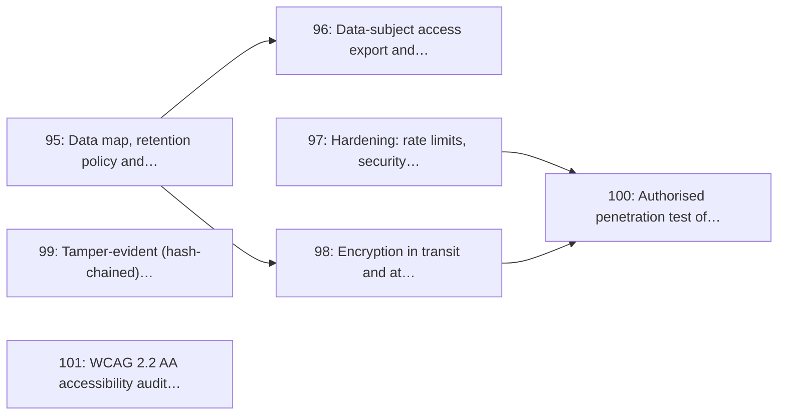

# Milestone 13: Security, Privacy & POPIA Compliance

> **In short:** Everything a system holding health information must prove before real patients use it: retention, access and erasure, encryption, a hardened surface and an independent test.

| | |
|---|---|
| **Status** | 📋 Planned |
| **Sprints** | 12–13 (weeks 23–26), semester 2. The sprint plan spreads its issues over sprints 8–13: some start early against stubs (see the table) |
| **Release tag** | `v0.13.0` |
| **Primary owner** | E, DevOps/QA · F, Data & Research |
| **Who does the work** | E: 3 issues · F: 2 issues · A: 1 issue · C: 1 issue (see each issue for the backup) |
| **Issues** | 95–101 (7 issues, about 20 person-days of estimates) |
| **Depends on** | [M3](M3_identity_auth_rbac.md), [M8](M8_display_monitor.md), [M9](M9_notifications_patient_pwa.md) |
| **Blocks** | [M14](M14_production_pilot_golive.md) go-live; a pilot with real patients cannot start before this closes |

## Goal

Make the privacy promises in the design enforceable and provable: a data map with automatic retention purges, data-subject access and erasure, hardened endpoints, encrypted patient contact data, a tamper-evident audit trail, an authorised penetration test, and a WCAG 2.2 AA audit.

## Why this milestone exists

ClinicQ handles health-adjacent personal information about identifiable people: a phone number, a
reason for visit, a clinic attended, a time. Under POPIA that is special personal information the
moment a name is attached to it, and the project has said in writing (docs 04 and 13) that reason
text and visit notes are purged on a short retention window. **This milestone is where that sentence
becomes a scheduled job with a test**, rather than an intention.

The penetration test is scoped and authorised in writing against the team's own staging environment
only. Nothing in this milestone is a licence to test any third party's system.

## Scope

- Data map of every personal field, its purpose, lawful basis and retention period
- Automatic purge jobs for `reason_text`, `visit_notes` and stale patient records, with proof tests
- Data-subject rights: machine-readable access export and an erasure workflow with audit
- Hardening: rate limits, security headers, CSRF, dependency and secret scanning in CI
- TLS everywhere, encryption at rest, field-level encryption for patient phone numbers
- Tamper-evident audit log (hash-chained) plus an admin viewer UI
- Authorised penetration test of the team's own staging environment and remediation
- WCAG 2.2 AA audit across patient, dashboard and board surfaces, with remediation

## Issues

| # | Issue | Owner | Estimate | Sprint | Needs first (this milestone) |
|---|-------|-------|----------|--------|------------------------------|
| [95](../ISSUES/M13/ISSUE_95_data_map_retention_purge.md) | Data map, retention policy and automatic purge jobs | F | 3 days | 12 | nothing |
| [96](../ISSUES/M13/ISSUE_96_dsar_export_erasure.md) | Data-subject access export and erasure workflow | F | 3 days | 13 | [95](../ISSUES/M13/ISSUE_95_data_map_retention_purge.md) |
| [97](../ISSUES/M13/ISSUE_97_hardening_rate_limits_scanning.md) | Hardening: rate limits, security headers, dependency and secret scanning | E | 3 days | 8 | nothing |
| [98](../ISSUES/M13/ISSUE_98_encryption_pii_protection.md) | Encryption in transit and at rest, field-level encryption for patient contacts | E | 2 days | 9 | [95](../ISSUES/M13/ISSUE_95_data_map_retention_purge.md) |
| [99](../ISSUES/M13/ISSUE_99_tamper_evident_audit_viewer.md) | Tamper-evident (hash-chained) audit log and admin viewer UI | A | 2 days | 12 | nothing |
| [100](../ISSUES/M13/ISSUE_100_pen_test_remediation.md) | Authorised penetration test of staging and remediation | E | 4 days | 11–12 | [97](../ISSUES/M13/ISSUE_97_hardening_rate_limits_scanning.md), [98](../ISSUES/M13/ISSUE_98_encryption_pii_protection.md) |
| [101](../ISSUES/M13/ISSUE_101_accessibility_audit_remediation.md) | WCAG 2.2 AA accessibility audit and remediation | C | 3 days | 10 | nothing |

## Order of work

Arrows point from an issue to the issues that need it. Start with the ones on the left; anything not connected by an arrow can run in parallel.

**Start here:** [Issue 95](../ISSUES/M13/ISSUE_95_data_map_retention_purge.md), [Issue 97](../ISSUES/M13/ISSUE_97_hardening_rate_limits_scanning.md), [Issue 99](../ISSUES/M13/ISSUE_99_tamper_evident_audit_viewer.md), [Issue 101](../ISSUES/M13/ISSUE_101_accessibility_audit_remediation.md).

**Needed from other milestones** (merged, or stubbed by agreement, before the issues that use them start):

- [Issue 16](../ISSUES/M3/ISSUE_16_staff_signin_sessions_csrf.md) (M3): Staff sign-in, sessions, logout, CSRF and password reset; needed by 97
- [Issue 17](../ISSUES/M3/ISSUE_17_patient_identity_otp.md) (M3): Patient identity: phone-first records with OTP verification; needed by 96, 98
- [Issue 20](../ISSUES/M3/ISSUE_20_audit_log_admin_api.md) (M3): Append-only audit log and admin read API; needed by 95, 99
- [Issue 40](../ISSUES/M6/ISSUE_40_join_queue_service_api.md) (M6): Join-queue service and API (all channels), with abuse guards; needed by 97
- [Issue 53](../ISSUES/M7/ISSUE_53_nurse_room_view_visit_notes.md) (M7): Nurse/doctor room view and private visit notes; needed by 95
- [Issue 59](../ISSUES/M8/ISSUE_59_board_accessibility.md) (M8): Accessibility pass: contrast, type scale, 5-metre legibility, reduced motion; needed by 101
- [Issue 68](../ISSUES/M9/ISSUE_68_patient_ticket_page.md) (M9): Patient ticket page: live position, ETA countdown, cancel; needed by 101

## Exit criteria

- [ ] Reason text and visit notes are provably gone after the retention window, checked by a test
- [ ] A patient can request everything held about them and receive it in a machine-readable file
- [ ] An erasure request removes or irreversibly anonymises personal data while preserving aggregate counts
- [ ] CI fails on a known-vulnerable dependency or a committed secret
- [ ] Patient phone numbers are unreadable in a raw database dump
- [ ] The audit chain detects any retrospective edit of a past entry
- [ ] All three surfaces pass an automated and a manual WCAG 2.2 AA check

## Demo at the end of the milestone

What the team shows at the sprint review to prove the milestone is done:

- A raw database dump shows no readable phone number.
- A patient requests their data, verifies their phone, and receives a complete export; an erasure leaves the reports correct.
- The penetration-test report lists every high and medium finding as fixed and retested.

---

**Navigation:** [GitHub docs index](../README.md) · [How to read a milestone](README.md) · [Implementation plan](../../PLAN/IMPLEMENTATION_PLAN.md) · [Workload split](../../TEAM/WORKLOAD_SPLIT.md) · [Issues](../ISSUES/M13/)
