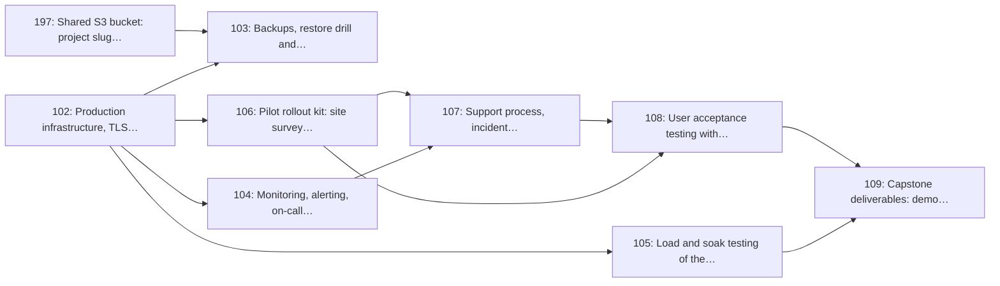

# Milestone 14: Production Readiness, Pilot & Go-live

> **In short:** Production, backups, monitoring, a load test, a pilot kit and real clinic staff using ClinicQ for a full day, then the capstone submission.

| | |
|---|---|
| **Status** | 🚧 In progress: Issue 197 in review |
| **Progress** | 🟩⬜⬜⬜⬜⬜⬜⬜⬜⬜ **11%** (1/9 issues) |
| **Sprints** | 13–14 (weeks 25–28), semester 2 |
| **Release tag** | `v0.14.0`, then **`v1.0.0`** when the last tracked issue closes |
| **Primary owner** | E, DevOps/QA · whole team |
| **Who does the work** | E: 6 issues · F: 3 issues (see each issue for the backup) |
| **Issues** | 102–109 and 197 (9 issues, about 25 person-days of estimates) |
| **Depends on** | [M7](M7_clinic_dashboard.md), [M8](M8_display_monitor.md), [M9](M9_notifications_patient_pwa.md), [M13](M13_security_privacy_compliance.md) |
| **Blocks** | None |

## Goal

Take ClinicQ from a working codebase to a system running in a real clinic with real patients, and produce the capstone deliverables that prove it.

## Why this milestone exists

A capstone is marked on demonstrated, defensible delivery, not on a repository. This milestone
covers the difference: production infrastructure with backups that have actually been restored,
monitoring that pages a human, a load test that proves the 07:30 rush is survivable, an install kit
and training pack a clinic can follow without the team present, and a documented UAT round with real
staff whose feedback visibly changed the product.

The last issue is the report, the demo video and the presentation. It is scheduled as work, with time
reserved, because it is worth a large share of the marks and is the thing student teams most reliably
leave until the final week.

## Scope

- Production infrastructure: VPS, managed PostgreSQL with PostGIS, Redis, TLS, domain, WAF/rate limit at the edge
- Backups with an actually-performed restore drill and a written DR runbook
- Monitoring, alerting, on-call rota and a public status page
- Load and soak test modelling a 07:30 clinic rush, with a documented performance budget
- Pilot rollout kit: site survey checklist, kiosk install guide, staff training pack, printed fallback procedure
- Support process, incident runbooks and an internal SLA
- User acceptance testing with real clinic staff, logged feedback and shipped fixes
- Capstone deliverables: demo script, demo video, project report, poster and presentation

## Issues

| # | Issue | Owner | Estimate | Sprint | Needs first (this milestone) |
|---|-------|-------|----------|--------|------------------------------|
| [102](../ISSUES/M14/ISSUE_102_production_infra_tls.md) | Production infrastructure, TLS, domains and edge protection | E | 3 days | 13 | nothing |
| [103](../ISSUES/M14/ISSUE_103_backups_restore_drill.md) | Backups, restore drill and disaster-recovery runbook | E | 2 days | 13 | [102](../ISSUES/M14/ISSUE_102_production_infra_tls.md) |
| [104](../ISSUES/M14/ISSUE_104_monitoring_alerting_status.md) | Monitoring, alerting, on-call rota and status page | E | 2 days | 13 | [102](../ISSUES/M14/ISSUE_102_production_infra_tls.md) |
| [105](../ISSUES/M14/ISSUE_105_load_soak_testing.md) | Load and soak testing of the morning-rush profile | E | 3 days | 13 | [102](../ISSUES/M14/ISSUE_102_production_infra_tls.md) |
| [106](../ISSUES/M14/ISSUE_106_pilot_rollout_kit.md) | Pilot rollout kit: site survey, install guide, staff training pack | F | 3 days | 13 | [102](../ISSUES/M14/ISSUE_102_production_infra_tls.md) |
| [107](../ISSUES/M14/ISSUE_107_support_incident_sla.md) | Support process, incident runbooks and internal SLA | E | 2 days | 13 | [104](../ISSUES/M14/ISSUE_104_monitoring_alerting_status.md), [106](../ISSUES/M14/ISSUE_106_pilot_rollout_kit.md) |
| [108](../ISSUES/M14/ISSUE_108_uat_clinic_staff.md) | User acceptance testing with clinic staff and remediation | F | 4 days | 14 | [106](../ISSUES/M14/ISSUE_106_pilot_rollout_kit.md), [107](../ISSUES/M14/ISSUE_107_support_incident_sla.md) |
| [109](../ISSUES/M14/ISSUE_109_capstone_deliverables.md) | Capstone deliverables: demo script, video, report, poster, presentation | F | 5 days | 14 | [105](../ISSUES/M14/ISSUE_105_load_soak_testing.md), [108](../ISSUES/M14/ISSUE_108_uat_clinic_staff.md) |
| [197](../ISSUES/M14/ISSUE_197_shared_s3_bucket_keys.md) | Shared S3 bucket: put the project slug first in every key | E | 1 day | 13 | nothing |

## Order of work

Arrows point from an issue to the issues that need it. Start with the ones on the left; anything not connected by an arrow can run in parallel.

**Start here:** [Issue 102](../ISSUES/M14/ISSUE_102_production_infra_tls.md).

**Needed from other milestones** (merged, or stubbed by agreement, before the issues that use them start):

- [Issue 11](../ISSUES/M2/ISSUE_11_cd_staging_prod_approval.md) (M2): CD: staging deploy on tag, production behind manual approval; needed by 102
- [Issue 14](../ISSUES/M2/ISSUE_14_monitoring_baseline_alerts.md) (M2): Monitoring baseline: uptime checks, error tracking, deploy notifications; needed by 104
- [Issue 47](../ISSUES/M6/ISSUE_47_queue_contract_concurrency_tests.md) (M6): Queue OpenAPI contract, concurrency and state-machine tests; needed by 105
- [Issue 61](../ISSUES/M8/ISSUE_61_kiosk_device_registry.md) (M8): Kiosk device registry, pairing codes and heartbeat monitoring; needed by 106
- [Issue 98](../ISSUES/M13/ISSUE_98_encryption_pii_protection.md) (M13): Encryption in transit and at rest, field-level encryption for patient contacts; needed by 102
- [Issue 100](../ISSUES/M13/ISSUE_100_pen_test_remediation.md) (M13): Authorised penetration test of staging and remediation; needed by 109

## Exit criteria

- [ ] The production stack is reachable over HTTPS on the project domain with automated certificate renewal
- [ ] A database restore has been performed end-to-end and timed, not merely configured
- [ ] An outage pages a named on-call team member within 5 minutes
- [ ] The system sustains the modelled morning rush within the performance budget with headroom
- [ ] A clinic can install a kiosk from the written guide without a team member on site
- [ ] At least one real clinic has run a full day on ClinicQ, and the UAT feedback log shows what changed as a result
- [ ] Report, video, poster and presentation are complete and rehearsed before the submission deadline

## Demo at the end of the milestone

What the team shows at the sprint review to prove the milestone is done:

- Production serves HTTPS on the real domain, and a timed restore drill has been recorded.
- The 07:30 rush load test passes inside the performance budget.
- A real clinic has run a full day on ClinicQ, and the demo video shows the whole loop.

---

**Navigation:** [GitHub docs index](../README.md) · [How to read a milestone](README.md) · [Implementation plan](../../PLAN/IMPLEMENTATION_PLAN.md) · [Workload split](../../TEAM/WORKLOAD_SPLIT.md) · [Issues](../ISSUES/M14/)
