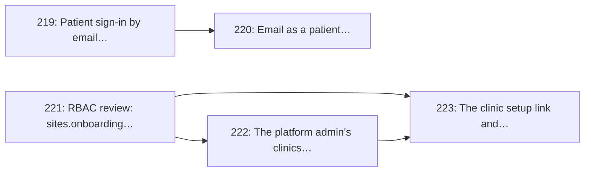

# Milestone 15: Clinic Onboarding & Patient Sign-in

> **In short:** A clinic is added and finishes its own setup from one link, and a patient can sign in with an email address as well as a phone number when the deployment switches it on.

| | |
|---|---|
| **Status** | 📋 Planned |
| **Progress** | 🟩🟩🟩🟩🟩🟩🟩🟩🟩⬜ **89%** (8/9 issues) |
| **Sprints** | 15–16 (weeks 29–32) |
| **Release tag** | `v0.15.0` |
| **Primary owner** | A, Backend Lead · D, Frontend/Clinic |
| **Who does the work** | A: 2 issues · B: 1 issue · D: 2 issues (see each issue for the backup) |
| **Issues** | 219–223 (5 issues, about 14 person-days of estimates) |
| **Depends on** | [M3](M3_identity_auth_rbac.md), [M4](M4_clinics_queues_config.md), [M9](M9_notifications_patient_pwa.md) |
| **Blocks** | The pilot rollout kit ([Issue 106](../ISSUES/M14/ISSUE_106_pilot_rollout_kit.md), M14) |

## Goal

Close the two gaps the product hits the moment real clinics and real patients are put in front of it:
**getting a clinic set up** without an engineer, and **getting a patient in** without a working
mobile number.

## Why this milestone exists

Both gaps were found by using the system rather than by reading the plan.

**A clinic cannot be set up from the browser.** Every verb exists in the sites API and none of them
has a screen. Creating a clinic on behalf of one that phoned in means hand-writing JSON. Worse, a
clinic that is created — by either existing path — keeps the *default* queues, catalogue, hours and
board settings until someone is invited as its first manager and finds the settings pages unprompted.
Nobody is told what is still missing, so a clinic can go live showing patients rooms it does not run
and hours it does not keep. The pilot needs the middle path: **add the clinic now, send one link, let
them finish it themselves.**

**A patient has exactly one way in: a phone number and an SMS.** That is the right default for the
walk-in population ClinicQ is built for, and it strands a patient whose number changed, costs money
per sign-in, and makes every demo and acceptance test need a real handset. The OTP store is already
keyed by `(kind, identifier)` with an `EMAIL` member it has never been asked to use.

And the review that preceded both found a real RBAC defect: **approving a clinic is gated by the
grant that deletes clinics**, so verification authority cannot be given without deletion authority.
That is fixed first, because the console and the setup link are built on top of it.

## Scope

- `patient.email`, and sign-in by an emailed code, behind `PATIENT_EMAIL_SIGN_IN_ENABLED` (off by default)
- Email as a free patient notification transport, so an email-only patient is reachable
- `sites.onboarding` as its own RBAC resource, and the verification routes moved onto it
- A clinics console for the platform admin: create, edit, archive, with the listing filters
- A single-use clinic setup link and the guided journey behind it: rooms, services, hours, the board,
  the first manager, and submission for verification

## Issues

| # | Issue | Owner | Estimate | Sprint | Needs first (this milestone) |
|---|-------|-------|----------|--------|------------------------------|
| [219](../ISSUES/M15/ISSUE_219_patient_email_sign_in.md) | Patient sign-in by email address, behind a feature flag | A | 3 days | 15 | nothing |
| [220](../ISSUES/M15/ISSUE_220_patient_email_transport.md) | Email as a patient notification transport | B | 2 days | 15 | [219](../ISSUES/M15/ISSUE_219_patient_email_sign_in.md) |
| [221](../ISSUES/M15/ISSUE_221_rbac_sites_onboarding.md) | RBAC review: a `sites.onboarding` resource and its grants | A | 2 days | 15 | nothing |
| [222](../ISSUES/M15/ISSUE_222_admin_clinics_console.md) | The platform admin's clinics console: create, edit, archive | D | 3 days | 15 | [221](../ISSUES/M15/ISSUE_221_rbac_sites_onboarding.md) |
| [223](../ISSUES/M15/ISSUE_223_clinic_setup_link.md) | The clinic setup link and its guided setup journey | A · D | 4 days | 16 | [221](../ISSUES/M15/ISSUE_221_rbac_sites_onboarding.md), [222](../ISSUES/M15/ISSUE_222_admin_clinics_console.md) |

## Order of work

Arrows point from an issue to the issues that need it. Two independent strands: the patient one and
the clinic one.

**Start here:** [Issue 219](../ISSUES/M15/ISSUE_219_patient_email_sign_in.md), [Issue 221](../ISSUES/M15/ISSUE_221_rbac_sites_onboarding.md).

**Needed from other milestones** (all merged):

- [Issue 17](../ISSUES/M3/ISSUE_17_patient_identity_otp.md) (M3): patient identity and the OTP store; needed by 219
- [Issue 18](../ISSUES/M3/ISSUE_18_rbac_roles_enforcement.md) (M3): the RBAC catalog and module manifests; needed by 221
- [Issue 22](../ISSUES/M3/ISSUE_22_staff_invitations_account_settings.md) (M3): the single-use invitation link; needed by 223
- [Issue 23](../ISSUES/M4/ISSUE_23_sites_model_profile_crud.md) (M4): the sites API; needed by 222
- [Issue 29](../ISSUES/M4/ISSUE_29_clinic_onboarding_verification.md) (M4): the onboarding state machine; needed by 221, 223
- [Issue 63](../ISSUES/M9/ISSUE_63_notification_service_adapters.md) (M9): the notification transports; needed by 220
- [Issue 200](../ISSUES/M9/ISSUE_200_patient_join_page.md) (M9): the sign-in `/t/` and the join page render; needed by 219

## Exit criteria

Re-derived from the code at the end of the milestone, each against the test or the demo that shows it:

- [ ] **A patient signs in at `/t/` with an email address and joins a queue, with the flag on** — and
      with the flag off the page is exactly what it is today
- [ ] **An email-only patient is told their ticket was called**, by email, without an SMS being sent
- [ ] **Verification authority can be granted without deletion authority** — a principal holding
      `sites.onboarding:update` and not `sites:delete` approves a clinic and is refused the delete
- [ ] **A platform admin creates, corrects and archives a clinic from the browser**, with no `curl`
- [ ] **A clinic completes its own rooms, services, hours and board from one emailed link**, with no
      account, and submits itself for verification with a complete checklist

## Demo at the end of the milestone

What the team shows at the sprint review to prove the milestone is done:

- An operator adds a clinic in `/admin/clinics` and sends the setup link; on a second screen the
  clinic opens the link, names its rooms, keeps its pharmacy, sets its hours and submits itself; the
  operator approves it and it appears on `/discover`.
- A patient signs in at `/t/` with an email address, joins that clinic's queue, and is emailed when
  their ticket is called.

---

**Navigation:** [GitHub docs index](../README.md) · [How to read a milestone](README.md) · [Implementation plan](../../PLAN/IMPLEMENTATION_PLAN.md) · [Workload split](../../TEAM/WORKLOAD_SPLIT.md) · [Issues](../ISSUES/M15/)
