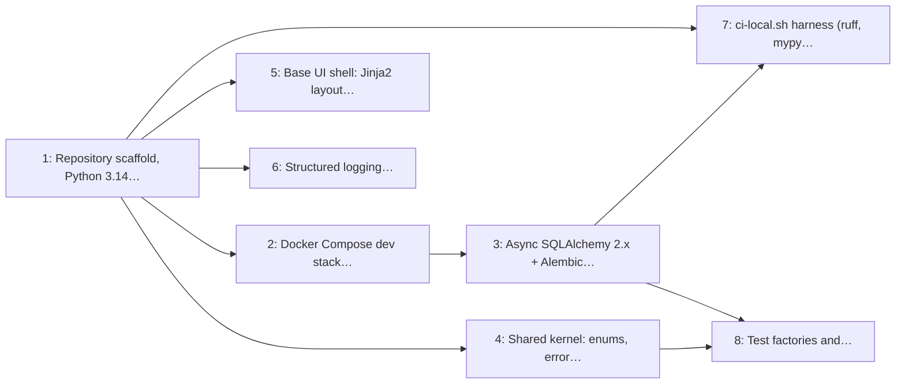

# Milestone 1: Foundation & Local CI

> **In short:** A running, tested, empty application that six people can work in without stepping on each other.

| | |
|---|---|
| **Status** | ✅ Done: issues 1–8 closed on 2026-09-11, release note [`v0.1.0`](../RELEASES/RELEASE_v0_1_0.md) |
| **Sprints** | 1–2 (weeks 1–4), semester 1 |
| **Release tag** | `v0.1.0` |
| **Primary owner** | E, DevOps/QA (primary) · A, Backend Lead (support) |
| **Who does the work** | E: 5 issues · A: 2 issues · C: 1 issue (see each issue for the backup) |
| **Issues** | 1–8 (8 issues, about 12 person-days of estimates) |
| **Depends on** | None |
| **Blocks** | Everything. No other milestone can start until the skeleton, database and test harness exist. |

## Goal

Stand up the repository, the Python 3.14 / FastAPI skeleton, the PostgreSQL 18 + PostGIS + Redis dev stack, the migration baseline, the shared UI shell and a fast local test loop, so every later milestone is built on the same foundation instead of six different ones.

## Why this milestone exists

Six people cannot work in parallel on a codebase that does not yet agree on how it boots, where
models live, how migrations run, or what "green" means. M1 is deliberately small in features and
large in conventions: one app factory, one settings object, one enum module, one base template, one
`ci-local.sh`. Everything after this milestone assumes a clinic row can be inserted, a page can be
rendered, and a test can run in under a minute on a student laptop.

This milestone also front-loads the two decisions that are expensive to reverse: **PostGIS in the
baseline migration** (discovery in M5 depends on a `geography(Point, 4326)` column and a GiST index)
and **timezone discipline** (all business datetimes are `Africa/Johannesburg`, stored as UTC).

## Scope

- `uv`-managed Python 3.14 project, `pyproject.toml`, ruff + mypy configuration, app factory and typed settings
- Docker Compose dev stack: PostgreSQL 18 with PostGIS, Redis, and the API container
- SQLAlchemy 2.x sessions (sync by default, async for streams: decision 5), Alembic baseline including the `postgis` extension
- Shared enums, error envelope, ID strategy and `Africa/Johannesburg` datetime helpers
- Jinja2 base layout and three layouts (patient, dashboard, board) on one set of design tokens, with htmx (decision 2: no Tailwind, no Alpine)
- Structured JSON logging with request-context middleware, `/health` and `/ready`
- `scripts/ci-local.sh` (ruff → mypy → pytest → docker build) and pre-commit hooks
- Test factories and a `seed_dev_data.py` that produces clinics, queues, staff and tickets

## Issues

| # | Issue | Owner | Estimate | Sprint | Needs first (this milestone) |
|---|-------|-------|----------|--------|------------------------------|
| [1](../ISSUES/M1/ISSUE_1_repo_scaffold_app_factory.md) | Repository scaffold, Python 3.14 + FastAPI app factory, typed settings | E | 2 days | 1 | nothing |
| [2](../ISSUES/M1/ISSUE_2_docker_dev_stack_postgis_redis.md) | Docker Compose dev stack: PostgreSQL 18 + PostGIS, Redis, API | E | 1 day | 1 | [1](../ISSUES/M1/ISSUE_1_repo_scaffold_app_factory.md) |
| [3](../ISSUES/M1/ISSUE_3_sqlalchemy_alembic_baseline.md) | Async SQLAlchemy 2.x + Alembic baseline (PostGIS extension enabled) | A | 2 days | 1 | [2](../ISSUES/M1/ISSUE_2_docker_dev_stack_postgis_redis.md) |
| [4](../ISSUES/M1/ISSUE_4_shared_kernel_enums_time_errors.md) | Shared kernel: enums, error envelope, IDs, Africa/Johannesburg datetimes | A | 1 day | 1 | [1](../ISSUES/M1/ISSUE_1_repo_scaffold_app_factory.md) |
| [5](../ISSUES/M1/ISSUE_5_base_ui_shell_tailwind_htmx.md) | Base UI shell: Jinja2 layout, Tailwind build, htmx + Alpine wiring | C | 2 days | 1 | [1](../ISSUES/M1/ISSUE_1_repo_scaffold_app_factory.md) |
| [6](../ISSUES/M1/ISSUE_6_logging_request_context_health.md) | Structured logging, request-context middleware, health & readiness probes | E | 1 day | 1 | [1](../ISSUES/M1/ISSUE_1_repo_scaffold_app_factory.md) |
| [7](../ISSUES/M1/ISSUE_7_ci_local_harness_precommit.md) | `ci-local.sh` harness (ruff, mypy, pytest, docker build) + pre-commit | E | 1 day | 2 | [1](../ISSUES/M1/ISSUE_1_repo_scaffold_app_factory.md), [3](../ISSUES/M1/ISSUE_3_sqlalchemy_alembic_baseline.md) |
| [8](../ISSUES/M1/ISSUE_8_test_factories_seed_data.md) | Test factories and `seed_dev_data.py` demo dataset | E | 2 days | 2 | [3](../ISSUES/M1/ISSUE_3_sqlalchemy_alembic_baseline.md), [4](../ISSUES/M1/ISSUE_4_shared_kernel_enums_time_errors.md) |

## Order of work

Arrows point from an issue to the issues that need it. Start with the ones on the left; anything not connected by an arrow can run in parallel.

**Start here:** [Issue 1](../ISSUES/M1/ISSUE_1_repo_scaffold_app_factory.md).

## Exit criteria

- [x] `docker compose up` brings up API + Postgres/PostGIS + Redis, and `/health` returns 200 (Issue 2)
- [x] `alembic upgrade head` creates the baseline schema with the PostGIS extension present (Issue 3, proven by test)
- [x] A Jinja2 page renders with the shared design tokens applied and an htmx fragment swap working (Issue 5)
- [x] `./scripts/ci-local.sh` runs ruff, mypy and pytest green in under 3 minutes on a laptop (Issue 7: 150 s with Docker)
- [ ] `uv run scripts/seed_dev_data.py` produces at least 5 clinics with real coordinates, 3 queues each, and 20 tickets. **Partly (Issue 8):** `make seed-dev-data` builds 11 real clinics, 34 queues and 3,574 tickets and seeds the staff; the clinics, queues and tickets reach the database with Issues 23, 25 and 39
- [x] Every business datetime helper returns `Africa/Johannesburg`; no naive datetimes pass the lint rule (Issue 4: the conventions guard)

## Demo at the end of the milestone

What the team shows at the sprint review to prove the milestone is done:

- A teammate who has not seen the repo clones it, starts the database and app with the documented commands, and opens `/health`.
- `make check` runs green on their laptop.
- The seed script fills a fresh database with demo clinics.

---

**Navigation:** [GitHub docs index](../README.md) · [How to read a milestone](README.md) · [Implementation plan](../../PLAN/IMPLEMENTATION_PLAN.md) · [Workload split](../../TEAM/WORKLOAD_SPLIT.md) · [Issues](../ISSUES/M1/)
