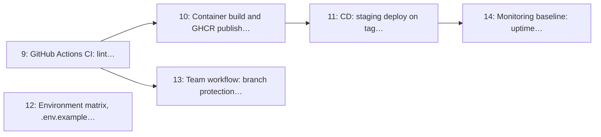

# Milestone 2: CI/CD, Environments & Team Workflow

> **In short:** A merge gate, a release pipeline and team rules, so broken code cannot reach `main` and a tag is all it takes to deploy.

| | |
|---|---|
| **Status** | ✅ Done: issues 9–14 closed on 2026-09-11, release note [`v0.2.0`](../RELEASES/RELEASE_v0_2_0.md). Three exit criteria are met only in part until hosts and a team channel exist (below) |
| **Progress** | 🟩🟩🟩🟩🟩🟩🟩🟩🟩🟩 **100%** (6/6 issues) |
| **Sprints** | 2 (weeks 3–4), semester 1. The sprint plan spreads its issues over sprints 2–3: some are scheduled after this window, which moves the milestone's close (and its tag) to sprint 3 (see the table) |
| **Release tag** | `v0.2.0` |
| **Primary owner** | E, DevOps/QA |
| **Who does the work** | E: 6 issues (see each issue for the backup) |
| **Issues** | 9–14 (6 issues, about 8 person-days of estimates) |
| **Depends on** | [M1](M1_foundation_local_ci.md) |
| **Blocks** | Nothing functionally, but running it late means every branch merges without a gate. Deliver it inside Sprint 2 or the team pays for it in integration pain from [M5](M5_discovery_geolocation.md) onwards. |

## Goal

Automate the quality gate and the deployment path, and encode the team's collaboration rules (branch names, PR template, CODEOWNERS, labels) so that six people merging into one `main` stays cheap and predictable.

## Why this milestone exists

This is a **six-person student project on the GitHub Free plan**, which means two constraints shape
the pipeline: Actions minutes are finite, and nobody is available to babysit a broken `main` at
23:00 the night before a demo. The answer is the same one the sibling `clinicq` project landed
on: a **local** gate that every developer runs before pushing (`./scripts/ci-local.sh`), a **cheap**
CI on pull requests, and **deployment only on tags**.

CODEOWNERS is not bureaucracy here; it is the anti-blocking mechanism. It routes a review to the
person who owns that module so nobody waits on the one teammate who happens to be online.

## Scope

- GitHub Actions CI: ruff, mypy, pytest with Postgres/PostGIS + Redis services, timeouts and caching
- Container image build and publish to GHCR on tag
- CD workflow deploying to the staging VPS on tag, with a manual production approval step
- `.env.example`, environment matrix (local / staging / production), fail-fast config validation
- Branch protection, PR template, issue templates, CODEOWNERS, `labels.yml` sync
- Monitoring baseline: uptime checks, error tracking, deploy notifications

## Issues

| # | Issue | Owner | Estimate | Sprint | Needs first (this milestone) |
|---|-------|-------|----------|--------|------------------------------|
| [9](../ISSUES/M2/ISSUE_9_actions_ci_lint_type_test.md) | GitHub Actions CI: lint, type-check, test with PostGIS + Redis services | E | 2 days | 2 | nothing |
| [10](../ISSUES/M2/ISSUE_10_container_build_ghcr_release.md) | Container build and GHCR publish on tag | E | 1 day | 2 | [9](../ISSUES/M2/ISSUE_9_actions_ci_lint_type_test.md) |
| [11](../ISSUES/M2/ISSUE_11_cd_staging_prod_approval.md) | CD: staging deploy on tag, production behind manual approval | E | 2 days | 3 | [10](../ISSUES/M2/ISSUE_10_container_build_ghcr_release.md) |
| [12](../ISSUES/M2/ISSUE_12_env_matrix_config_validation.md) | Environment matrix, `.env.example` and fail-fast config validation | E | 1 day | 3 | nothing |
| [13](../ISSUES/M2/ISSUE_13_team_workflow_templates_codeowners.md) | Team workflow: branch protection, PR/issue templates, CODEOWNERS, labels sync | E | 1 day | 3 | [9](../ISSUES/M2/ISSUE_9_actions_ci_lint_type_test.md) |
| [14](../ISSUES/M2/ISSUE_14_monitoring_baseline_alerts.md) | Monitoring baseline: uptime checks, error tracking, deploy notifications | E | 1 day | 3 | [11](../ISSUES/M2/ISSUE_11_cd_staging_prod_approval.md) |

## Order of work

Arrows point from an issue to the issues that need it. Start with the ones on the left; anything not connected by an arrow can run in parallel.

**Start here:** [Issue 9](../ISSUES/M2/ISSUE_9_actions_ci_lint_type_test.md), [Issue 12](../ISSUES/M2/ISSUE_12_env_matrix_config_validation.md).

**Needed from other milestones** (merged, or stubbed by agreement, before the issues that use them start):

- [Issue 1](../ISSUES/M1/ISSUE_1_repo_scaffold_app_factory.md) (M1): Repository scaffold, Python 3.14 + FastAPI app factory, typed settings; needed by 12
- [Issue 7](../ISSUES/M1/ISSUE_7_ci_local_harness_precommit.md) (M1): `ci-local.sh` harness (ruff, mypy, pytest, docker build) + pre-commit; needed by 9
- [Issue 8](../ISSUES/M1/ISSUE_8_test_factories_seed_data.md) (M1): Test factories and `seed_dev_data.py` demo dataset; needed by 9

## Exit criteria

- [x] A pull request runs lint + type-check + tests and blocks merge on failure (Issue 9: PR #121 was blocked by its red CI gate)
- [ ] Pushing a `v*.*.*` tag builds an image, publishes it to GHCR and deploys it to staging. **Partly (Issues 10, 11):** a tag builds, checks and publishes one image in under 4 minutes and starts a staging deploy by itself; with no staging host yet (Issue 102) that deploy reports "not provisioned". Every host step was proven on a local stand-in
- [x] Production deploys require an explicit approval from the DevOps/QA Lead (Issue 11: the `production` Environment; a production run waited with 0 steps run)
- [x] The app refuses to boot with a missing or default secret outside local development (Issues 1 and 12: every problem in one error)
- [ ] Every issue and PR carries a milestone, an area label and a CODEOWNERS-routed reviewer. **Partly (Issue 13):** every M2 issue and PR has milestone M2 and `AREA: Infra`; CODEOWNERS routes every path to one reviewer until `WORKLOAD_SPLIT.md` §1 names the team, and GitHub requests no review from an author who owns every path
- [ ] Staging downtime raises an alert in the team channel within 5 minutes. **Partly (Issue 14):** one alert, naming the responsible role, 122 s into an outage and none more for its 6.5 minutes, shown on a local stand-in; no staging host or team channel exists yet

## Demo at the end of the milestone

What the team shows at the sprint review to prove the milestone is done:

- A PR with a failing test is blocked; the same PR fixed goes green and merges after one approval.
- A `v0.2.0` tag builds an image, publishes it to GHCR and deploys it to staging with no human action.
- An intentional staging outage produces an alert in the team channel.

---

**Navigation:** [GitHub docs index](../README.md) · [How to read a milestone](README.md) · [Implementation plan](../../PLAN/IMPLEMENTATION_PLAN.md) · [Workload split](../../TEAM/WORKLOAD_SPLIT.md) · [Issues](../ISSUES/M2/)
