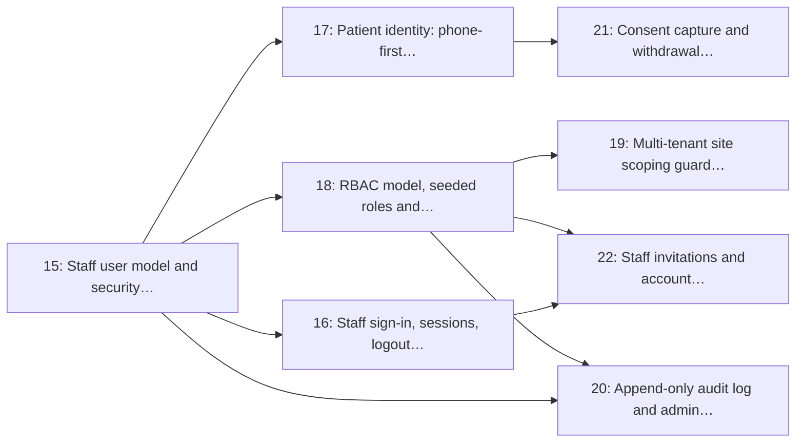

# Milestone 3: Identity, Auth, RBAC & Consent

> **In short:** Staff accounts, patient phone identity, roles, per-clinic data isolation, the audit trail and consent: the trust layer everything else stands on.

| | |
|---|---|
| **Status** | ✅ Done: issues 15–22 closed on 2026-09-12, release note [`v0.3.0`](../RELEASES/RELEASE_v0_3_0.md). Two exit criteria are met only in part until queues and tickets exist (below) |
| **Progress** | 🟩🟩🟩🟩🟩🟩🟩🟩🟩🟩 **100%** (8/8 issues) |
| **Sprints** | 3–4 (weeks 5–8), semester 2. The sprint plan spreads its issues over sprints 2–4: some start early against stubs (see the table) |
| **Release tag** | `v0.3.0` |
| **Primary owner** | A, Backend Lead |
| **Who does the work** | A: 7 issues · F: 1 issue (see each issue for the backup) |
| **Issues** | 15–22 (8 issues, about 19 person-days of estimates) |
| **Depends on** | [M1](M1_foundation_local_ci.md) |
| **Blocks** | [M4](M4_clinics_queues_config.md), [M7](M7_clinic_dashboard.md), [M12](M12_reporting_analytics.md), [M13](M13_security_privacy_compliance.md); every authenticated surface and every site-scoped query. Ship the RBAC dependency and the site-scoping guard **first** inside this milestone so the dashboard and clinic-admin work can start against them. |

## Goal

Give the platform two distinct identities: **staff**, who sign in with an account, and **patients**, who are identified by a phone number and an OTP, plus role-based access control, hard multi-tenant site scoping, an append-only audit log, and POPIA-grade consent capture.

## Why this milestone exists

ClinicQ is multi-tenant from the first pilot: two clinics share one database, and a receptionist at
Clinic A must never see a ticket at Clinic B. Retrofitting that guarantee later means auditing every
query in the codebase, so the **site-scoping dependency lands here**, before there is anything to
scope.

Patient identity is deliberately **not** an account. Asking someone to create a password before they
can join a queue kills the USSD and WhatsApp channels outright (M10) and most of the walk-in
population with them. A phone number plus a one-time PIN is the whole identity, and consent flags
ride on the patient record because the display board (M8) and the notification service (M9) both
have to check them before they act.

## Scope

- Staff accounts on the kernel's `user` table (no `staff_users`: Issue 15), password hashing, short-lived access JWT + rotating refresh cookie, CSRF
- Staff sign-in, sessions list, logout, password reset and staff invitation flow
- Patient identity: phone-first records, OTP verification, rate-limited resend, no password
- RBAC: roles `patient`, `receptionist`, `nurse_doctor`, `clinic_manager`, `platform_admin`; verb-based permissions enforced by FastAPI dependencies
- Multi-tenancy: a `require_site_access` dependency and a query guard so cross-site reads are impossible
- Append-only audit log with actor, action, target, site and request id, plus an admin read API
- Consent model: display consent, notification consent, comment-on-board consent, each with capture and withdrawal

## Issues

| # | Issue | Owner | Estimate | Sprint | Needs first (this milestone) |
|---|-------|-------|----------|--------|------------------------------|
| [15](../ISSUES/M3/ISSUE_15_staff_user_security_core.md) | Staff user model and security core (JWT, refresh rotation, password hashing) | A | 3 days | 2 | nothing |
| [16](../ISSUES/M3/ISSUE_16_staff_signin_sessions_csrf.md) | Staff sign-in, sessions, logout, CSRF and password reset | A | 2 days | 3 | [15](../ISSUES/M3/ISSUE_15_staff_user_security_core.md) |
| [17](../ISSUES/M3/ISSUE_17_patient_identity_otp.md) | Patient identity: phone-first records with OTP verification | A | 3 days | 3 | [15](../ISSUES/M3/ISSUE_15_staff_user_security_core.md) |
| [18](../ISSUES/M3/ISSUE_18_rbac_roles_enforcement.md) | RBAC model, seeded roles and enforcement dependencies | A | 3 days | 4 | [15](../ISSUES/M3/ISSUE_15_staff_user_security_core.md) |
| [19](../ISSUES/M3/ISSUE_19_site_scoping_guard.md) | Multi-tenant site scoping guard and cross-site access tests | A | 2 days | 4 | [18](../ISSUES/M3/ISSUE_18_rbac_roles_enforcement.md) |
| [20](../ISSUES/M3/ISSUE_20_audit_log_admin_api.md) | Append-only audit log and admin read API | A | 2 days | 4 | [15](../ISSUES/M3/ISSUE_15_staff_user_security_core.md), [18](../ISSUES/M3/ISSUE_18_rbac_roles_enforcement.md) |
| [21](../ISSUES/M3/ISSUE_21_consent_capture_withdrawal.md) | Consent capture and withdrawal (display, notifications, board comment) | F | 2 days | 3 | [17](../ISSUES/M3/ISSUE_17_patient_identity_otp.md) |
| [22](../ISSUES/M3/ISSUE_22_staff_invitations_account_settings.md) | Staff invitations and account settings | A | 2 days | 4 | [16](../ISSUES/M3/ISSUE_16_staff_signin_sessions_csrf.md), [18](../ISSUES/M3/ISSUE_18_rbac_roles_enforcement.md) |

## Order of work

Arrows point from an issue to the issues that need it. Start with the ones on the left; anything not connected by an arrow can run in parallel.

**Start here:** [Issue 15](../ISSUES/M3/ISSUE_15_staff_user_security_core.md).

**Needed from other milestones** (merged, or stubbed by agreement, before the issues that use them start):

- [Issue 3](../ISSUES/M1/ISSUE_3_sqlalchemy_alembic_baseline.md) (M1): Async SQLAlchemy 2.x + Alembic baseline (PostGIS extension enabled); needed by 15
- [Issue 4](../ISSUES/M1/ISSUE_4_shared_kernel_enums_time_errors.md) (M1): Shared kernel: enums, error envelope, IDs, Africa/Johannesburg datetimes; needed by 15, 17

## Exit criteria

- [x] A clinic manager can invite a receptionist, who activates the account and signs in (Issue 22: the invitation link carries only its id, acceptance is single-use and grants one role at that clinic)
- [x] Access tokens expire in 15 minutes; refresh rotates and detects reuse; logout revokes (Issues 15, 16: a replayed token revokes the whole family, shown by a test that replays one)
- [ ] A patient joins a queue with a phone number and a 6-digit OTP, with no account created. **Partly (Issue 17):** the identity half is done — one number is one patient, the code is single-use and never reaches a log, and no password column exists — but there is no queue to join until [M4](M4_clinics_queues_config.md) and [M6](M6_queue_engine_core.md)
- [x] A receptionist at Clinic A receives 404 (not 403) for any Clinic B resource, proven by tests (Issue 19: one helper, 404 before any permission is considered, with a guard that fails on a query built outside it)
- [ ] Every state-changing action writes one audit row that cannot be updated or deleted. **Partly (Issue 20):** `UPDATE`, `DELETE` and `TRUNCATE` are each refused by the database and proven against PostgreSQL, and a guard fails the build when a mutating route records nothing — but the priority reorder, display-mode change and no-show the issue names have no routes yet (Issues 46, 27, 43)
- [x] Consent is stored per patient per purpose, is withdrawable, and withdrawal takes effect immediately (Issue 21: the default is no on every channel, and a withdrawal stops a message already queued). The wording ships as F's draft, `2026-09-v1-draft`, pending their review

## Demo at the end of the milestone

What the team shows at the sprint review to prove the milestone is done:

- A receptionist, a nurse and a clinic manager sign in and each see only what their role allows.
- A Clinic A token asks for a Clinic B record and gets 404.
- A patient verifies a phone number with a 6-digit code; the audit log shows every step.

---

**Navigation:** [GitHub docs index](../README.md) · [How to read a milestone](README.md) · [Implementation plan](../../PLAN/IMPLEMENTATION_PLAN.md) · [Workload split](../../TEAM/WORKLOAD_SPLIT.md) · [Issues](../ISSUES/M3/)
