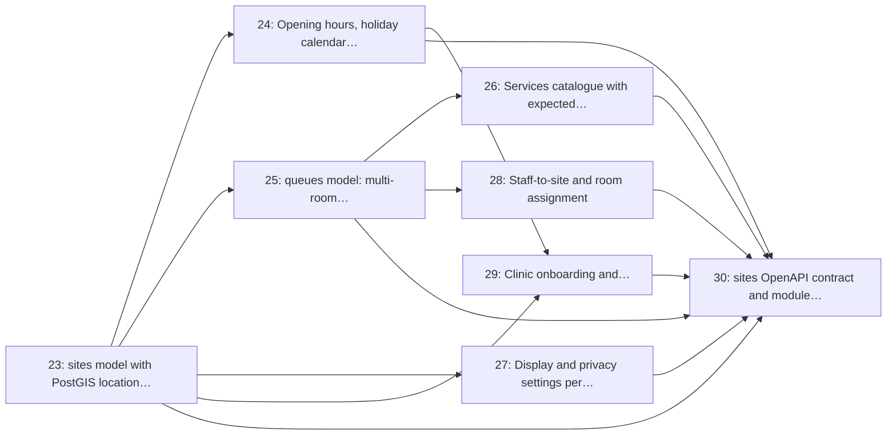

# Milestone 4: Clinics, Queues & Configuration

> **In short:** Clinics exist in the system with a location, opening hours, queues, services, staff and privacy settings, and can sign themselves up.

| | |
|---|---|
| **Status** | 📋 Planned |
| **Progress** | ⬜⬜⬜⬜⬜⬜⬜⬜⬜⬜ **0%** (0/8 issues) |
| **Sprints** | 4–5 (weeks 7–10), semester 1 |
| **Release tag** | `v0.4.0` |
| **Primary owner** | A, Backend Lead · D, Frontend/Clinic |
| **Who does the work** | A: 7 issues · F: 1 issue (see each issue for the backup) |
| **Issues** | 23–30 (8 issues, about 14 person-days of estimates) |
| **Depends on** | [M3](M3_identity_auth_rbac.md) |
| **Blocks** | [M5](M5_discovery_geolocation.md) (discovery reads `sites`), [M6](M6_queue_engine_core.md) (tickets belong to `queues`), [M7](M7_clinic_dashboard.md), [M8](M8_display_monitor.md). This is the **widest bottleneck in the project**, see the workload split doc. |

## Goal

Model the clinic itself: its location, sector, opening hours, rooms and services, its named queues, its display and privacy settings, and the workflow by which a new clinic is onboarded and verified.

## Why this milestone exists

Almost every other module reads a `site` or a `queue`. Discovery searches sites by distance, tickets
hang off queues, the display board renders a site's privacy mode, and reporting aggregates by site
and queue. That makes M4 the single most blocking milestone in the plan, and the reason the
workload split asks the Backend Lead to land **Issue 23 (sites) and Issue 25 (queues) in the first
three days of Sprint 4**, ahead of the rest of the milestone, so four other people can unblock.

Multi-room queueing is not a nice-to-have: a real clinic visit is triage → doctor → pharmacy, and a
system that models one line per clinic will be abandoned by week two of a pilot.

## Scope

- `sites`: name, sector (public/private), `geography(Point, 4326)` location, address, phone, status
- Opening hours, public-holiday calendar, and an operator-triggered temporary-closure broadcast
- `queues`: named per site (Triage, Doctor Room 1–3, Pharmacy), ordered, activatable
- Services/departments catalogue with a per-service expected service time that seeds wait estimates
- Display and privacy settings per site: `display_mode`, `display_show_comment`, retention window
- Staff-to-site assignment and room assignment
- Clinic self-service onboarding with platform-admin verification before the listing goes public
- Hand-written `sites` OpenAPI contract plus a drift test

## Issues

| # | Issue | Owner | Estimate | Sprint | Needs first (this milestone) |
|---|-------|-------|----------|--------|------------------------------|
| [23](../ISSUES/M4/ISSUE_23_sites_model_profile_crud.md) | `sites` model with PostGIS location and clinic profile CRUD | A | 3 days | 5 | nothing |
| [24](../ISSUES/M4/ISSUE_24_opening_hours_closures.md) | Opening hours, holiday calendar and temporary-closure broadcast | A | 2 days | 5 | [23](../ISSUES/M4/ISSUE_23_sites_model_profile_crud.md) |
| [25](../ISSUES/M4/ISSUE_25_queues_model_multiroom.md) | `queues` model: multi-room, multi-service queues per site | A | 2 days | 5 | [23](../ISSUES/M4/ISSUE_23_sites_model_profile_crud.md) |
| [26](../ISSUES/M4/ISSUE_26_services_catalogue_service_times.md) | Services catalogue with expected service times | A | 1 day | 5 | [25](../ISSUES/M4/ISSUE_25_queues_model_multiroom.md) |
| [27](../ISSUES/M4/ISSUE_27_display_privacy_settings.md) | Display and privacy settings per site | A | 1 day | 5 | [23](../ISSUES/M4/ISSUE_23_sites_model_profile_crud.md) |
| [28](../ISSUES/M4/ISSUE_28_staff_site_room_assignment.md) | Staff-to-site and room assignment | A | 1 day | 5 | [25](../ISSUES/M4/ISSUE_25_queues_model_multiroom.md) |
| [29](../ISSUES/M4/ISSUE_29_clinic_onboarding_verification.md) | Clinic onboarding and platform-admin verification workflow | F | 2 days | 4 | [23](../ISSUES/M4/ISSUE_23_sites_model_profile_crud.md), [24](../ISSUES/M4/ISSUE_24_opening_hours_closures.md) |
| [30](../ISSUES/M4/ISSUE_30_sites_openapi_contract_tests.md) | `sites` OpenAPI contract and module tests | A | 2 days | 5 | [23](../ISSUES/M4/ISSUE_23_sites_model_profile_crud.md), [24](../ISSUES/M4/ISSUE_24_opening_hours_closures.md), [25](../ISSUES/M4/ISSUE_25_queues_model_multiroom.md), [26](../ISSUES/M4/ISSUE_26_services_catalogue_service_times.md), [27](../ISSUES/M4/ISSUE_27_display_privacy_settings.md), [28](../ISSUES/M4/ISSUE_28_staff_site_room_assignment.md), [29](../ISSUES/M4/ISSUE_29_clinic_onboarding_verification.md) |

## Order of work

Arrows point from an issue to the issues that need it. Start with the ones on the left; anything not connected by an arrow can run in parallel.

**Start here:** [Issue 23](../ISSUES/M4/ISSUE_23_sites_model_profile_crud.md).

**Needed from other milestones** (merged, or stubbed by agreement, before the issues that use them start):

- [Issue 3](../ISSUES/M1/ISSUE_3_sqlalchemy_alembic_baseline.md) (M1): Async SQLAlchemy 2.x + Alembic baseline (PostGIS extension enabled); needed by 23
- [Issue 19](../ISSUES/M3/ISSUE_19_site_scoping_guard.md) (M3): Multi-tenant site scoping guard and cross-site access tests; needed by 23
- [Issue 21](../ISSUES/M3/ISSUE_21_consent_capture_withdrawal.md) (M3): Consent capture and withdrawal (display, notifications, board comment); needed by 27
- [Issue 22](../ISSUES/M3/ISSUE_22_staff_invitations_account_settings.md) (M3): Staff invitations and account settings; needed by 28

## Exit criteria

- [ ] A clinic can be created with a real coordinate and appears in a PostGIS distance query
- [ ] A site carries 1..n named queues, and a queue can be deactivated without deleting its history
- [ ] Opening hours drive an `is_open_now` flag that respects public holidays and ad-hoc closures
- [ ] Display mode defaults to `number_only` on every newly created site, never anything else
- [ ] A new clinic stays invisible in discovery until a platform admin verifies it
- [ ] `sites.yaml` documents every route the sites router serves, enforced by a drift test

## Demo at the end of the milestone

What the team shows at the sprint review to prove the milestone is done:

- A clinic registers through the public form, a platform admin verifies it, and it appears with its default queues.
- The manager sets hours and a holiday; the clinic reports "closed, opens 07:00" correctly.
- The new clinic's display mode is `number_only` without anyone choosing it.

---

**Navigation:** [GitHub docs index](../README.md) · [How to read a milestone](README.md) · [Implementation plan](../../PLAN/IMPLEMENTATION_PLAN.md) · [Workload split](../../TEAM/WORKLOAD_SPLIT.md) · [Issues](../ISSUES/M4/)
