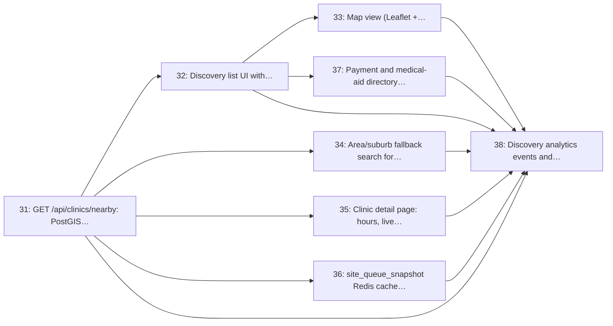

# Milestone 5: Discovery & Geolocation

> **In short:** Patients can find nearby clinics, public or private, by GPS or suburb, with live queue lengths, on a list or a map.

| | |
|---|---|
| **Status** | ✅ Done: issues 31–38 closed with the merge of #154, release note [`v0.5.0`](../RELEASES/RELEASE_v0_5_0.md). One exit criterion and the throttled-phone demo are met only in part (below) |
| **Progress** | 🟩🟩🟩🟩🟩🟩🟩🟩🟩🟩 **100%** (8/8 issues) |
| **Sprints** | 5–6 (weeks 9–12), semester 2. The sprint plan spreads its issues over sprints 2–6: some start early against stubs (see the table) |
| **Release tag** | `v0.5.0` |
| **Primary owner** | C, Frontend/Patient · A, Backend Lead |
| **Who does the work** | A: 3 issues · C: 3 issues · F: 2 issues (see each issue for the backup) |
| **Issues** | 31–38 (8 issues, about 18 person-days of estimates) |
| **Depends on** | [M4](M4_clinics_queues_config.md) |
| **Blocks** | [M9](M9_notifications_patient_pwa.md) (the patient PWA links from discovery), [M10](M10_ussd_whatsapp_channels.md) (USSD/WhatsApp reuse the same search service) |

## Goal

Let a patient find the right clinic before thinking about a queue: a PostGIS radius search from GPS or a typed suburb, a public/private/all toggle, a map and list view, live queue length per clinic, and a self-reported payment/medical-aid filter for private clinics.

## Why this milestone exists

The original ClinicQueue brief was queue management for one clinic. The discovery layer is what turns
it into a product a patient would open unprompted, closer to "Maps for clinics, with a live queue
attached" than to practice-management software, and the thing no incumbent
(Qminder, Qless, Qmatic, NHS e-RS) offers at ordinary clinic scale in this market.

The **search service is channel-agnostic on purpose**: the same `find_nearby_sites()` call serves the
web page, the USSD menu and the WhatsApp bot, so M10 adds a thin adapter rather than a second search
implementation. The medical-aid filter is explicitly a **self-reported directory attribute** with a
"confirm with the clinic" disclaimer, not an eligibility check, because sending a patient to a
clinic that will not take their scheme is worse than not filtering at all.

## Scope

- `find_nearby_sites()` service: `ST_DWithin` + distance ordering, open/closed, live queue length
- Discovery list UI with sector toggle (Public / Private / All) and clear sector badges
- Map view on Leaflet + OpenStreetMap tiles with pin clustering and a 'directions' hand-off
- Area/suburb fallback for patients who decline GPS, using an area centroid
- Clinic detail page: hours, queue length, expected wait, services, phone, directions
- `site_queue_snapshot` cache in Redis so list rendering never runs a per-site ticket count
- `site_payment_profile`: accepts cash/card, self-reported medical-aid tags, copay notice, filterable only under 'Private'
- Discovery analytics events (viewed vs joined) and a discovery OpenAPI contract

## Issues

| # | Issue | Owner | Estimate | Sprint | Needs first (this milestone) |
|---|-------|-------|----------|--------|------------------------------|
| [31](../ISSUES/M5/ISSUE_31_clinics_nearby_postgis_search.md) | `GET /api/clinics/nearby`: PostGIS radius search with distance and ETA | A | 3 days | 5 | nothing |
| [32](../ISSUES/M5/ISSUE_32_discovery_list_ui_sector_toggle.md) | Discovery list UI with public/private/all toggle and sector badges | C | 3 days | 3–5 | [31](../ISSUES/M5/ISSUE_31_clinics_nearby_postgis_search.md) |
| [33](../ISSUES/M5/ISSUE_33_discovery_map_leaflet_osm.md) | Map view (Leaflet + OpenStreetMap) with clustering and directions hand-off | C | 2 days | 4 | [32](../ISSUES/M5/ISSUE_32_discovery_list_ui_sector_toggle.md) |
| [34](../ISSUES/M5/ISSUE_34_area_fallback_search.md) | Area/suburb fallback search for patients without GPS | A | 2 days | 2 | [31](../ISSUES/M5/ISSUE_31_clinics_nearby_postgis_search.md) |
| [35](../ISSUES/M5/ISSUE_35_clinic_detail_page.md) | Clinic detail page: hours, live queue length, services, contact | C | 2 days | 5 | [31](../ISSUES/M5/ISSUE_31_clinics_nearby_postgis_search.md) |
| [36](../ISSUES/M5/ISSUE_36_queue_snapshot_cache.md) | `site_queue_snapshot` Redis cache with warm and invalidate paths | A | 2 days | 5–6 | [31](../ISSUES/M5/ISSUE_31_clinics_nearby_postgis_search.md) |
| [37](../ISSUES/M5/ISSUE_37_payment_medical_aid_filter.md) | Payment and medical-aid directory filter (private clinics only) | F | 2 days | 5 | [32](../ISSUES/M5/ISSUE_32_discovery_list_ui_sector_toggle.md) |
| [38](../ISSUES/M5/ISSUE_38_discovery_analytics_contract.md) | Discovery analytics events and discovery OpenAPI contract | F | 2 days | 6 | [31](../ISSUES/M5/ISSUE_31_clinics_nearby_postgis_search.md), [32](../ISSUES/M5/ISSUE_32_discovery_list_ui_sector_toggle.md), [33](../ISSUES/M5/ISSUE_33_discovery_map_leaflet_osm.md), [34](../ISSUES/M5/ISSUE_34_area_fallback_search.md), [35](../ISSUES/M5/ISSUE_35_clinic_detail_page.md), [36](../ISSUES/M5/ISSUE_36_queue_snapshot_cache.md), [37](../ISSUES/M5/ISSUE_37_payment_medical_aid_filter.md) |

## Order of work

Arrows point from an issue to the issues that need it. Start with the ones on the left; anything not connected by an arrow can run in parallel.

**Start here:** [Issue 31](../ISSUES/M5/ISSUE_31_clinics_nearby_postgis_search.md).

**Needed from other milestones** (merged, or stubbed by agreement, before the issues that use them start):

- [Issue 23](../ISSUES/M4/ISSUE_23_sites_model_profile_crud.md) (M4): `sites` model with PostGIS location and clinic profile CRUD; needed by 31, 37
- [Issue 24](../ISSUES/M4/ISSUE_24_opening_hours_closures.md) (M4): Opening hours, holiday calendar and temporary-closure broadcast; needed by 35
- [Issue 25](../ISSUES/M4/ISSUE_25_queues_model_multiroom.md) (M4): `queues` model: multi-room, multi-service queues per site; needed by 36

## Exit criteria

- [x] Searching from a coordinate returns clinics within the radius, nearest first, in under 200 ms
      with 500 seeded clinics (Issue 31). The GiST index is asserted from `EXPLAIN`, and the budget
      is the median of seven runs against PostGIS, including `open_now`.
- [x] The sector toggle filters correctly, and payment filters are hidden entirely when 'Public' is
      selected (Issues 32, 37). Absent from the page, not greyed out, and refused by the API with a
      `422` under any sector but Private, so no client can send them.
- [x] Declining GPS still produces results via a typed suburb name (Issue 34), misspellings included,
      from 2,081 OpenStreetMap places in Gauteng and KwaZulu-Natal. Distances from an area's centroid
      are labelled approximate everywhere they appear.
- [x] Each result shows a live queue length no more than 30 seconds stale (Issue 36). **Partly:** the
      snapshot refuses to serve a figure older than `QUEUE_SNAPSHOT_MAX_AGE_SECONDS` (30) and a
      flushed cache is slower, never wrong, but there are no tickets to count until Issue 39 (M6), so
      every queue reads "not measured" rather than a number until then.
- [x] The map degrades to the list view on a slow connection rather than blocking the page (Issue 33).
      Leaflet loads only when the map is opened; tile failures and an eight-second timeout fall back
      to the list, demonstrated by blocking the tile host.
- [x] A medical-aid tag is visibly labelled as clinic-reported, with a confirm-with-the-clinic
      disclaimer (Issue 37), on the card, the detail page, the API and the manager's editor.

Also delivered with the last issue (38): anonymous discovery events (search, clinic view, join
started, join completed) whose stored rows carry no identifier beyond a daily-rotating session
reference, a per-clinic opt-out and view-to-join report, a rate limit on the public search, and
`contracts/discovery.yaml` under the Issue 30 drift test.

## Demo at the end of the milestone

What the team shows at the sprint review to prove the milestone is done:

- On a throttled phone, the list of nearby clinics appears within 2 seconds, and the sector toggle re-filters it without a reload.
  **Partly (Issue 32):** about 1.5 s on DevTools' 3G preset and 2.1 s on a return visit, but about
  5 s for a cold first load on the Slow 3G preset; the re-filter is an htmx swap, no reload.
- With location declined, a typed suburb (misspelt on purpose) still finds clinics.
- The map shows the same clinics, and "Directions" opens the phone's maps app.

---

**Navigation:** [GitHub docs index](../README.md) · [How to read a milestone](README.md) · [Implementation plan](../../PLAN/IMPLEMENTATION_PLAN.md) · [Workload split](../../TEAM/WORKLOAD_SPLIT.md) · [Issues](../ISSUES/M5/)
