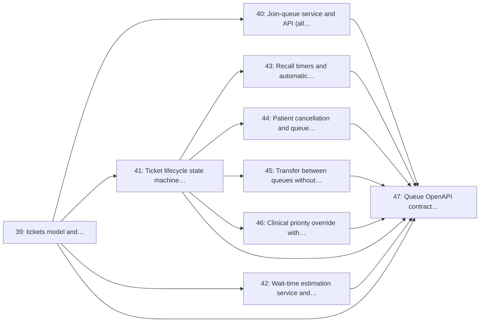

# Milestone 6: Queue Engine Core

> **In short:** The queue engine: fair, concurrency-safe ticket numbers, a strict lifecycle, honest wait ranges, recall, transfers and audited priority.

| | |
|---|---|
| **Status** | 🚧 In progress · **critical path**: issues 39 (tickets and their numbering), 40 (the one join service) and 41 (the lifecycle) delivered |
| **Progress** | 🟩🟩🟩⬜⬜⬜⬜⬜⬜⬜ **33%** (3/9 issues) |
| **Sprints** | 6–7 (weeks 11–14), semester 2 |
| **Release tag** | `v0.6.0` |
| **Primary owner** | A, Backend Lead |
| **Who does the work** | A: 9 issues (see each issue for the backup) |
| **Issues** | 39–47 (9 issues, about 22 person-days of estimates) |
| **Depends on** | [M4](M4_clinics_queues_config.md) ([M3](M3_identity_auth_rbac.md) for patient identity) |
| **Blocks** | [M7](M7_clinic_dashboard.md), [M8](M8_display_monitor.md), [M9](M9_notifications_patient_pwa.md), [M10](M10_ussd_whatsapp_channels.md), [M11](M11_appointments_checkin_patient_care.md), [M12](M12_reporting_analytics.md); the entire second half of the project. This is the critical path, so protect it. |

## Goal

Build the heart of the product: one fair queue per room, joined from any channel, with concurrency-safe ticket numbering, a strict lifecycle, honest wait estimates, recall and no-show handling, transfers between rooms, and audited clinical priority overrides.

## Why this milestone exists

Every other surface is a view onto this engine. The two rules that matter most are worth stating as
invariants rather than features:

1. **One queue, not two.** A remote join and a walk-in take numbers from the *same* sequence. The
   common failure mode in naive queue apps is an online line that quietly jumps the physical line;
   patients notice within a day and staff stop using the system.
2. **Numbering is concurrency-safe.** Two receptionists tapping *Add walk-in* at the same instant
   must not both get `#043`. This is enforced in the database, not in Python.

Wait estimates are shown as a **range** ("~15–25 min"), never a single number, because a
false-precision estimate that slips is worse for trust than an honest band.

## Scope

- `tickets` model with a per-site, per-queue, per-day sequence allocated under a database constraint
- Join API used by every channel, with an abuse guard against duplicate and bulk joins
- Explicit lifecycle state machine: `waiting → called → in_progress → done | no_show | cancelled`
- Wait estimation from `wait_time_samples`, published as a range with a confidence signal
- Recall timers and automatic no-show transitions driven by `arq` scheduled jobs
- Patient-initiated cancellation with position recalculation for everyone behind
- Transfer between queues (triage → doctor → pharmacy) that preserves the visit
- Clinical priority override with a mandatory reason code, staff id and audit row
- Queue OpenAPI contract, concurrency tests and state-machine property tests

## Issues

| # | Issue | Owner | Estimate | Sprint | Needs first (this milestone) |
|---|-------|-------|----------|--------|------------------------------|
| [39](../ISSUES/M6/ISSUE_39_tickets_model_sequence.md) | `tickets` model and concurrency-safe daily sequence numbering | A | 3 days | 6 | nothing |
| [40](../ISSUES/M6/ISSUE_40_join_queue_service_api.md) | Join-queue service and API (all channels), with abuse guards | A | 3 days | 6 | [39](../ISSUES/M6/ISSUE_39_tickets_model_sequence.md) |
| [41](../ISSUES/M6/ISSUE_41_ticket_lifecycle_state_machine.md) | Ticket lifecycle state machine and illegal-transition rejection | A | 2 days | 6 | [39](../ISSUES/M6/ISSUE_39_tickets_model_sequence.md) |
| [42](../ISSUES/M6/ISSUE_42_wait_time_estimation.md) | Wait-time estimation service and `wait_time_samples` | A | 3 days | 7 | [39](../ISSUES/M6/ISSUE_39_tickets_model_sequence.md) |
| [43](../ISSUES/M6/ISSUE_43_recall_noshow_timers.md) | Recall timers and automatic no-show transitions (`arq` jobs) | A | 2 days | 7 | [41](../ISSUES/M6/ISSUE_41_ticket_lifecycle_state_machine.md) |
| [44](../ISSUES/M6/ISSUE_44_patient_cancel_recalculation.md) | Patient cancellation and queue position recalculation | A | 2 days | 7 | [41](../ISSUES/M6/ISSUE_41_ticket_lifecycle_state_machine.md) |
| [45](../ISSUES/M6/ISSUE_45_queue_transfer.md) | Transfer between queues without re-joining (triage → doctor → pharmacy) | A | 2 days | 7 | [41](../ISSUES/M6/ISSUE_41_ticket_lifecycle_state_machine.md) |
| [46](../ISSUES/M6/ISSUE_46_priority_override_audit.md) | Clinical priority override with reason codes and audit trail | A | 2 days | 7 | [41](../ISSUES/M6/ISSUE_41_ticket_lifecycle_state_machine.md) |
| [47](../ISSUES/M6/ISSUE_47_queue_contract_concurrency_tests.md) | Queue OpenAPI contract, concurrency and state-machine tests | A | 3 days | 7 | [39](../ISSUES/M6/ISSUE_39_tickets_model_sequence.md), [40](../ISSUES/M6/ISSUE_40_join_queue_service_api.md), [41](../ISSUES/M6/ISSUE_41_ticket_lifecycle_state_machine.md), [42](../ISSUES/M6/ISSUE_42_wait_time_estimation.md), [43](../ISSUES/M6/ISSUE_43_recall_noshow_timers.md), [44](../ISSUES/M6/ISSUE_44_patient_cancel_recalculation.md), [45](../ISSUES/M6/ISSUE_45_queue_transfer.md), [46](../ISSUES/M6/ISSUE_46_priority_override_audit.md) |

## Order of work

Arrows point from an issue to the issues that need it. Start with the ones on the left; anything not connected by an arrow can run in parallel.

**Start here:** [Issue 39](../ISSUES/M6/ISSUE_39_tickets_model_sequence.md).

**Needed from other milestones** (merged, or stubbed by agreement, before the issues that use them start):

- [Issue 2](../ISSUES/M1/ISSUE_2_docker_dev_stack_postgis_redis.md) (M1): Docker Compose dev stack: PostgreSQL 18 + PostGIS, Redis, API; needed by 43
- [Issue 17](../ISSUES/M3/ISSUE_17_patient_identity_otp.md) (M3): Patient identity: phone-first records with OTP verification; needed by 39
- [Issue 20](../ISSUES/M3/ISSUE_20_audit_log_admin_api.md) (M3): Append-only audit log and admin read API; needed by 46
- [Issue 25](../ISSUES/M4/ISSUE_25_queues_model_multiroom.md) (M4): `queues` model: multi-room, multi-service queues per site; needed by 39, 45
- [Issue 26](../ISSUES/M4/ISSUE_26_services_catalogue_service_times.md) (M4): Services catalogue with expected service times; needed by 42

## Exit criteria

- [ ] 100 concurrent joins on one queue produce 100 unique consecutive numbers, proven by a test
- [ ] Every illegal transition (e.g. `done → called`) is rejected with 409 and never mutates state
- [ ] A walk-in and a remote join issued in the same second occupy adjacent numbers in one sequence
- [ ] The estimate is a range derived from the last N completed visits on that queue, not a constant
- [ ] A called ticket that is not attended auto-recalls once, then becomes `no_show`, and the patient is told why
- [ ] A priority override cannot be saved without a reason code, and every one is visible in the audit log

## Demo at the end of the milestone

What the team shows at the sprint review to prove the milestone is done:

- The concurrency test issues 100 simultaneous joins and gets 100 consecutive numbers.
- A walk-in and a remote join in the same second get adjacent numbers in one sequence.
- A called patient who does not arrive is recalled once, then marked as a no-show automatically.

---

**Navigation:** [GitHub docs index](../README.md) · [How to read a milestone](README.md) · [Implementation plan](../../PLAN/IMPLEMENTATION_PLAN.md) · [Workload split](../../TEAM/WORKLOAD_SPLIT.md) · [Issues](../ISSUES/M6/)
