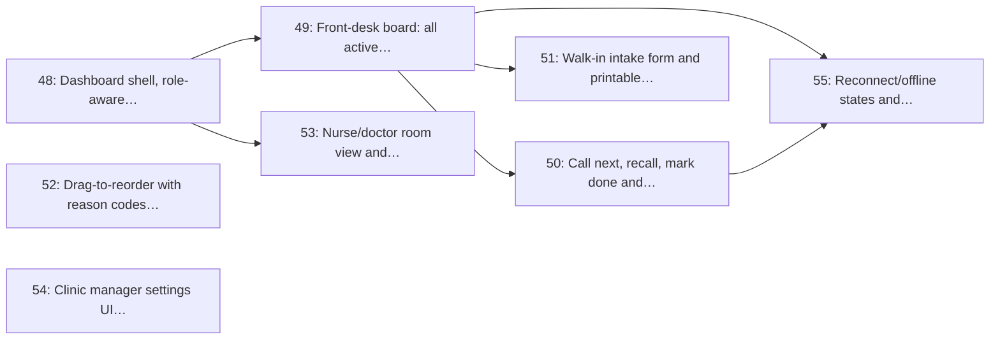

# Milestone 7: Clinic Dashboard

> **In short:** The screen reception and nurses keep open all day: every queue live, one big Call Next, walk-ins in seconds, and honest offline states.

| | |
|---|---|
| **Status** | ✅ Done: issues 48–55 closed with the merge of the Issue 55 pull request, release note [`v0.7.0`](../RELEASES/RELEASE_v0_7_0.md), whose tag follows that merge. Five exit criteria are met; the sixth (a call reaching the patient's phone and the waiting-room board within 2 seconds) is met for the staff screens and waits for Issues 57 and 68 for the other two |
| **Progress** | 🟩🟩🟩🟩🟩🟩🟩🟩🟩🟩 **100%** (8/8 issues) |
| **Sprints** | 8–9 (weeks 15–18), semester 2. The sprint plan spreads its issues over sprints 3–11: some start early against stubs and some are scheduled after this window, which moves the milestone's close (and its tag) to sprint 11 (see the table) |
| **Release tag** | `v0.7.0` |
| **Primary owner** | D, Frontend/Clinic |
| **Who does the work** | D: 8 issues (see each issue for the backup) |
| **Issues** | 48–55 (8 issues, about 18 person-days of estimates) |
| **Depends on** | [M6](M6_queue_engine_core.md) ([M3](M3_identity_auth_rbac.md) for roles) |
| **Blocks** | [M14](M14_production_pilot_golive.md) pilot; staff cannot run a clinic without it |

## Goal

Give reception, nurses and the clinic manager the one screen they run the day from: every active queue live, a big Call Next, walk-in intake, audited reordering, a private per-room view, and the settings that control the public board.

## Why this milestone exists

The dashboard is where the product either earns its place at the front desk or gets abandoned for the
paper list. Three design commitments come from that:

- **The primary action is enormous and always visible.** Call Next is used hundreds of times a day by
  someone who is also talking to a patient.
- **The board never lies about being live.** When the connection drops, the UI says so explicitly and
  shows the age of the data, rather than displaying a frozen queue that looks current.
- **Overrides are easy but recorded.** Staff must be able to bump a visibly unwell patient in two
  taps, and every bump is attributable, which is what keeps the "one fair queue" rule credible.

## Scope

- Auth-gated dashboard shell with role-aware navigation and site switching for multi-site staff
- Front-desk board: every active queue side by side, live via SSE with an htmx polling fallback
- Call next / recall / mark done / mark no-show actions with optimistic UI and rollback
- Walk-in intake: display name or initials, optional phone for notifications, optional reason, ticket stub
- Drag-to-reorder with a reason-code prompt and an inline audit trail
- Nurse/doctor room view limited to their own queue, with private visit notes
- Clinic manager settings UI: profile, hours, display mode, staff, services
- Reconnection and offline states, plus dashboard interaction tests

## Issues

| # | Issue | Owner | Estimate | Sprint | Needs first (this milestone) |
|---|-------|-------|----------|--------|------------------------------|
| [48](../ISSUES/M7/ISSUE_48_dashboard_shell_role_nav.md) | Dashboard shell, role-aware navigation and site switcher | D | 2 days | 3 | nothing |
| [49](../ISSUES/M7/ISSUE_49_front_desk_board_live.md) | Front-desk board: all active queues, live via SSE with polling fallback | D | 3 days | 6 | [48](../ISSUES/M7/ISSUE_48_dashboard_shell_role_nav.md) |
| [50](../ISSUES/M7/ISSUE_50_call_next_actions.md) | Call next, recall, mark done and no-show actions | D | 2 days | 7 | [49](../ISSUES/M7/ISSUE_49_front_desk_board_live.md) |
| [51](../ISSUES/M7/ISSUE_51_walkin_intake_ticket_stub.md) | Walk-in intake form and printable ticket stub | D | 2 days | 7 | [49](../ISSUES/M7/ISSUE_49_front_desk_board_live.md) |
| [52](../ISSUES/M7/ISSUE_52_reorder_ui_audit_trail.md) | Drag-to-reorder with reason codes and inline audit trail | D | 2 days | 8 | nothing |
| [53](../ISSUES/M7/ISSUE_53_nurse_room_view_visit_notes.md) | Nurse/doctor room view and private visit notes | D | 2 days | 8 | [48](../ISSUES/M7/ISSUE_48_dashboard_shell_role_nav.md) |
| [54](../ISSUES/M7/ISSUE_54_manager_settings_ui.md) | Clinic manager settings UI (profile, hours, display mode, staff, services) | D | 3 days | 9 | nothing |
| [55](../ISSUES/M7/ISSUE_55_dashboard_offline_tests.md) | Reconnect/offline states and dashboard interaction tests | D | 2 days | 11 | [49](../ISSUES/M7/ISSUE_49_front_desk_board_live.md), [50](../ISSUES/M7/ISSUE_50_call_next_actions.md) |

## Order of work

Arrows point from an issue to the issues that need it. Start with the ones on the left; anything not connected by an arrow can run in parallel.

**Start here:** [Issue 48](../ISSUES/M7/ISSUE_48_dashboard_shell_role_nav.md), [Issue 52](../ISSUES/M7/ISSUE_52_reorder_ui_audit_trail.md), [Issue 54](../ISSUES/M7/ISSUE_54_manager_settings_ui.md).

**Needed from other milestones** (merged, or stubbed by agreement, before the issues that use them start):

- [Issue 18](../ISSUES/M3/ISSUE_18_rbac_roles_enforcement.md) (M3): RBAC model, seeded roles and enforcement dependencies; needed by 48
- [Issue 24](../ISSUES/M4/ISSUE_24_opening_hours_closures.md) (M4): Opening hours, holiday calendar and temporary-closure broadcast; needed by 54
- [Issue 27](../ISSUES/M4/ISSUE_27_display_privacy_settings.md) (M4): Display and privacy settings per site; needed by 54
- [Issue 28](../ISSUES/M4/ISSUE_28_staff_site_room_assignment.md) (M4): Staff-to-site and room assignment; needed by 48, 53, 54
- [Issue 40](../ISSUES/M6/ISSUE_40_join_queue_service_api.md) (M6): Join-queue service and API (all channels), with abuse guards; needed by 49, 51
- [Issue 41](../ISSUES/M6/ISSUE_41_ticket_lifecycle_state_machine.md) (M6): Ticket lifecycle state machine and illegal-transition rejection; needed by 50
- [Issue 46](../ISSUES/M6/ISSUE_46_priority_override_audit.md) (M6): Clinical priority override with reason codes and audit trail; needed by 52

## Exit criteria

- [x] A receptionist can issue a walk-in ticket in under 10 seconds without using a keyboard shortcut
  (a name and Enter: 0.42–2.53 s in four keyboard-only flows, #176; a browser test in `tests/e2e`)
- [ ] Call Next updates the patient's phone and the waiting-room board within 2 seconds. **Met for the
  staff screens only**: a second device's front desk changed 320–369 ms after the click (#175). The
  waiting-room board (Issue 57) and the patient's ticket page (Issue 68) do not exist yet; every call is
  already published after its commit for them to listen to
- [x] A nurse signed into Room 2 sees only Room 2's queue and cannot call another room's ticket
  (another room's calls answer 404, #174 and #175)
- [x] Losing the network shows an explicit 'reconnecting, data from HH:MM' banner, never a frozen board
  (Reconnecting with the attempt, Updating every 5 seconds or Offline with the data's age; Offline
  within 10 seconds of the network going, #173 and Issue 55)
- [x] Private visit notes are never rendered on any public surface, proven by a test (#174)
- [x] Every reorder shows who did it and why, without leaving the board (#171)

## Demo at the end of the milestone

What the team shows at the sprint review to prove the milestone is done:

- A receptionist issues a walk-in in under 10 seconds and calls the next patient; a second browser sees it within 2 seconds.
- A nurse sees only their own room.
- The network is pulled: the dashboard says so, then recovers without a refresh.

---

**Navigation:** [GitHub docs index](../README.md) · [How to read a milestone](README.md) · [Implementation plan](../../PLAN/IMPLEMENTATION_PLAN.md) · [Workload split](../../TEAM/WORKLOAD_SPLIT.md) · [Issues](../ISSUES/M7/)
