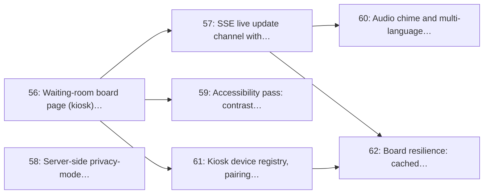

# Milestone 8: Waiting-room Display Monitor

> **In short:** The waiting-room TV: now serving and up next, legible across the room, spoken aloud, private by default, and self-healing after power cuts.

| | |
|---|---|
| **Status** | 🚧 In progress: issue 58 (the server-side privacy projection every board response passes through) delivered |
| **Progress** | 🟩⬜⬜⬜⬜⬜⬜⬜⬜⬜ **14%** (1/7 issues) |
| **Sprints** | 9 (weeks 17–18), semester 2. The sprint plan spreads its issues over sprints 5–11: some start early against stubs and some are scheduled after this window, which moves the milestone's close (and its tag) to sprint 11 (see the table) |
| **Release tag** | `v0.8.0` |
| **Primary owner** | D, Frontend/Clinic · E, DevOps/QA (device provisioning) |
| **Who does the work** | D: 4 issues · A: 2 issues · E: 1 issue (see each issue for the backup) |
| **Issues** | 56–62 (7 issues, about 15 person-days of estimates) |
| **Depends on** | [M6](M6_queue_engine_core.md), [M7](M7_clinic_dashboard.md) |
| **Blocks** | [M14](M14_production_pilot_golive.md) pilot |

## Goal

Ship the screen every patient in the waiting room stares at: now serving plus up next, live over SSE, privacy-mode aware, accessible at 5 metres, audible for patients who are not watching, and running unattended on a cheap kiosk box.

## Why this milestone exists

This is the most visible part of the product and the one with the sharpest privacy edge. Putting a
person's **name next to their symptom** on a public screen is health information about an identifiable
person, displayed publicly, squarely inside what POPIA treats as special personal information. So the
board's rules are architectural, not cosmetic:

- `number_only` is the hard default for every new site.
- A comment may appear **only** beside a ticket number, never beside a full name, unless the patient
  gave an explicit per-visit consent.
- The renderer applies the site's privacy mode **server-side**, so a mis-styled template can never
  leak a name that the mode forbids.

Accessibility is treated the same way. A board that a patient with low vision cannot read, or that a
patient looking at their phone never notices, has failed at its only job; hence the contrast, type-size
and audio-announcement requirements.

## Scope

- Kiosk board page: now serving, up next (3–5), per-queue panels, clock
- SSE update channel with exponential-backoff reconnect and a visible heartbeat
- Server-side privacy-mode rendering (`number_only` / `name_lite` / `full`) with consent gating
- Accessibility: WCAG 2.2 AA contrast, 5-metre legibility, colour-blind-safe status colours, reduced motion
- Audio chime and multi-language text-to-speech announcement of the called number and room
- Device registry: pairing code, kiosk provisioning, auto-launch on boot, heartbeat monitoring
- Resilience: last-known board cached locally, explicit stale banner, load-shedding recovery

## Issues

| # | Issue | Owner | Estimate | Sprint | Needs first (this milestone) |
|---|-------|-------|----------|--------|------------------------------|
| [56](../ISSUES/M8/ISSUE_56_board_page_kiosk.md) | Waiting-room board page (kiosk) with now-serving and up-next panels | D | 3 days | 5 | nothing |
| [57](../ISSUES/M8/ISSUE_57_board_sse_channel.md) | SSE live update channel with reconnect, backoff and heartbeat | A | 2 days | 9 | [56](../ISSUES/M8/ISSUE_56_board_page_kiosk.md) |
| [58](../ISSUES/M8/ISSUE_58_board_privacy_rendering.md) | Server-side privacy-mode rendering and consent gating | A | 2 days | 9 | nothing |
| [59](../ISSUES/M8/ISSUE_59_board_accessibility.md) | Accessibility pass: contrast, type scale, 5-metre legibility, reduced motion | D | 2 days | 10 | [56](../ISSUES/M8/ISSUE_56_board_page_kiosk.md) |
| [60](../ISSUES/M8/ISSUE_60_board_audio_tts.md) | Audio chime and multi-language text-to-speech call announcements | D | 2 days | 10 | [57](../ISSUES/M8/ISSUE_57_board_sse_channel.md) |
| [61](../ISSUES/M8/ISSUE_61_kiosk_device_registry.md) | Kiosk device registry, pairing codes and heartbeat monitoring | E | 2 days | 10 | [56](../ISSUES/M8/ISSUE_56_board_page_kiosk.md) |
| [62](../ISSUES/M8/ISSUE_62_board_resilience_tests.md) | Board resilience: cached last-known state, stale banner, recovery tests | D | 2 days | 10–11 | [57](../ISSUES/M8/ISSUE_57_board_sse_channel.md), [61](../ISSUES/M8/ISSUE_61_kiosk_device_registry.md) |

## Order of work

Arrows point from an issue to the issues that need it. Start with the ones on the left; anything not connected by an arrow can run in parallel.

**Start here:** [Issue 56](../ISSUES/M8/ISSUE_56_board_page_kiosk.md), [Issue 58](../ISSUES/M8/ISSUE_58_board_privacy_rendering.md).

**Needed from other milestones** (merged, or stubbed by agreement, before the issues that use them start):

- [Issue 21](../ISSUES/M3/ISSUE_21_consent_capture_withdrawal.md) (M3): Consent capture and withdrawal (display, notifications, board comment); needed by 58
- [Issue 23](../ISSUES/M4/ISSUE_23_sites_model_profile_crud.md) (M4): `sites` model with PostGIS location and clinic profile CRUD; needed by 61
- [Issue 26](../ISSUES/M4/ISSUE_26_services_catalogue_service_times.md) (M4): Services catalogue with expected service times; needed by 60
- [Issue 27](../ISSUES/M4/ISSUE_27_display_privacy_settings.md) (M4): Display and privacy settings per site; needed by 56, 58
- [Issue 41](../ISSUES/M6/ISSUE_41_ticket_lifecycle_state_machine.md) (M6): Ticket lifecycle state machine and illegal-transition rejection; needed by 56, 57

## Exit criteria

- [ ] The board updates within 2 seconds of Call Next, and recovers on its own after a 10-minute outage
- [ ] With `number_only` set, no request to the board endpoint returns a patient name in the payload at all
- [ ] A comment never renders alongside a full name unless per-visit consent is recorded
- [ ] Ticket numbers are legible at 5 metres on a 32-inch screen and pass AA contrast in a bright room
- [ ] A called ticket triggers a chime and a spoken announcement in the site's configured language
- [ ] An offline kiosk shows a stale banner with the timestamp of the last good update

## Demo at the end of the milestone

What the team shows at the sprint review to prove the milestone is done:

- Call next on the dashboard: the board updates and announces the number within 2 seconds.
- Under `number_only`, the board's network responses contain no names at all.
- The box is unplugged and plugged back in: the board returns by itself.

---

**Navigation:** [GitHub docs index](../README.md) · [How to read a milestone](README.md) · [Implementation plan](../../PLAN/IMPLEMENTATION_PLAN.md) · [Workload split](../../TEAM/WORKLOAD_SPLIT.md) · [Issues](../ISSUES/M8/)
