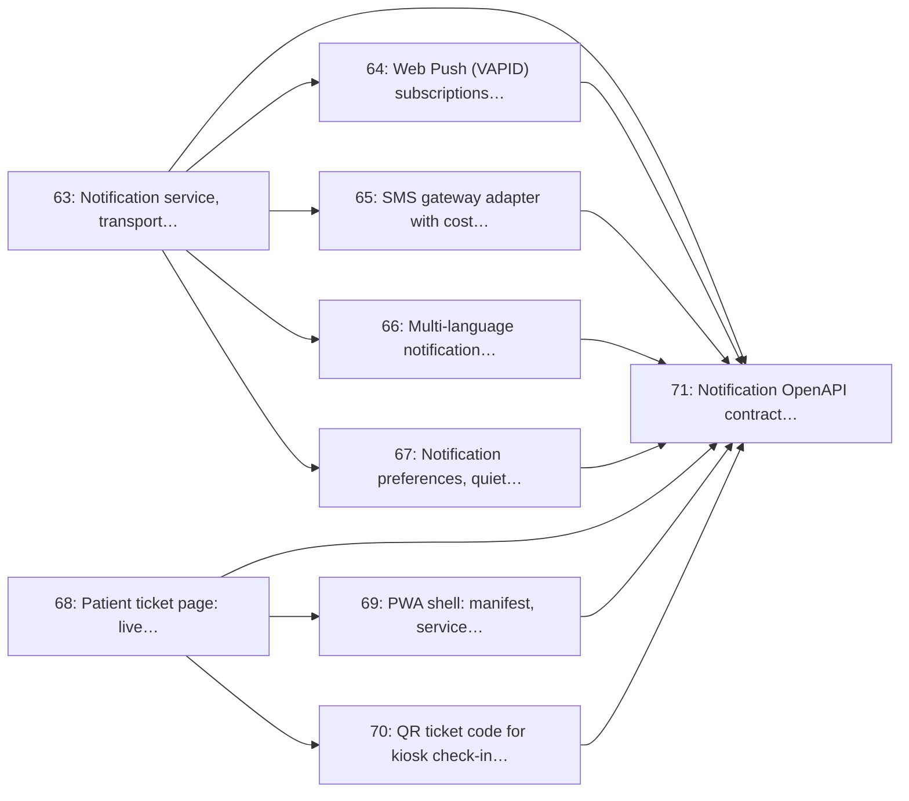

# Milestone 9: Notifications & Patient PWA

> **In short:** Patients hear when it is their turn (push, SMS or WhatsApp) and can follow their place in line from an installable app.

| | |
|---|---|
| **Status** | 🚧 In progress: the notification service, transports and delivery log (63), the patient ticket page (68), web push (64), the SMS gateway with cost caps (65), versioned templates with their editor (66; English only until Issue 77) patient preferences with quiet hours and STOP across every channel (67) the installable app with its offline last-known ticket (69) and the ticket QR and code with reception lookup (70) delivered |
| **Progress** | 🟩🟩🟩🟩🟩🟩🟩🟩🟩⬜ **89%** (8/9 issues) |
| **Sprints** | 9–10 (weeks 17–20), semester 2. The sprint plan spreads its issues over sprints 3–12: some start early against stubs and some are scheduled after this window, which moves the milestone's close (and its tag) to sprint 12 (see the table) |
| **Release tag** | `v0.9.0` |
| **Primary owner** | B, Integrations · C, Frontend/Patient |
| **Who does the work** | B: 7 issues · C: 2 issues (see each issue for the backup) |
| **Issues** | 63–71 (9 issues, about 19 person-days of estimates) |
| **Depends on** | [M6](M6_queue_engine_core.md) |
| **Blocks** | [M10](M10_ussd_whatsapp_channels.md) (channels reuse the notification service), [M11](M11_appointments_checkin_patient_care.md) (reminders) |

## Goal

Close the loop with the patient: a live ticket page that counts down, an installable PWA that still shows the last known position offline, and a notification service that reaches them by push, SMS or WhatsApp with preferences, quiet hours and cost guardrails respected.

## Why this milestone exists

The product's core promise is *"wait at home, not on a bench"*. That promise is only kept if the
"you're next" message actually arrives, which is why notifications are a **service with adapters and
a delivery log**, not a `send_sms()` call sprinkled through the queue code.

SMS costs real money per message on a student budget, so the send path carries a hard per-site daily
cap and prefers free transports (web push, WhatsApp session messages) before falling back to SMS.
Every send is recorded with its provider, cost and delivery status, which is also what makes the
no-show analysis in M12 meaningful: a high no-show rate caused by undelivered messages is a very
different problem from one caused by bad wait estimates.

## Scope

- Notification service with pluggable transports, a delivery log, retries and backoff
- Web Push (VAPID) subscription and the 'you're next' push
- SMS gateway adapter with delivery receipts, per-site daily cost caps and a kill switch
- Multi-language message templates with an admin editor and preview
- Patient preferences, quiet hours and opt-out handling that the sender must honour
- Patient ticket page: live position, ETA range countdown, cancel, directions
- PWA shell: manifest, service worker, offline last-known ticket, install prompt
- QR ticket code used for kiosk check-in (M11) and reception lookup
- Notification OpenAPI contract and delivery/failure tests

## Issues

| # | Issue | Owner | Estimate | Sprint | Needs first (this milestone) |
|---|-------|-------|----------|--------|------------------------------|
| [63](../ISSUES/M9/ISSUE_63_notification_service_adapters.md) | Notification service, transport adapters and delivery log | B | 3 days | 3 | nothing |
| [64](../ISSUES/M9/ISSUE_64_web_push_vapid.md) | Web Push (VAPID) subscriptions and 'you're next' push | B | 2 days | 5 | [63](../ISSUES/M9/ISSUE_63_notification_service_adapters.md) |
| [65](../ISSUES/M9/ISSUE_65_sms_gateway_cost_caps.md) | SMS gateway adapter with cost caps, delivery receipts and kill switch | B | 2 days | 5 | [63](../ISSUES/M9/ISSUE_63_notification_service_adapters.md) |
| [66](../ISSUES/M9/ISSUE_66_notification_templates_i18n.md) | Multi-language notification templates and admin editor | B | 2 days | 4 | [63](../ISSUES/M9/ISSUE_63_notification_service_adapters.md) |
| [67](../ISSUES/M9/ISSUE_67_notification_preferences_quiet_hours.md) | Notification preferences, quiet hours and opt-out enforcement | B | 2 days | 6 | [63](../ISSUES/M9/ISSUE_63_notification_service_adapters.md) |
| [68](../ISSUES/M9/ISSUE_68_patient_ticket_page.md) | Patient ticket page: live position, ETA countdown, cancel | C | 3 days | 7 | nothing |
| [69](../ISSUES/M9/ISSUE_69_pwa_shell_service_worker.md) | PWA shell: manifest, service worker, offline last-known ticket | C | 2 days | 7 | [68](../ISSUES/M9/ISSUE_68_patient_ticket_page.md) |
| [70](../ISSUES/M9/ISSUE_70_qr_ticket_code.md) | QR ticket code for kiosk check-in and reception lookup | B | 1 day | 8 | [68](../ISSUES/M9/ISSUE_68_patient_ticket_page.md) |
| [71](../ISSUES/M9/ISSUE_71_notifications_contract_tests.md) | Notification OpenAPI contract, delivery and retry tests | B | 2 days | 11–12 | [63](../ISSUES/M9/ISSUE_63_notification_service_adapters.md), [64](../ISSUES/M9/ISSUE_64_web_push_vapid.md), [65](../ISSUES/M9/ISSUE_65_sms_gateway_cost_caps.md), [66](../ISSUES/M9/ISSUE_66_notification_templates_i18n.md), [67](../ISSUES/M9/ISSUE_67_notification_preferences_quiet_hours.md), [68](../ISSUES/M9/ISSUE_68_patient_ticket_page.md), [69](../ISSUES/M9/ISSUE_69_pwa_shell_service_worker.md), [70](../ISSUES/M9/ISSUE_70_qr_ticket_code.md) |

## Order of work

Arrows point from an issue to the issues that need it. Start with the ones on the left; anything not connected by an arrow can run in parallel.

**Start here:** [Issue 63](../ISSUES/M9/ISSUE_63_notification_service_adapters.md), [Issue 68](../ISSUES/M9/ISSUE_68_patient_ticket_page.md).

**Needed from other milestones** (merged, or stubbed by agreement, before the issues that use them start):

- [Issue 5](../ISSUES/M1/ISSUE_5_base_ui_shell_tailwind_htmx.md) (M1): Base UI shell: Jinja2 layout, Tailwind build, htmx + Alpine wiring; needed by 69
- [Issue 21](../ISSUES/M3/ISSUE_21_consent_capture_withdrawal.md) (M3): Consent capture and withdrawal (display, notifications, board comment); needed by 63, 67
- [Issue 39](../ISSUES/M6/ISSUE_39_tickets_model_sequence.md) (M6): `tickets` model and concurrency-safe daily sequence numbering; needed by 70
- [Issue 40](../ISSUES/M6/ISSUE_40_join_queue_service_api.md) (M6): Join-queue service and API (all channels), with abuse guards; needed by 68
- [Issue 41](../ISSUES/M6/ISSUE_41_ticket_lifecycle_state_machine.md) (M6): Ticket lifecycle state machine and illegal-transition rejection; needed by 63
- [Issue 42](../ISSUES/M6/ISSUE_42_wait_time_estimation.md) (M6): Wait-time estimation service and `wait_time_samples`; needed by 68
- [Issue 77](../ISSUES/M10/ISSUE_77_i18n_menu_translations.md) (M10): i18n framework and menu translations (5 languages); needed by 66

> ⚠️ **Planning conflict:** Issue 77 belongs to M10, a later milestone. See the note on the issue that depends on it.

## Exit criteria

- [ ] A patient receives a 'you're next' message within 5 seconds of Call Next on their preferred transport
- [ ] The sender refuses to send outside quiet hours or after an opt-out, proven by tests
- [ ] SMS spend per site per day is capped, and hitting the cap raises an alert rather than failing silently
- [ ] The PWA installs to a home screen and shows the last known ticket position with no network
- [ ] A failed send is retried with backoff and ends in the delivery log with a terminal status
- [ ] Every template renders correctly in all supported languages with no truncation on a 160-character SMS

## Demo at the end of the milestone

What the team shows at the sprint review to prove the milestone is done:

- A patient joins from the PWA, locks the phone, and receives "you're next" as a push.
- The same patient with push declined gets an SMS instead, inside the site's cost cap.
- Airplane mode on: the app still shows the last known position and its age.

---

**Navigation:** [GitHub docs index](../README.md) · [How to read a milestone](README.md) · [Implementation plan](../../PLAN/IMPLEMENTATION_PLAN.md) · [Workload split](../../TEAM/WORKLOAD_SPLIT.md) · [Issues](../ISSUES/M9/)
