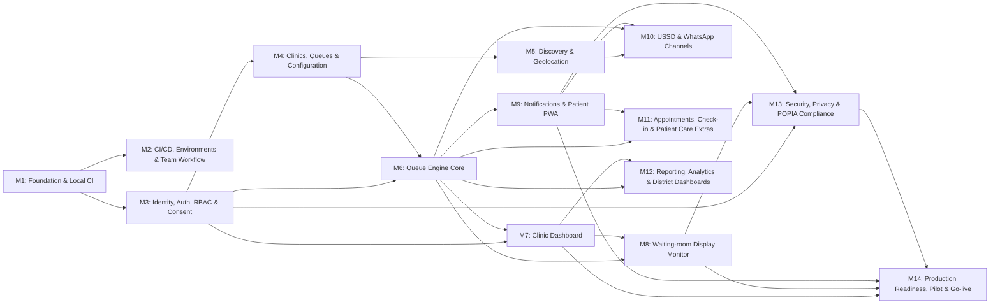

# ClinicQ milestones: how to read one

A milestone is a group of issues that together deliver one thing the team can demonstrate. Each
milestone closes with a release tag (`v0.1.0` … `v0.14.0`); `v1.0.0` is cut only when the very last
issue closes (see [release tags](../README.md#release-tags)).

## What a milestone page contains

| Part | What it tells you |
|------|-------------------|
| **Title** (`# Milestone N: …`) | The GitHub milestone title. Keep the `Milestone N` prefix: `scripts/gh_sync_docs.py` matches on it. |
| **In short** | What the milestone delivers, in one sentence. |
| **Sprints** | The window in which it should close, and a warning when the sprint plan schedules its issues outside that window. |
| **Primary owner** / **Who does the work** | The accountable role, and how the issues are actually spread across the six roles. |
| **Depends on** / **Blocks** | Milestone-level ordering, as planned. |
| **Goal**, **Why**, **Scope** | What and why, in product terms. |
| **Issues** | Every issue with its owner, estimate, sprint and the issues inside this milestone it needs first. |
| **Order of work** | A diagram of those dependencies, where to start, and what is needed from other milestones. |
| **Exit criteria** | The checklist for closing the milestone and cutting its tag. |
| **Demo at the end of the milestone** | What the team shows at the sprint review as proof. |

## How the milestones depend on each other

Arrows point from a milestone to the milestones that need it. **M6 (the queue engine) is the critical
path**: most of the second half of the project is a view onto it.

## All milestones

| Milestone | In short | Sprints | Issues | Tag |
|-----------|----------|---------|--------|-----|
| [M1: Foundation & Local CI](M1_foundation_local_ci.md) | A running, tested, empty application that six people can work in without stepping on each other. | 1–2 | 1–8 | `v0.1.0` |
| [M2: CI/CD, Environments & Team Workflow](M2_cicd_environments.md) | A merge gate, a release pipeline and team rules, so broken code cannot reach `main` and a tag is all it takes to deploy. | 2 | 9–14 | `v0.2.0` |
| [M3: Identity, Auth, RBAC & Consent](M3_identity_auth_rbac.md) | Staff accounts, patient phone identity, roles, per-clinic data isolation, the audit trail and consent: the trust layer everything else stands on. | 3–4 | 15–22 | `v0.3.0` |
| [M4: Clinics, Queues & Configuration](M4_clinics_queues_config.md) | Clinics exist in the system with a location, opening hours, queues, services, staff and privacy settings, and can sign themselves up. | 4–5 | 23–30 | `v0.4.0` |
| [M5: Discovery & Geolocation](M5_discovery_geolocation.md) | Patients can find nearby clinics, public or private, by GPS or suburb, with live queue lengths, on a list or a map. | 5–6 | 31–38 | `v0.5.0` |
| [M6: Queue Engine Core](M6_queue_engine_core.md) | The queue engine: fair, concurrency-safe ticket numbers, a strict lifecycle, honest wait ranges, recall, transfers and audited priority. | 6–7 | 39–47 | `v0.6.0` |
| [M7: Clinic Dashboard](M7_clinic_dashboard.md) | The screen reception and nurses keep open all day: every queue live, one big Call Next, walk-ins in seconds, and honest offline states. | 8–9 | 48–55 | `v0.7.0` |
| [M8: Waiting-room Display Monitor](M8_display_monitor.md) | The waiting-room TV: now serving and up next, legible across the room, spoken aloud, private by default, and self-healing after power cuts. | 9 | 56–62 | `v0.8.0` |
| [M9: Notifications & Patient PWA](M9_notifications_patient_pwa.md) | Patients hear when it is their turn (push, SMS or WhatsApp) and can follow their place in line from an installable app. | 9–10 | 63–71 | `v0.9.0` |
| [M10: USSD & WhatsApp Channels](M10_ussd_whatsapp_channels.md) | A feature phone with no data (USSD) and WhatsApp become full doors into the same queue, in five languages. | 10–11 | 72–79 | `v0.10.0` |
| [M11: Appointments, Check-in & Patient Care Extras](M11_appointments_checkin_patient_care.md) | Booked appointments, arrival check-in, booking for family members, chronic reminders, a virtual waiting room and post-visit feedback. | 11–12 | 80–87 | `v0.11.0` |
| [M12: Reporting, Analytics & District Dashboards](M12_reporting_analytics.md) | The numbers a clinic manager takes to their district: wait times, no-shows, channel mix and busiest hours, all checked against hand calculations. | 12 | 88–94 | `v0.12.0` |
| [M13: Security, Privacy & POPIA Compliance](M13_security_privacy_compliance.md) | Everything a system holding health information must prove before real patients use it: retention, access and erasure, encryption, a hardened surface and an independent test. | 12–13 | 95–101 | `v0.13.0` |
| [M14: Production Readiness, Pilot & Go-live](M14_production_pilot_golive.md) | Production, backups, monitoring, a load test, a pilot kit and real clinic staff using ClinicQ for a full day, then the capstone submission. | 13–14 | 102–109, 197 | `v0.14.0` |

---

**Navigation:** [GitHub docs index](../README.md) · [How to read an issue spec](../ISSUES/README.md) · [Workload split](../../TEAM/WORKLOAD_SPLIT.md) · [Implementation plan](../../PLAN/IMPLEMENTATION_PLAN.md)
