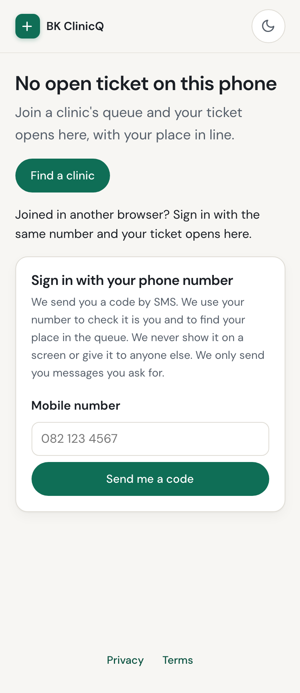
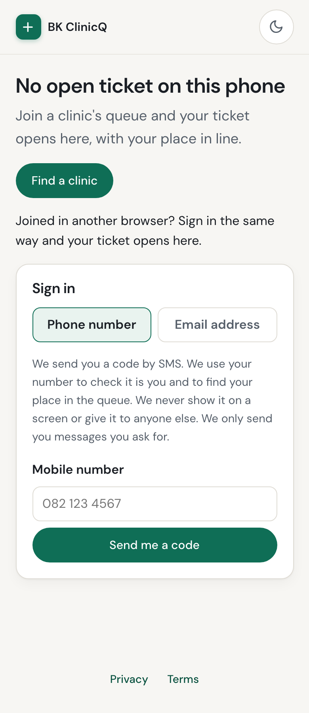
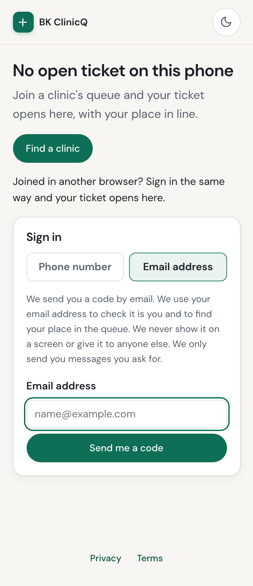
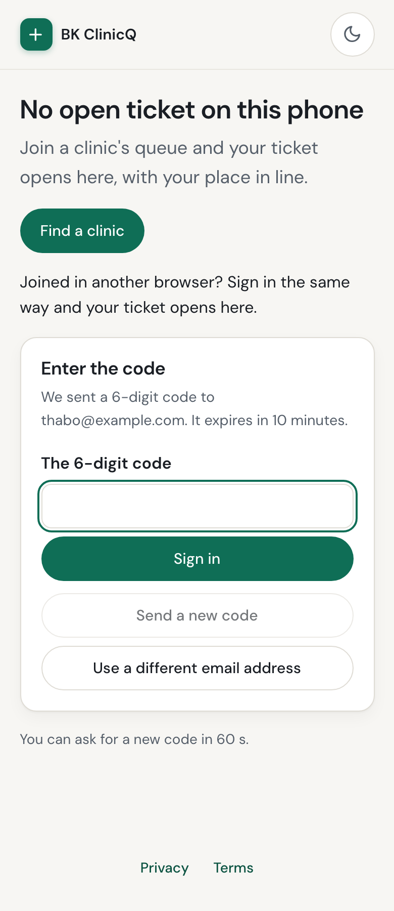
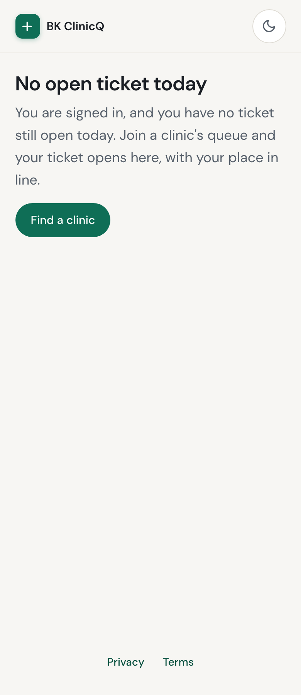

# PR: Sign in to `/t/` with an email address too, behind a feature flag (Issue 219 / M15-219)

**Milestone:** [Milestone 15: Clinic Onboarding & Patient Sign-in](https://github.com/Billykat7/clinicQ/milestone/15) ·
**Issue:** [#219](https://github.com/Billykat7/clinicQ/issues/219) · **Builds on:** #17 (patient identity and the
OTP store), #200 (the sign-in `/t/` and the join page render), both merged

A patient's identity has been a mobile number and nothing else. Right for the walk-in population ClinicQ
is built for, and no use to a patient whose number changed, to someone with no mobile, or to anyone
testing or demoing the product without a handset and SMS credit. The OTP store has been keyed by
`(kind, identifier)` since Issue 17 and has had an `EMAIL` member it was never asked to use.

With this PR, and **only** where `PATIENT_EMAIL_SIGN_IN_ENABLED` is on:

- **An address is an identity, not a second factor.** A patient who signs in with one gets a record with
  an address and no phone number at all, and then does what any patient does — joins queues, holds
  tickets, opens `/t/`, answers consent.
- **The two contacts are peers.** One store, one set of budgets and cooldowns, one set of outcomes and
  sentences, one "no patient is created until a code is verified". The shared half is written once and
  called twice, so they cannot drift apart.
- **`/t/` and the join page offer both**, the number first and selected.
- **With the flag off, nothing changed.** The rendered page contains the word "email" **zero times**, and
  an `email` body is refused `503 patients.otp.email_disabled`.

**Not done here, and not claimed:**

- **An email-only patient cannot yet be reached by the notification chain.** `PATIENT_TRANSPORT_CHAIN` is
  `WEB_PUSH → WHATSAPP → SMS`, and a patient with no number matches none of it: they hold a ticket and are
  not told when it is called. That is [Issue 220](https://github.com/Billykat7/clinicQ/issues/220), which
  follows immediately, and it is **the reason the flag is off by default**. Do not switch it on in a
  deployment serving real patients until 220 lands.
- **No merge of an email patient with the phone patient who is the same person.** Two identifiers, two
  records, until someone specifies the merge.
- **No way to add or change an address on an existing record** from `/me`: that needs the
  confirm-by-link dance a staff email change has (Issue 22's neighbourhood).
- **USSD and WhatsApp are untouched.** Those channels are numbers by definition.

## Summary

- **Migration `0047`**: `patient.email` (254, nullable, `uq_patient_email`) and
  `patient.email_verified_at`. No backfill, nothing made mandatory; `phone_e164` is exactly as it was.
- **`src/commons/email_address.py`** — the sibling of `commons/phone.py`, and it exists for the same
  reason: `normalize_email` (trim + lower-case, one `@`, a dot in the domain) is the only thing that
  writes the column, so `Nomsa@Gmail.COM` and `nomsa@gmail.com` cannot become two patients.
  `mask_email` gives `n•••a@gmail.com`; a local part of one or two characters is masked whole rather
  than given away by the rule.
- **`PATIENT_EMAIL_SIGN_IN_ENABLED`** in `Settings`, default `false`, regenerated into `.env.example`.
- **The service** (`src/modules/patients/service.py`): `_reserve_code`, `_code_sent` and `_spend_code`
  are the shared half, each taking the `OtpSubjectKind` it acts for. The phone path now calls them;
  `send_email_code` / `verify_email_code` / `get_or_create_patient_by_email` are the twin, including the
  savepoint race the unique constraint needs. `EmailSignInUnavailableError` mirrors
  `SmsSignInUnavailableError` down to the 503 and the code shape.
- **The API**: `POST /patients/otp/request` and `/otp/verify` take **exactly one** of `phone` and
  `email` — a `_OneContact` model validator, so both-or-neither is a 422 from the schema before anything
  is issued, counted or looked up. `PatientOut` gains a masked `email` and `email_verified_at`.
- **The page** (`patient/_sign_in.html`, `patient-sign-in.js`, `components.css`): two tabs when the
  server rendered them, and the closed field is **disabled** as well as hidden, so the form carries one
  contact whatever the browser does with `hidden` and a password manager cannot fill the one nobody is
  looking at. `SignInView.email_enabled` is where the decision is made, so `/t/`, the join page and the
  booking page all follow one flag. "SMS is switched off" no longer disables a sign-in that works: `off`
  is per way in.
- **Tests**: `tests/integration/patients/conftest.py` now holds the fixture both halves share (and
  patches the patients service's own `get_settings`, which the flag is read through).

## How it was checked

Against a real PostgreSQL + PostGIS database, with `SMTP_HOST=` empty so every code goes to the
development outbox and no mail leaves the machine.

- [x] **The whole loop in a real browser**, Playwright at 390 px: tab to *Email address*, type it, read
  the code from `/dev/outbox`, sign in, land on the signed-in start page. The row it left:

  ```
  $ psql -d clinicq_m15_demo -c "select email, coalesce(phone_e164,'(no number)') from clinicq.patient …"
  nomsa@example.com|(no number)
  thabo@example.com|(no number)
  ```

- [x] **With the flag off, the page does not mention an address at all** — not hidden, absent:

  ```
  --- flag ON  ---           --- flag OFF ---
  sign-in-tabs:      1       sign-in-tabs:      0
  email field:       1       email field:       0
  any 'email' word:  10      any 'email' word:  0
  heading: "Sign in"         heading: "Sign in with your phone number"
  ```

- [x] **The two refusals, over HTTP:**

  ```
  $ curl -X POST :8052/…/otp/request -d '{"email":"nomsa@example.com"}'          → HTTP 503
    {"detail":"Signing in with an email address is not available here. Use your mobile number.",
     "code":"patients.otp.email_disabled"}
  $ curl -X POST :8051/…/otp/request -d '{"email":"a@b.com","phone":"0821234567"}' → HTTP 422
    "Give a mobile number or an email address, not both."
  ```

- [x] **Migration `0047` applied to an empty database** and produced
  `uq_patient_email UNIQUE CONSTRAINT, btree (email)` beside the number's, with both columns nullable.
- [x] **15 integration tests** (`test_patient_email_sign_in.py`): the flag off and mid-sign-in; an
  address signing in with no number on the record; one address written two ways being one patient; the
  savepoint race making one row; parity (`/me/consents`, `PATCH /me`, `/logout`); a code issued for an
  address refused on a number; both-or-neither; an unreadable address; the cooldown; wrong-then-locked;
  single use; the code and the address never reaching a log record or the audit trail.
- [x] **22 unit tests** (`test_email_address.py`): five spellings of one address normalising to one,
  idempotence, ten refusals, the refusal never repeating what was typed, and the masking rule.
- [x] **The phone half is untouched:** all 38 tests in `test_patient_otp.py` pass after the fixture move.
- [x] `TZ=UTC pytest tests/unit tests/integration` green with `TEST_DATABASE_URL` set; `ruff check`,
  `ruff format --check` and `mypy src` (333 files) clean.

| The flag off (390 px) | Both ways in | The address tab | The code step | Signed in, no number |
|---|---|---|---|---|
|  |  |  |  |  |

## Acceptance criteria

- [x] **With the flag off, `/t/` and the join page render what they render today**, and an `email` body is
  `503 patients.otp.email_disabled`.
- [x] **With the flag on, a new address goes from `/t/` to a signed-in session in one browser, no console.**
- [x] **A patient created by email has no phone number on the record** and opens `/t/`. *Joining a queue
  is exercised by the API-parity test and by the shared join path, not by a browser walk-through: the
  demo clinic is closed at the hour these screenshots were taken.*
- [x] **Both or neither contact is a 422.**
- [x] **The cooldown, the budgets and the wrong/expired/locked outcomes behave identically**, because
  they are literally the same three functions.
- [x] **Two simultaneous first sign-ins at one address create exactly one patient.**
- [x] **`patient` still has no password column**, and no log line or audit row contains an address.
- [x] **The tabs are keyboard-reachable with `role="tablist"`/`aria-selected`, announce their errors
  through the existing `role="alert"`, and fit 320 px** — two equal halves that never wrap.

## Risk and rollback

- **The flag is off**, so a deployment that does nothing sees no change at all: no new field, no new
  accepted body, no new row.
- **Switching it on before [Issue 220](https://github.com/Billykat7/clinicQ/issues/220) merges** gives
  you patients the notification chain cannot reach. That is the one real risk here, and it is why the
  default is off.
- **`patient.email` is unique and nullable.** PostgreSQL treats NULLs as distinct, so every existing
  patient is unaffected by the constraint.
- **Rollback:** revert, then `alembic downgrade 0046`, which drops both columns and the constraint. No
  patient's number, ticket, session or audit row depends on either.

Closes #219
