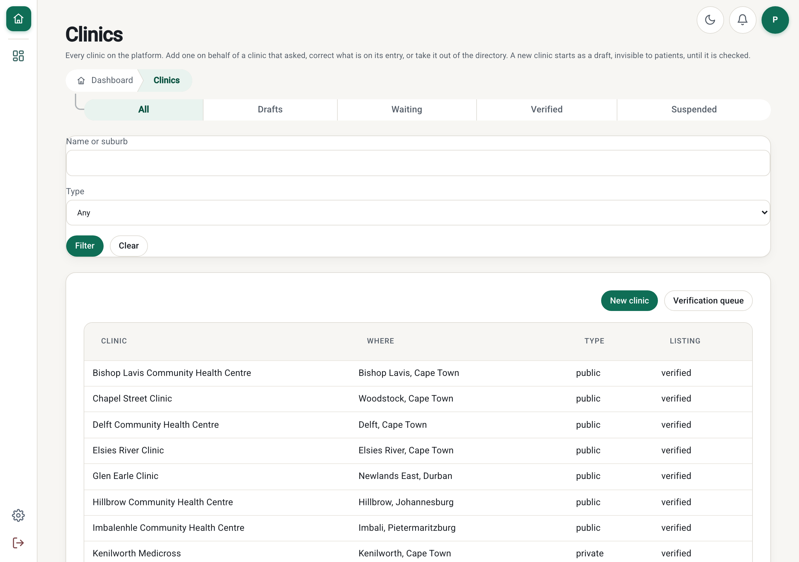
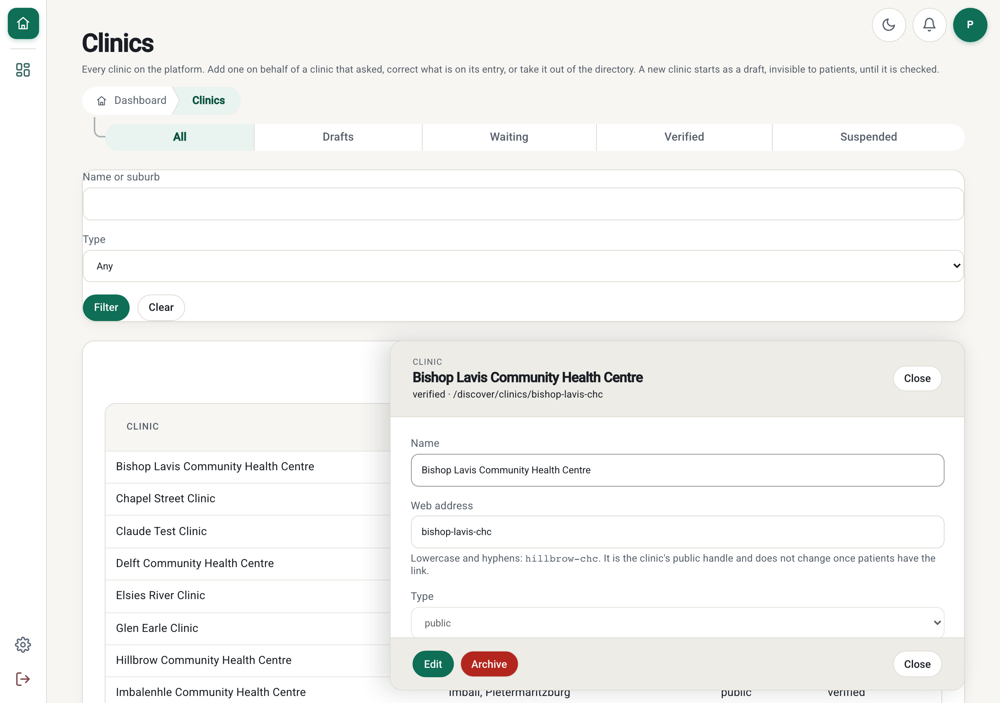
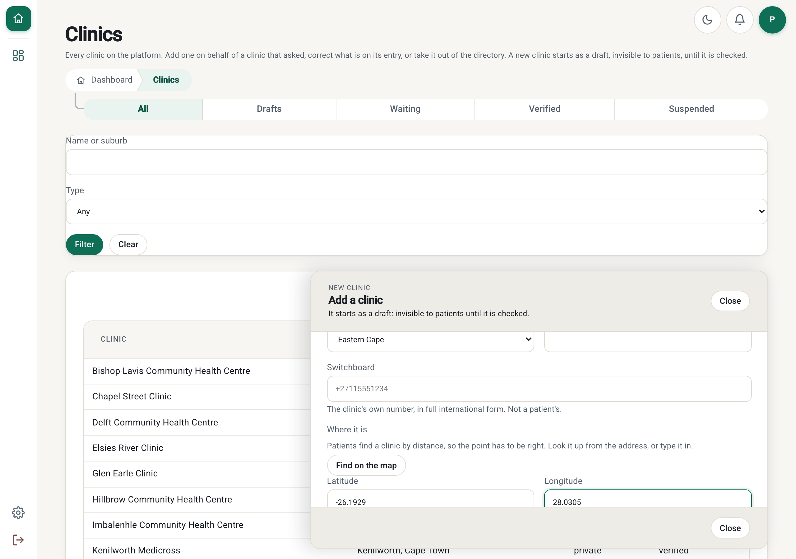
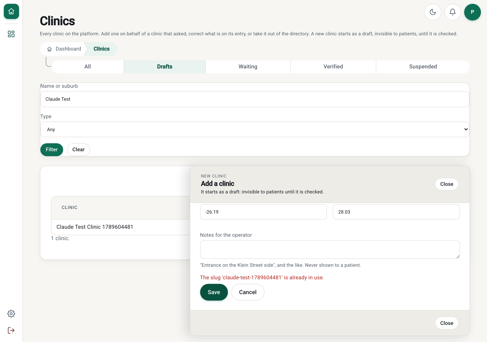
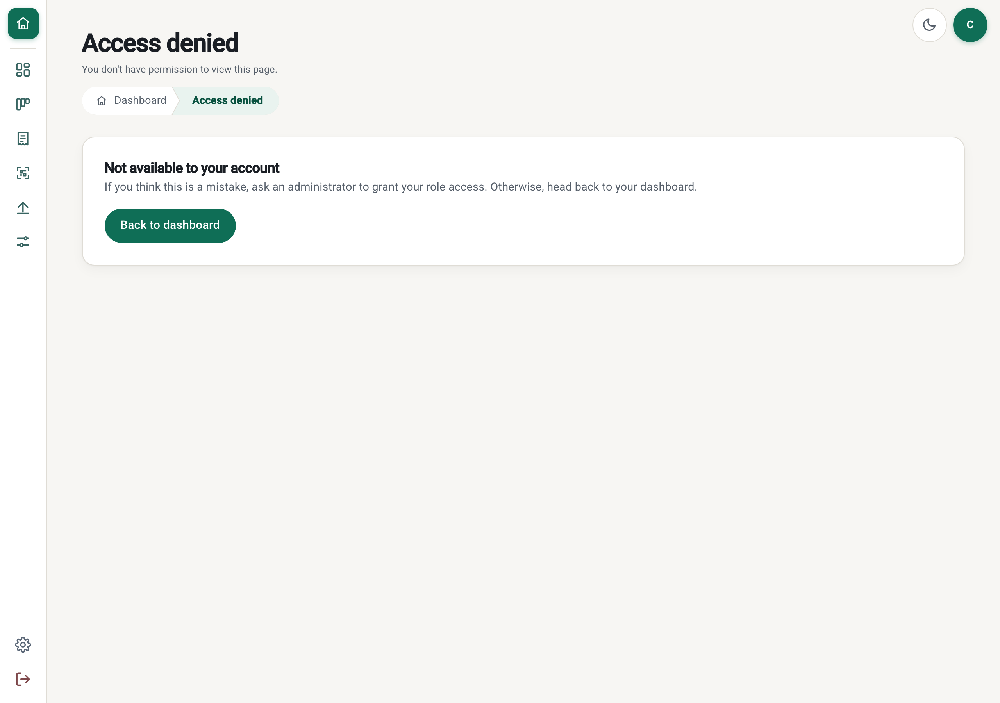

# PR: A clinic can be created, corrected and archived from the browser (Issue 222 / M15-222)

**Milestone:** [Milestone 15: Clinic Onboarding & Patient Sign-in](https://github.com/Billykat7/clinicQ/milestone/15) ·
**Issue:** [#222](https://github.com/Billykat7/clinicQ/issues/222) · **Builds on:** #23 (the sites API),
#221 (`sites.onboarding`), #19 (the site guard)

Every verb a clinic needs has been in the sites API since Issue 23 — `POST /sites`, `GET /sites`,
`GET/PUT /sites/{id}`, `DELETE /sites/{id}` — and **none of them had a screen**. Creating a clinic on
behalf of one that phoned in, or fixing a typed address, meant hand-writing JSON against the API with a
session cookie, and there was no list of *all* clinics anywhere in the product: `/admin/verification`
is filtered to one listing status at a time, and the site switcher is built from a member's own
assignments.

With this PR, `/admin/clinics` — the console the operator actually works in, beside the verification
queue:

- **Tabbed by listing** (`all` · `draft` · `pending` · `verified` · `suspended`), each its own URL,
  with a filter bar that submits as a real navigation so the filtered view is bookmarkable.
- **New clinic**: name, slug, sector, address, province, contact — created a **draft**, invisible to
  patients, with the default queues and services catalogue, exactly as a self-registration is.
- **Edit**, read-only until *Edit* is pressed, so a stray keystroke cannot change a live clinic's
  address.
- **Archive**, behind a confirm that names the clinic and says what it does.
- **The address is geocoded**, and the coordinate stays editable, because the operator is the fallback
  when the service cannot answer — not an error state.

**Found while building it, and the reason this PR touches the API:**

**A platform admin could not edit a clinic at all.** `PUT /sites/{site_id}` is behind
`require_site_access`, which is what keeps a clinic manager to their own clinic — but a platform admin
is **assigned to no clinic** (Issue 19), so the guard 404s them, and the guard's cross-site escape
hatch covers **reads only**: `SAFE_METHODS`, with a cross-site write refused outright. So the operator
could create a clinic and archive one and never correct a typed address in between. The console found
it in the first minute of use.

The fix does **not** weaken the guard. `PUT /sites/{site_id}/directory` is a new **platform** route —
`sites` + `update` at `business`, not behind the guard, audited — the same shape `POST /sites` and
`DELETE /sites/{id}` already have, and for the same stated reason. Both routes call the same
`service.update_site`, so there is one writer and they cannot disagree about what an update does.

**Not done here, and not claimed:**

- **The verification decision stays at `/admin/verification`**; this console links across to it rather
  than duplicating it.
- **Hours, queues, services, display settings and the payment profile are not edited here** — those are
  the clinic's own dashboard settings, and the setup link ([Issue 223](https://github.com/Billykat7/clinicQ/issues/223))
  is how a new clinic reaches them.
- **No bulk import**, and **no un-archiving**: a soft-deleted clinic is restored by an operator with
  database access, as before.
- **No paging.** The console renders up to 200 clinics in one request and says so when there are more;
  the filter is how an operator narrows it. The directory is a few hundred rows at most.

## Summary

- **`src/web/routes.py`**: `/admin/clinics` → `/admin/clinics/all`, and `/admin/clinics/{section}`
  with `_CLINIC_SECTIONS`. Gated on `sites:read @ business` — the same grant `GET /api/v1/sites`
  enforces — and deliberately not behind the site guard, for the reason above. An unknown section
  redirects to the default rather than 404ing, as `admin_verification_section` does.
- **`src/templates/admin/clinics.html`** and **`src/static/js/admin-clinics.js`**: the console, in the
  second of the two wiring styles in `docs/IDE/RULES/list-view-ui-pattern.mdc` — server-rendered rows,
  client-side sort and quick view, real requests for the writes. One set of fields serves both reading
  and editing, so what an operator reads and what they change cannot disagree.
- **`src/modules/sites/router.py`**: `SitesUpdate` and `PUT /sites/{site_id}/directory`.
- **`src/core/nav_registry.py`**: a `clinics` destination at `business`, so the console is reachable
  from the rail rather than only by URL.
- **`contracts/sites.yaml`**: the new route, and the `PUT /sites/{site_id}` description corrected to
  say who it is for and where the operator's is.
- Regenerated `tests/snapshots/rbac_decisions.txt` (the nav gate) and the RBAC matrix.

## How it was checked

Driven in a real browser (Playwright, 1280 px) against a PostgreSQL + PostGIS database seeded with the
26-clinic demo directory:

```
1. lands on: /admin/clinics/all · rows: 26
2. sector left untouched, reads: public
3. created as: draft · claude-test-1789604481
4. taken slug says: "The slug 'claude-test-1789604481' is already in use."
5. after edit, notes now: 'Entrance on the Klein Street side.'
6. confirm: Archive Claude Test Clinic 1789604481?
   rows after archiving: 0 · public page: 404
7. clinic manager sees the table: False
```

- [x] **Two defects the browser found and the tests now hold:**
  - a new clinic's `<select>` fields started blank, so the API refused it with
    `sector: Input should be 'public' or 'private'`. A `<select>` has no empty option, so a missing
    value now means *the first one*;
  - the edit answered `Not found` — the guarded-route problem above, which is what `/directory` fixes.
- [x] **11 page tests** (`test_admin_clinics_console.py`): the bare URL and an unknown tab both
  redirect to the default; each tab shows exactly its listing; the filter narrows by name and by type
  and stays in the URL; a hand-edited `?sector=banana` shows the unfiltered list rather than 500ing;
  the operator is offered create/update/delete **through the gate the template actually calls**; the
  manager, the desk and the nurse each get a 403; nobody signed in is sent to sign in; an archived
  clinic is in no listing.
- [x] **5 API tests** (`test_site_profile_api.py`): the operator is 404'd by the guarded route and
  succeeds on `/directory`; the edit leaves every clinic's `status` alone; a clinic manager is refused
  `/directory` **and** allowed the guarded route on their own clinic; a taken slug is a 409; the edit
  is audited with an actor.
- [x] **The nav gate**: the snapshot gains one surface line per role — `platform_admin` allow at
  `business`, every other role deny. No existing decision moved.
- [x] `tests/unit/security` (the route-gate and ungated-control guards) pass: every state-changing
  control on the page carries a `can('sites', verb, 'business')` gate.
- [x] `TZ=UTC pytest tests/unit tests/integration` green with `TEST_DATABASE_URL` set; `ruff`,
  `ruff format --check` and `mypy src` clean.

| The console | A clinic, read-only | Adding one | A taken slug | A clinic manager |
|---|---|---|---|---|
|  |  |  |  |  |

## Acceptance criteria

- [x] **A platform admin creates a clinic from the browser; it is a draft and is invisible on
  `/discover`** — asserted on the row and on the public page.
- [ ] **…with the default queues and catalogue.** **Not true when this PR was written, and I said it
  was.** `service.create_site` did not seed them — only `onboarding.submit_registration` (the public
  form) did — so a clinic an operator typed in started with no rooms and no services. Issue 223's
  browser walk-through found it, and the fix is in [PR #228](https://github.com/Billykat7/clinicQ/pull/228),
  which makes the two paths identical. Nothing in this PR depends on it.
- [x] **The listing pages, filters and sorts work, and each tab is its own URL that survives a refresh.**
- [x] **Editing a clinic's address re-geocodes it; with geocoding unavailable the operator is asked for
  the coordinate and the save still succeeds** — the coordinate fields are never disabled while
  editing, and the lookup's failure is a message beside them, not a blocked save.
- [x] **A taken slug is refused with the sentence the API gives, and nothing is created.**
- [x] **Archiving asks for confirmation naming the clinic, and the clinic then appears nowhere a
  patient can reach** — its public page answers 404.
- [x] **A `clinic_manager` who opens `/admin/clinics` is refused, and no nav entry is shown to them.**
- [x] **Every mutation writes its audit row.**
- [x] **The console is keyboard-navigable and fits a 1024 px screen** — it is the kernel's console
  chrome, unchanged.

## Risk and rollback

- **`PUT /sites/{site_id}/directory` is a new way to write a clinic's profile.** It is `business`-tier,
  so only `platform_admin` reaches it; it cannot touch `status`; and it is audited like every other
  mutation on this router. The guarded route is unchanged, so no clinic manager gains anything.
- **The nav gate is a new row** written by `make seed-rbac`, which the deploy sequence already runs
  after the migrations. Until it runs, the destination is simply not offered.
- **No migration and no data change.**
- **Rollback:** revert. The `clinics` nav-gate row can stay — nothing reads it once the destination is
  gone — or be removed from `nav_gate_override`.

Closes #222
