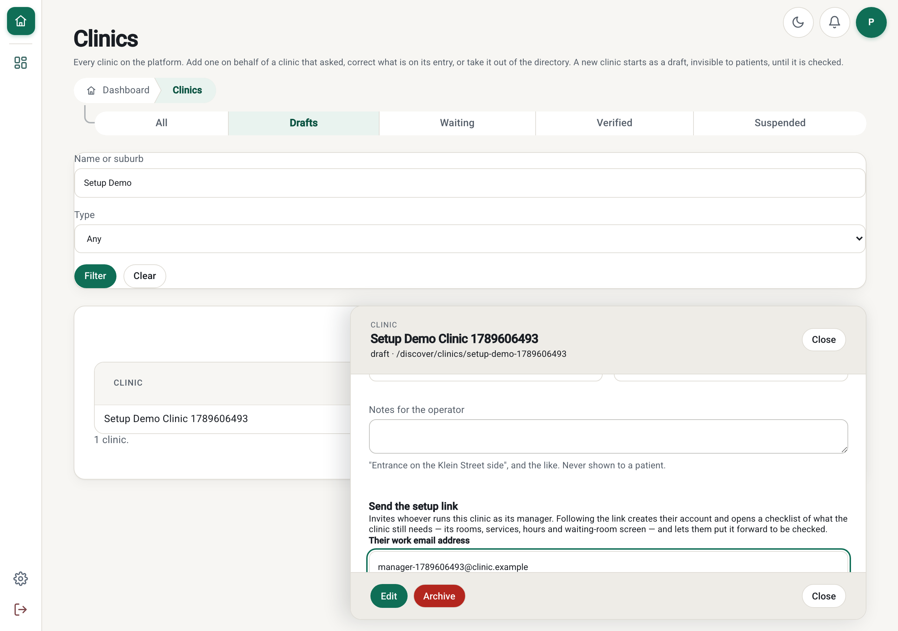
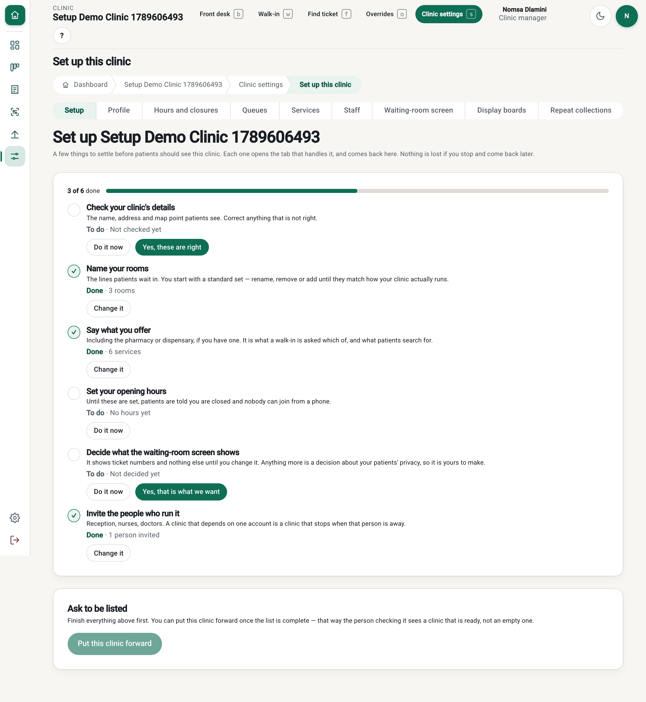
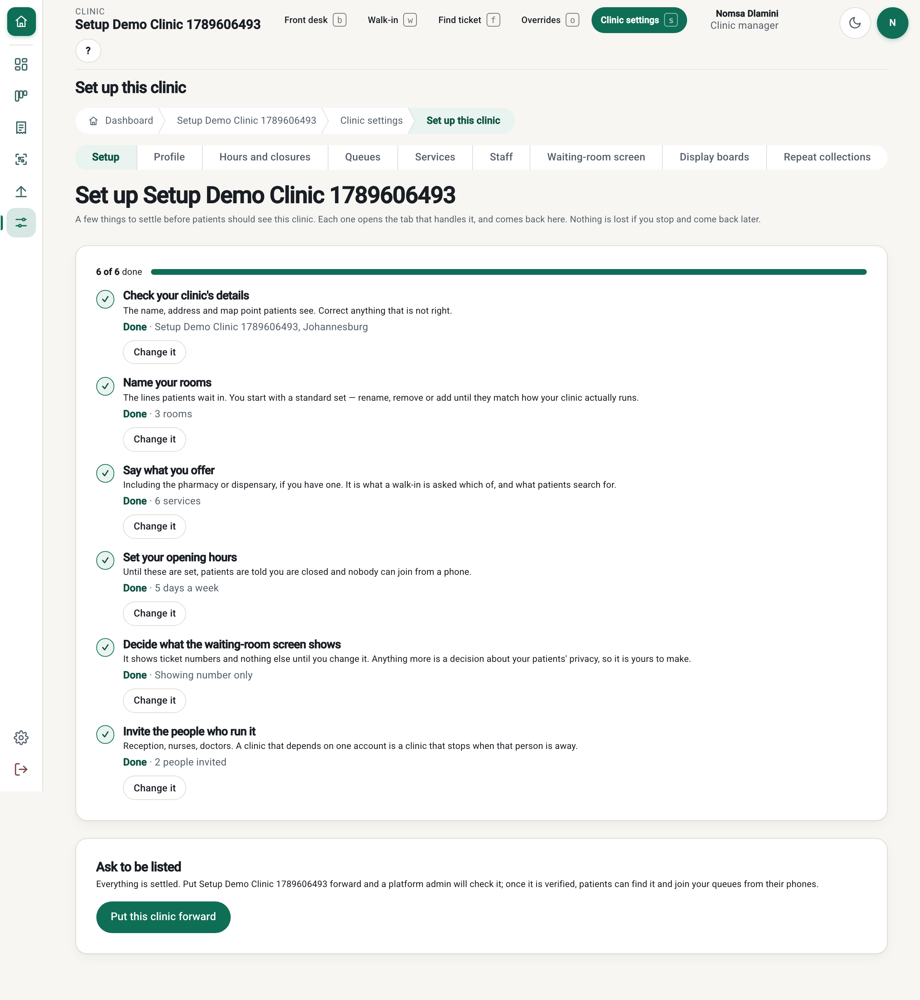
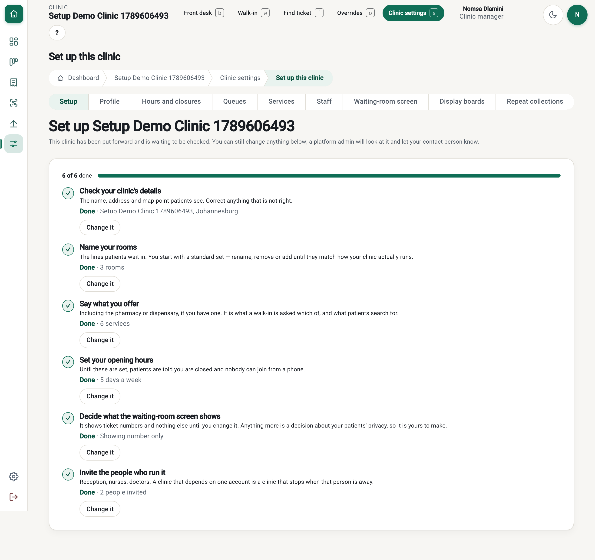
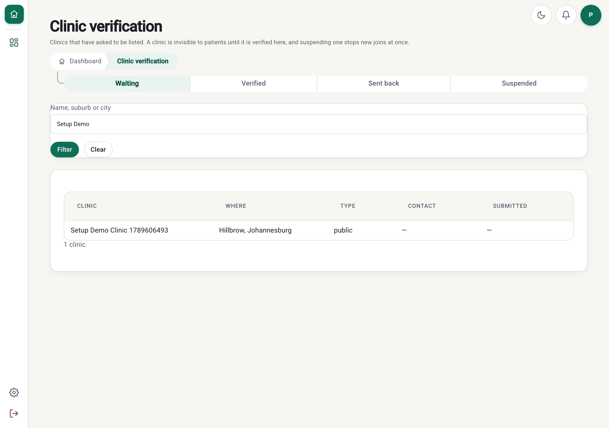

# PR: Add a clinic, send one link, and the clinic sets itself up (Issue 223 / M15-223)

**Milestone:** [Milestone 15: Clinic Onboarding & Patient Sign-in](https://github.com/Billykat7/clinicQ/milestone/15) ·
**Issue:** [#223](https://github.com/Billykat7/clinicQ/issues/223) · **Builds on:** #22 (the single-use
invitation), #29 (the onboarding state machine), #54 (the clinic settings tabs), #221
(`sites.onboarding`), #222 (the console the link is sent from)

Onboarding had two shapes and a hole between them. A clinic could find us and submit itself, or an
operator could type it in — and in both, the clinic's **own** configuration (which rooms it runs,
whether it has a pharmacy, what hours it keeps, what the waiting-room board may show) was left at the
defaults until someone was invited as its first manager and found the settings tabs unprompted.
Nobody was told what was still missing. A clinic that goes live on defaults shows patients rooms it
does not run and hours it does not keep, which is worse than not being listed.

With this PR: **add the clinic, send one link, and the clinic does the rest.**

- **`/admin/clinics` → Send the setup link.** One address, one button.
- **Following it creates the manager's account and their role at that clinic**, and lands them on
  **Setup** — the first tab in their clinic's settings.
- **A six-step checklist**: check your details · name your rooms · say what you offer · set your
  hours · decide what the screen shows · invite the people who run it. Each opens the tab that owns
  it and comes back. It can be left and returned to.
- **One button to ask to be listed**, which refuses — **naming every step still unfinished** — until
  the list is complete.
- **`docs/OPS/CLINIC_ONBOARDING.md`**: the journey end to end, for whoever runs the pilot.

## The journey changed, and that is the thing to review

The issue specified a setup link with **a token of its own**: a single-use JWT reaching a clinic's
rooms, hours and waiting-room board with **no account at all**. I did not build that, and the issue
spec is rewritten in this PR to say so and why.

It is a second authentication surface into a clinic's configuration, built beside `StaffInvitation`,
which already does exactly this job — single use, expiring, row-is-the-authority, emailed, audited.
And the person setting a clinic up needs an account the next morning anyway to run its queue.

So **the link is that invitation**, issued for `clinic_manager` at the new clinic. The operator still
sends one link and the clinic still does the rest. What is different is that there is **no new way
into a clinic**: every step goes through the settings pages, the API and the site guard that already
exist, and every change is audited under a real person instead of under a token. The issue asked for
"any other journey that would be better for this"; this is my answer, and it is the one place a
reviewer should push back if they disagree.

**Not done here, and not claimed:**

- **No `site_setup_link` table.** The invitation row is the link. The migration adds three columns
  and nothing else.
- **The invitation email has no development fallback.** With no `SMTP_HOST` a sign-in code goes to
  `/dev/outbox`; a staff invitation does not, so in development the link has to be read from the
  row. That is Issue 22's gap, it predates this PR, and closing it is not this issue's.
- **No slug editing from the setup journey**, no logo upload, no payment profile, and no automatic
  approval: a platform admin still decides.

## Summary

- **Migration `0048`** — `site.setup_confirmed_details`, `setup_confirmed_board`,
  `setup_completed_at`. **The checklist is otherwise derived** from the clinic's own rows on every
  read, so a step finished on a settings tab, through the API or by an operator is finished on it
  with nothing told twice. Those three are the exceptions because no other row answers their
  question: two steps are a *decision* (the details somebody else typed; what the board shows, which
  is `number_only` by default whether or not anyone has chosen), and `setup_completed_at` is *when
  the clinic said it was finished*.
- **`src/modules/sites/setup.py`** — `setup_state` (the six steps and what each says about itself)
  and `submit_for_checking`, which goes through `onboarding.transition`, the only writer of `status`.
- **The API** — `GET /sites/{id}/setup`, `POST /sites/{id}/setup/{details,board}` (no body: each
  means one thing), `POST /sites/{id}/setup/submit`. All `sites.onboarding` at `assigned`, so they
  are the clinic's own and another clinic's id is the guard's 404. **Submitting is the clinic's;
  deciding is the operator's at `business`** — a clinic can ask and can never list itself.
- **`POST /sites/{id}/setup-link`** — the operator's route, `business` tier. Same reason
  `/directory` exists (Issue 222): a platform admin is assigned to no clinic, so
  `POST /sites/{id}/staff/invitations` 404s them. It issues exactly one role at exactly the clinic in
  the path, and the invitation is the same row with the same deadline and the same single use.
- **The Setup tab**, first in the clinic's settings, gated `sites.onboarding:update`.
- **No JavaScript of its own**: the two confirms and the submission are declared with `data-api` and
  sent by `dashboard-api.js`, like every other write on these screens.

## How it was checked

The whole journey, driven in a real browser against PostgreSQL + PostGIS — operator, clinic and
operator again, in three separate browser contexts:

```
1. link: Sent to manager-1789606493@clinic.example.
2. the link opens: /invite
   accepting it: 200 - clinic_manager
3. the manager holds a role at: 01a0acdc …
   checklist page: "Set up this clinic"
   at the start: 3 of 6 done
4. submitting early: 422 - "There is still something to do before this clinic can be
                            checked: Check your clinic's deta…"
5. now: 6 of 6 · can submit: True
6. submitted: 200 - pending_verification
7. in the verification queue: 1
   verified: 200
8. the public page: 200
```

- [x] **Three defects the browser found, and the tests now hold:**
  - **The progress bar lied.** It was a `<div>` with an inline `style="width: …%"`, and the CSP is
    `style-src 'self'` — so the inline style was dropped and the bar rendered **full at 3 of 6**. It
    is a native `<progress>` now, which cannot lie and needs no `aria-label`.
  - **A clinic an operator typed in had no rooms and no services.** `service.create_site` never
    seeded the defaults; only the public registration form did. So the checklist opened on an empty
    clinic for exactly the path this issue is about. Both seeds are idempotent, and `create_site`
    now calls them — which also corrects a claim I made in
    [PR #227](https://github.com/Billykat7/clinicQ/pull/227) and have marked as wrong there.
  - **The operator could not send the invitation**, for the third instance of the guard trap: hence
    `/setup-link`.
- [x] **13 integration tests** (`test_clinic_setup.py`): a fresh clinic's checklist and what is not
  done on it; setting the hours *anywhere* settles that step; the two confirms, and confirming the
  board changing no setting; an unfinished clinic refused **with the list**, and nothing moved; a
  finished one moving `draft → pending_verification` and landing in the admin queue; a clinic that
  cannot approve itself; no submitting twice; a verified clinic having nothing to submit; the
  submission audited under the manager's name; another clinic's setup a 404, not a 403; the front
  desk reaching none of it.
- [x] **A logic bug the tests found:** `can_submit` read the move off `ALLOWED_TRANSITIONS`, which
  permits `verified → pending_verification` — that is how an admin says "we need more information"
  about a listed clinic. Reading it off the machine handed a **listed** clinic a button that took
  itself out of the directory. Asking to be listed is asked once, from a draft.
- [x] **A third fixture leaking real email**, caught by Issue 220's SMTP guard:
  `tests/integration/sites/conftest.py` set `smtp_host=""` and never patched `email_send`.
- [x] `TZ=UTC pytest tests/unit tests/integration` green with `TEST_DATABASE_URL` set; `ruff`,
  `ruff format --check` and `mypy src` clean.

| Sending the link | The checklist, 3 of 6 | Complete | Waiting to be checked | In the queue |
|---|---|---|---|---|
|  |  |  |  |  |

## Acceptance criteria

- [x] **An operator adds a clinic and sends a setup link; it arrives by email** — in development it
  is read from the invitation row, for the reason given above.
- [x] **Following the link creates the account and the role, and lands on the checklist.**
- [x] **The checklist reflects a change made on a settings tab** — it is derived, so there is nothing
  to keep in step.
- [x] **Each step opens the tab that finishes it.**
- [x] **The board is `number_only` until the clinic changes it**, and confirming the step changes no
  setting.
- [x] **An incomplete clinic is refused with the list of what is missing, and nothing moves.**
- [x] **A complete clinic moves through `transition()`, appears in `/admin/verification`, and the
  move is audited under the manager's name.**
- [x] **A clinic cannot approve itself, cannot submit twice, and a verified clinic has nothing to
  submit.**
- [x] **Another clinic's setup is the guard's 404, and the front desk reaches none of it.**

## Risk and rollback

- **`create_site` now seeds the default queues and catalogue.** Every clinic created from now on
  starts with three rooms and six services instead of nothing. Both seeds are idempotent and skip a
  clinic that already has any, so no existing clinic is touched — but an operator who wanted an
  empty clinic now deletes what they do not want, which is the same thing a self-registered clinic
  has always done.
- **`POST /sites/{id}/setup-link` can create a `clinic_manager` account at any clinic.** It is
  `business`-tier, so only `platform_admin` reaches it; it can issue no other role; and it writes the
  same audited, expiring, single-use row a clinic manager's own invitation writes.
- **The Setup tab appears in every clinic's settings**, including verified ones, where it is a
  read-only summary with no submit button.
- **Rollback:** revert, then `alembic downgrade 0047`, which drops the three columns. No queue,
  ticket or listing depends on any of them.

**Merge order:** after [#225](https://github.com/Billykat7/clinicQ/pull/225) (Issue 219), whose
migration `0047` this one follows.

Closes #223
