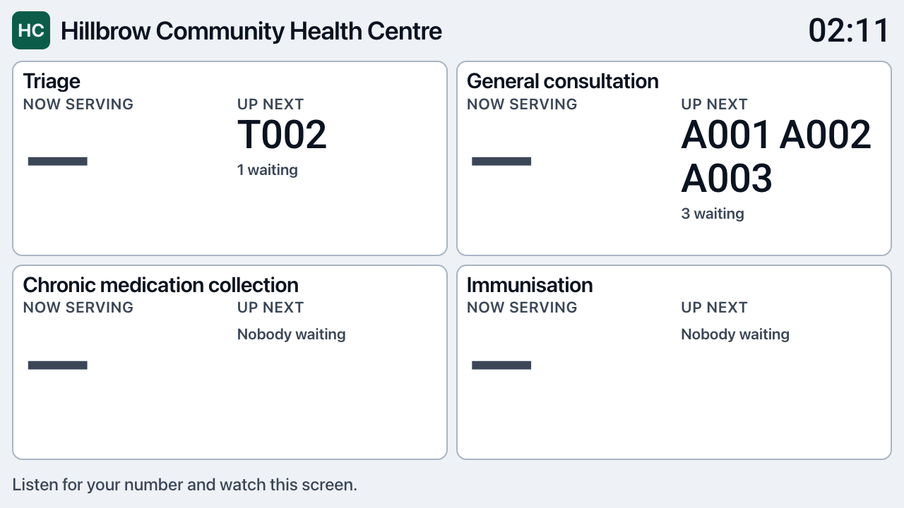

# PR: Find the clinic's Smart TV on the network and send it the board (Issue 237 / M8-237)

**Milestone:** [Milestone 8: Waiting-room Display Monitor](https://github.com/Billykat7/clinicQ/milestone/8) ·
**Issue:** [#237](https://github.com/Billykat7/clinicQ/issues/237) · **Builds on:** [#61](https://github.com/Billykat7/clinicQ/issues/61)
(the device registry this reuses whole)

[Issue 61](../../ISSUES/M8/ISSUE_61_kiosk_device_registry.md) sets a board up the way that works with
every television ever made: a box on the HDMI port shows a six-character code, and a manager types it
into the dashboard. That stays the default. It also asks a clinic to buy and mount a box, and to walk
a code across the room.

A television with Chromecast built in is already a computer on the clinic's network, and already
announces itself to anything that asks. This adds the second way in — the server finds the screen, the
manager picks it from a list, and the code travels *to* the screen instead of through a person.

**The same registry, the same cookie, the same board.** Only the direction the code travels changes.

## Design notes

### It searches the *server's* network, and says so

mDNS is a multicast question shouted at the local link; only a process on that link hears the
answers. A web page has no multicast, so the server asks — which means the feature works exactly
where the server is in the building, and nowhere else:

| Where ClinicQ runs | Finds the clinic's TV? |
|---|---|
| A box at the clinic (on-prem) | Yes |
| A laptop on the clinic's Wi-Fi (a demo) | Yes |
| A cloud instance | **No, and never** |

So `SMART_TV_DISCOVERY_ENABLED` is off by default, and while it is off the **Screens on this
network** section is not rendered at all — no button that could only ever fail.

### An empty list always says which empty it is

"No screens found" has four causes and a manager can act on three of them. `ScanOutcome.note`
carries the sentence, and the fourth is the one that would otherwise cost a day:

> On macOS, also check System Settings → Privacy & Security → Local Network and allow the program
> running this server; without that macOS drops these answers silently.

That is not a guess. On this machine, at the same moment, the system's own daemon answered and a
Python process heard nothing at all:

```
$ dns-sd -B _googlecast._tcp local.
 0:58:02.588  Add   2  14 local.  _googlecast._tcp.  Smart-TV-Pro-ec9b8350bd0df7e89faaace4909c455f

$ .venv/bin/python -m scripts.find_screens --seconds 4
Listening for 4s on this machine's network…
No screen answered.
```

The same split shows on the connection: `curl` reached the television's Cast port and Python did not.

```
$ curl -s -o /dev/null -w "%{http_code}\n" http://192.168.3.106:8008/setup/eureka_info
200
$ .venv/bin/python -c "import socket; s=socket.socket(); s.settimeout(4); s.connect(('192.168.3.106',8009))"
OSError: [Errno 65] No route to host
```

### Reaching a screen and showing it the board are different answers

A Chromecast is not a browser you can point anywhere: it runs a *receiver application* registered
with Google under an id, and refuses an unregistered page. `CastOutcome` therefore reports `reached`
and `showing` separately, so a deployment that has not done the one-off registration is told the
screen is fine and the registration is missing — not that "it failed".
[`docs/OPS/SMART_TV_SETUP.md`](../../../OPS/SMART_TV_SETUP.md) is the registration.

### How a screen becomes this clinic's screen, with no migration

The dashboard holds a row for the screen **before** contacting it, and sends it a one-time claim
code. The screen hands the code straight back at `/display/claim`; that is what proves it is the
screen that was chosen, and in return it gets the same httpOnly secret every kiosk box gets.

The reservation reuses Issue 61's own `pairing_code_hash` / `pairing_expires_at` columns, so **no
migration**. Three properties fall out of the design rather than being asserted on top of it:

- a reservation is **not a credential** — `token_hash` holds a placeholder that is replaced when a
  screen actually claims, so a row sitting in the database opens nothing;
- the row reads **pairing** in the clinic's list, so a screen that never answers is visible and
  removable rather than silently absent;
- the two flows' codes **cannot be spent on each other** — `_pending_by_code` requires `site_id IS
  NULL` and `_reserved_by_code` requires `site_id IS NOT NULL` with `paired_at IS NULL`.

### One page gets its own Content-Security-Policy

A receiver that does not load Google's receiver SDK is not a receiver, and that SDK is served only
from `www.gstatic.com` — it cannot be vendored under `/static` the way Leaflet was. Rather than add a
third-party script host to *every* page's policy for the sake of one,
`SecurityHeadersMiddleware` now leaves a policy a handler already set alone — the same shape as the
`Cache-Control` rule directly below it — and `/display/cast` writes its own.

## Changes

| Area | What |
|---|---|
| `src/modules/display/discovery.py` | **new** — finds Cast screens on the server's network; every empty result carries its reason |
| `src/modules/display/casting.py` | **new** — connects to one screen and launches the receiver; `reached` / `showing` |
| `src/modules/display/devices.py` | `start_claimable_device` and `claim_device`, the mirror of `pair_device` |
| `src/modules/display/router.py` | `POST …/display-devices/discover` and `…/connect`, both on the `sites.display` update grant |
| `src/web/display.py` | `/display/cast` (the receiver), `/display/claim` (POST for the receiver, GET as a link) |
| `src/core/security_headers.py` | a handler may set its own policy; everything else keeps the strict one |
| `src/core/config.py` | `SMART_TV_DISCOVERY_ENABLED`, `SMART_TV_DISCOVERY_SECONDS`, `CAST_RECEIVER_APP_ID` |
| `src/templates/dashboard/settings_devices.html` | **Screens on this network**, rendered only where it can work |
| `scripts/find_screens.py` | **new** — the same search, run on the server, for when the button finds nothing |
| `docs/OPS/SMART_TV_SETUP.md` | **new** — the three things it needs, and what to do when it will not work |
| `requirements.txt` | `PyChromecast==14.0.10`, imported only when a search runs |

## Testing

**23 new tests.** The network is stubbed throughout, deliberately: what is worth asserting is the
handover — which grant may search, what a manager is told, what row exists while a screen thinks
about it — and a real Chromecast answering a real multicast query is not something a suite can hold
still.

```
$ TZ=UTC pytest tests/integration/display tests/unit/display -q --no-cov
86 passed, 1 skipped, 1 warning in 18.17s

$ TZ=UTC SMTP_HOST= pytest tests/ -q --no-cov -n auto --dist loadscope -m "not slow"
2537 passed, 3 skipped, 9 xfailed, 11 warnings in 142.43s

$ ruff check src scripts tests && ruff format --check src scripts tests && mypy src
All checks passed!
648 files already formatted
Success: no issues found in 337 source files
```

### The claim → board path, in a real browser

A row was held the way `connect` holds one, and its code opened in a browser. One address, nothing
typed, and the browser became a paired screen showing the clinic's live board:

```
clinic     : Hillbrow Community Health Centre
status     : pairing
claim code : QA952C

GET /display/claim?code=QA952C  →  302  /display/01a0af5f-…
```



The verification row was deleted afterwards.

### The browser found a bug the tests could not

Loading `/display/cast` showed the Cast SDK opening `ws://localhost:8008/v2/ipc` — the channel a
receiver uses to talk to the Chromecast it is running on — and the page's own policy refusing it:

```
[error] Connecting to 'ws://localhost:8008/v2/ipc' violates the following Content Security Policy
        directive: "connect-src 'self' https://*.gstatic.com wss://*.google.com". The action has
        been blocked.
```

That page would have worked on a laptop and been dead on every television. `connect-src` now names
the socket, and the same load leaves only `WebSocket connection failed` — true, because a laptop is
not a Chromecast.

### Three existing guards caught this change

Each is satisfied honestly rather than loosened:

- **the display-template renderer** — `/display/cast` renders through `board_template_response`, so
  there is still no second way to render a page under `display/`;
- **the site-scoped-query rule** — `_reserved_by_code` is recorded in `_UNSCOPED_BY_DESIGN` with its
  reason, one function, not one file;
- **the board privacy sweep** — both new routes are in `_READERS` and are searched for a patient's
  name like every other board endpoint.

## Acceptance criteria

- [x] **A manager searching sees the clinic's Chromecast-capable screens** — `displayDiscoverScreens`,
      wired to the **Search the network** button. On this machine the answer is the macOS note above;
      the screen itself is visible to the system daemon, so the finding half is proven at the wire.
- [x] **Picking one pairs it and shows the board, nothing typed** — proven through the claim link and
      the screenshot above; the Cast leg needs a registered receiver id (below).
- [x] **A claim code works once, and cannot be spent on the other flow** —
      `test_a_claim_code_works_once`, `test_the_two_kinds_of_code_cannot_be_spent_on_each_other`.
- [x] **A screen that never answers leaves a visible row, and the attempt is audited** —
      `test_connecting_holds_a_row_before_the_screen_is_asked_and_audits_either_way`.
- [x] **An empty search says why** — four notes, four tests, including the macOS one and its absence
      on Linux.
- [x] **Searching and connecting need the pairing grant** —
      `test_the_front_desk_may_not_search_or_take_over_a_screen`, and the cross-clinic case.
- [x] **Other pages keep the strict policy** —
      `test_the_cast_receiver_page_is_served_with_its_own_policy` asserts `/display` has no `gstatic`.
- [x] **A television with a browser but no Chromecast can be paired by one link** —
      `test_a_screen_with_a_browser_can_claim_by_opening_one_address`.

## Not done here, and not claimed

- **No Cast has reached a real television.** It needs a receiver application registered with Google
  (`CAST_RECEIVER_APP_ID`), which is an account action, and the macOS local-network permission on
  the machine that runs the server. Both are written down in `SMART_TV_SETUP.md`. Everything up to
  that line is exercised; the last hop is not.
- **`pychromecast.discovery.discover_chromecasts` logs a deprecation notice** on each search. It is
  still shipped in 14.0.10 and works; moving to `CastBrowser` is a follow-up, not a fix this needs.
- **Non-Cast screens are listed, not driven.** A DIAL or UPnP television can be found where the
  network allows it, but nothing is pushed to it — it is pointed at the claim link instead.
- **No speaker support, and no per-device audio setting.** Announcements are spoken by the board
  page in the browser (Issue 60), so a screen showing the board already speaks through the TV;
  a standalone speaker would need a server-side audio path that does not exist.
- **No on-prem agent.** A cloud deployment still cannot see a clinic's network, and says so.

## Risk and rollback

Low. Every new path is behind `SMART_TV_DISCOVERY_ENABLED`, which is **off** unless a deployment
turns it on; with it off, nothing new renders, no endpoint does any work, and the optional package is
never imported. Issue 61's pairing flow is untouched — the same tests cover it unchanged. No
migration, so rollback is reverting the merge.

Closes #237
