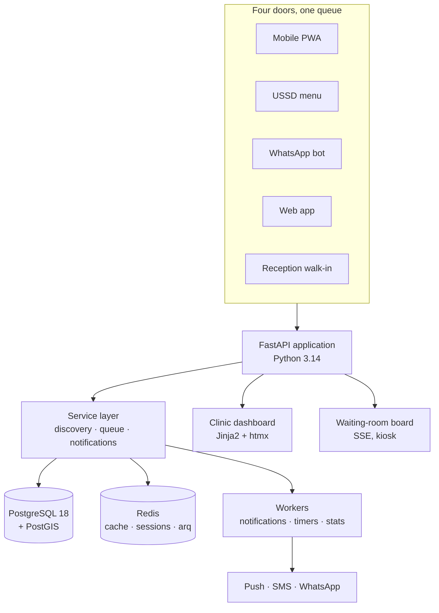

# ClinicQ: Implementation Plan

**The whole project on one page.** What we are building, in what order, why that order, and how we will
know it works.

- **What to build (detail):** [`docs/PRODUCT/`](../PRODUCT/README.md) (14 numbered product docs)
- **How the work is tracked:** [`docs/GITHUB/`](../GITHUB/README.md) (14 milestones, 109 issues)
- **Who does it, and what blocks what:** [`docs/TEAM/WORKLOAD_SPLIT.md`](../TEAM/WORKLOAD_SPLIT.md)
- **What it looks like:** [`docs/DEMO/index.html`](../DEMO/index.html)

---

## 1. The product in one paragraph

**ClinicQ** is a clinic discovery and digital queue platform. A patient finds a nearby clinic, public
or private, by geolocation, joins its queue from a phone before leaving home (mobile PWA, USSD menu,
WhatsApp bot or plain web), and watches their ticket number count down on the clinic's own waiting-room
display, while staff run the whole line from one dashboard. It is deliberately **not** an electronic
medical record, **not** a medical-aid claims platform and **not** a triage tool: it is a discovery and
queueing layer that sits in front of whatever a clinic already has, including nothing at all.

## 2. What makes it worth building

| | |
|---|---|
| **The gap** | Digital queue management has existed abroad for over a decade (Qminder, Qless, Wavetec, Qmatic; NHS e-Referral and the NHS App; Solv and Zocdoc in the US). Most South African clinics, especially public ones, still run paper-and-shout queues. |
| **Why the incumbents do not fill it** | Commercial queue systems are priced and packaged for retail and corporate budgets, and every one of them assumes a smartphone with data. |
| **The wedge** | Four channels into one engine, **including USSD**, which reaches any phone with no data at all. No global queue vendor offers that, and in this market it is the difference between serving some patients and serving all of them. |
| **The second wedge** | **Discovery.** Existing systems manage the queue at a clinic you already chose. ClinicQ helps you choose: nearest, shortest wait, open now, public or private. |

## 3. Architecture at a glance

**Stack:** Python 3.14 · FastAPI · PostgreSQL 18 with PostGIS · SQLAlchemy 2.x async + Alembic ·
Jinja2 + htmx + Alpine + Tailwind · Redis + `arq` · Docker Compose · GitHub Actions.

**One codebase, no separate JavaScript build.** The same FastAPI application renders the patient pages,
the clinic dashboard and the display board; htmx swaps fragments and SSE pushes live updates. For a
six-person team this is the difference between one thing to debug and three. JSON endpoints under
`/api/*` exist from day one, so a native client or a partner integration is possible later without
rework, and the USSD and WhatsApp adapters already prove the API is genuinely channel-neutral.

## 4. The seven modules

| # | Module | Milestone | What it does |
|---|--------|-----------|--------------|
| 1 | **Clinic discovery** | M5 | PostGIS radius search, public/private toggle, live queue length, map and list, medical-aid filter |
| 2 | **Queue engine** | M6 | One fair sequence per room, joined from any channel; lifecycle, estimates, recall, transfer, priority |
| 3 | **Multi-channel access** | M9, M10 | PWA, USSD, WhatsApp, web; thin adapters over shared services |
| 4 | **Notifications** | M9 | "You're #5", "you're next", "come in now" over push, SMS or WhatsApp, with consent and cost caps |
| 5 | **Clinic dashboard** | M7 | Call next, walk-in intake, per-room queues, audited reordering, settings |
| 6 | **Display monitor** | M8 | Waiting-room board: number, time, privacy-gated name and comment, audio call-out |
| 7 | **Reporting & analytics** | M12 | Wait times, no-show rate, channel mix, heatmap, district aggregates |
| + | **Admin, security & compliance** | M3, M13 | RBAC, multi-tenancy, audit, POPIA consent, retention, DSAR |

## 5. Delivery sequence

```mermaid
gantt
    title ClinicQ delivery - 14 sprints over 28 weeks
    dateFormat X
    axisFormat S%d
    section Foundation
    M1 Foundation            :done,   m1, 0, 2
    M2 CI/CD                 :        m2, 1, 2
    section Domain core
    M3 Identity & RBAC       :crit,   m3, 2, 2
    M4 Clinics & Queues      :crit,   m4, 3, 2
    section Product
    M5 Discovery             :        m5, 4, 2
    M6 QUEUE ENGINE          :crit,   m6, 5, 2
    M7 Dashboard             :crit,   m7, 7, 2
    M8 Display board         :crit,   m8, 8, 2
    M9 Notifications & PWA   :        m9, 8, 2
    M10 USSD & WhatsApp      :        m10, 9, 2
    M11 Appointments         :        m11, 10, 2
    section Close
    M12 Reporting            :        m12, 11, 2
    M13 Security & POPIA     :        m13, 11, 2
    M14 Pilot & Go-live      :crit,   m14, 12, 2
```

**Why this order.** M1–M2 make six people able to share one codebase. M3–M4 build what everything else
reads: an identity, a site, a queue. **M6 is the heart**: the dashboard, the board, the PWA, the
channels, appointments and reports are all views onto it, which makes it the critical path. M5 is
placed *before* M6 so the patient-facing developer has real work while the engine is being built. M13
and M14 close the project: a system handling health-adjacent personal data does not go near a real
patient before the privacy work is done.

## 6. Milestones

| Milestone | Issues | Sprints | Tag | Ships |
|-----------|--------|---------|-----|-------|
| [M1 Foundation & Local CI](../GITHUB/MILESTONES/M1_foundation_local_ci.md) | 1–8 | 1–2 | `v0.1.0` | Skeleton, PostGIS, migrations, UI shell, test loop |
| [M2 CI/CD & Team Workflow](../GITHUB/MILESTONES/M2_cicd_environments.md) | 9–14 | 2 | `v0.2.0` | CI, GHCR, deploy on tag, CODEOWNERS |
| [M3 Identity, Auth, RBAC & Consent](../GITHUB/MILESTONES/M3_identity_auth_rbac.md) | 15–22 | 3–4 | `v0.3.0` | Staff auth, patient OTP, RBAC, tenancy, audit, consent |
| [M4 Clinics, Queues & Configuration](../GITHUB/MILESTONES/M4_clinics_queues_config.md) | 23–30 | 4–5 | `v0.4.0` | Sites with PostGIS, hours, multi-room queues, onboarding |
| [M5 Discovery & Geolocation](../GITHUB/MILESTONES/M5_discovery_geolocation.md) | 31–38 | 5–6 | `v0.5.0` | Nearby search, map, sector toggle, payment filter |
| [M6 Queue Engine Core](../GITHUB/MILESTONES/M6_queue_engine_core.md) | 39–47 | 6–7 | `v0.6.0` | Tickets, join, lifecycle, estimates, recall, transfer, priority |
| [M7 Clinic Dashboard](../GITHUB/MILESTONES/M7_clinic_dashboard.md) | 48–55 | 8–9 | `v0.7.0` | Front-desk board, call next, walk-in, reorder, room view |
| [M8 Display Monitor](../GITHUB/MILESTONES/M8_display_monitor.md) | 56–62 | 9 | `v0.8.0` | Kiosk board, SSE, privacy modes, a11y, audio, devices |
| [M9 Notifications & Patient PWA](../GITHUB/MILESTONES/M9_notifications_patient_pwa.md) | 63–71 | 9–10 | `v0.9.0` | Push, SMS, templates, preferences, ticket page, PWA |
| [M10 USSD & WhatsApp](../GITHUB/MILESTONES/M10_ussd_whatsapp_channels.md) | 72–79 | 10–11 | `v0.10.0` | Adapters, USSD menu, WhatsApp bot, 5 languages, parity |
| [M11 Appointments & Check-in](../GITHUB/MILESTONES/M11_appointments_checkin_patient_care.md) | 80–87 | 11–12 | `v0.11.0` | Slots, booking, reminders, kiosk, proxy, chronic, feedback |
| [M12 Reporting & Analytics](../GITHUB/MILESTONES/M12_reporting_analytics.md) | 88–94 | 12 | `v0.12.0` | Stats worker, reports, KPIs, exports, district view |
| [M13 Security, Privacy & POPIA](../GITHUB/MILESTONES/M13_security_privacy_compliance.md) | 95–101 | 12–13 | `v0.13.0` | Retention, DSAR, hardening, encryption, pen test, a11y |
| [M14 Production, Pilot & Go-live](../GITHUB/MILESTONES/M14_production_pilot_golive.md) | 102–109 | 13–14 | `v0.14.0` | Prod infra, backups, load test, pilot kit, UAT, capstone |

**Versioning:** one minor per milestone; every `0.x` is a pre-release. **`v1.0.0` is cut only when the
last issue in the last milestone (Issue 109) closes**: it means every one of the 109 issues is done,
not that the pilot went live. Details in [release tags](../GITHUB/README.md#release-tags).

## 7. Features added beyond the original brief

The original shortlist card described appointments and queue management for one clinic. Comparing
against what UK and US patients already use (the NHS App and e-Referral Service, NHS outpatient
check-in kiosks and calling boards, Solv, Zocdoc, Qmatic, Qminder, Qless) surfaced a set of features
that are cheap to add on top of a working ticket engine and materially raise the product's scope:

| Feature | Milestone | Borrowed from | Why it earns its place |
|---------|-----------|---------------|------------------------|
| **Geolocation clinic discovery** | M5 | Zocdoc, Solv, Google Maps | Turns a single-clinic tool into a product a patient opens unprompted |
| **USSD channel** | M10 | Africa's Talking-class infrastructure | Reaches feature phones and no-data users: the gap no global vendor fills |
| **WhatsApp bot** | M10 | Regional WhatsApp-first booking deployments | The channel most patients already have open |
| **Scheduled appointments** | M11 | NHS App, e-RS, Zocdoc | Chronic and follow-up patients should not queue at all |
| **Self check-in kiosk / QR arrival** | M11 | Qmatic, NHS outpatient kiosks | Removes the 07:30 reception bottleneck |
| **Proxy / dependant booking** | M11 | NHS App linked profiles | One household, one smartphone, several patients |
| **Chronic repeat reminders** | M11 | Primary-care practice worldwide | The highest-value nudge in chronic-medication care |
| **Virtual waiting room** | M11 | Solv, US urgent care | "Wait nearby": a queue position becomes a usable instruction |
| **Post-visit feedback** | M11 | NHS Friends & Family Test | Gives a manager a service-quality number for their district |
| **Audio + multi-language call-out** | M8, M10 | NHS accessible information standard | A number nobody hears is a recall and a slower queue |
| **District aggregate dashboards** | M12 | NHS/PHE-style area reporting | The view that opens a provincial conversation |
| **DSAR (access & erasure)** | M13 | POPIA, GDPR practice | Health-adjacent data demands it, and most student projects skip it |
| **Tamper-evident audit chain** | M13 | Regulated-systems practice | An audit log that can be edited proves nothing |
| **Multi-language throughout** | M10 | - | Five languages across menus, messages and announcements |

Parked deliberately, with reasons, in [`ISSUES/BACKLOG/`](../GITHUB/ISSUES/BACKLOG/): verified
medical-aid eligibility, FHIR/EMR interoperability, public clinic ratings, SaaS billing, inter-clinic
referrals, and a native app with offline-first clinic mode.

## 8. Non-negotiables

Five rules enforced by guard tests rather than by review attention. Breaking one fails the build.

1. **One queue, not two.** A remote join and a walk-in draw from the same sequence, in arrival order.
   No channel gets a better position. (Issue 40, proven by Issue 79.)
2. **Ticket status is written only by `transition_ticket()`.** No route, template or worker mutates it
   directly. (Issue 41.)
3. **Every site-scoped query goes through the tenancy helper**, and cross-site access returns 404, not
   403. (Issue 19.)
4. **The board applies privacy server-side.** Under `number_only`, a name is not in the payload at all,
   not merely hidden by CSS. New sites always default to `number_only`. (Issues 27, 58.)
5. **Wire-safe values are enums; business datetimes are `Africa/Johannesburg`.** (Issue 4.)

## 9. How we will know it works

| Dimension | Target | Where it is proven |
|-----------|--------|--------------------|
| Correctness | 100 concurrent joins produce 100 unique consecutive numbers | Issue 47 |
| Latency | Call Next reaches board and phone in under 2 s | Issues 57, 63 |
| Discovery | Nearby search under 200 ms with 500 clinics | Issue 31 |
| Load | 200 joins in 10 minutes across 4 queues, within budget | Issue 105 |
| Resilience | Board recovers unattended from a 10-minute outage | Issue 62 |
| Reach | A feature phone completes find → join → ticket over USSD alone | Issue 73 |
| Accessibility | WCAG 2.2 AA across patient, dashboard and board | Issue 101 |
| Privacy | Reason text provably purged after the retention window | Issue 95 |
| Security | Authorised pen test of staging, all high/medium findings closed | Issue 100 |
| Reality | One real clinic runs a full day on ClinicQ | Issue 108 |

## 10. Cost and hardware

Per pilot clinic (from [`09-pricing-and-budget.md`](../PRODUCT/09-pricing-and-budget.md) and
[`07-devices-and-bom.md`](../PRODUCT/07-devices-and-bom.md)):

| Item | Cost | Note |
|------|------|------|
| Display screen | R0–3,500 | Often already on site |
| Signage box (Raspberry Pi-class) | R800–1,500 | Runs a kiosk browser, no proprietary signage software |
| Reception device | R0 | Reuse the existing PC |
| Small UPS | R800–1,500 | Keeps the board alive through load-shedding |
| Thermal printer (optional) | R700–1,200 | Only if the clinic wants paper stubs |
| **Startup per clinic** | **~R1,800–15,000** | Depending on what already exists on site |
| Cloud hosting (all clinics) | ~R400–800/month | One small VPS plus managed Postgres at pilot scale |

The software runs in a browser tab. That is the whole reason the hardware bill is this small, and it is
a deliberate architectural choice, not a shortcut.

---

**Next:** read the [workload split](../TEAM/WORKLOAD_SPLIT.md) to see who does what and what blocks
what, then open [M1](../GITHUB/MILESTONES/M1_foundation_local_ci.md) and start.
