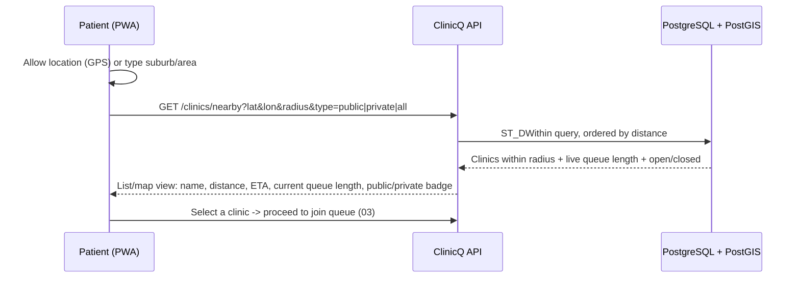
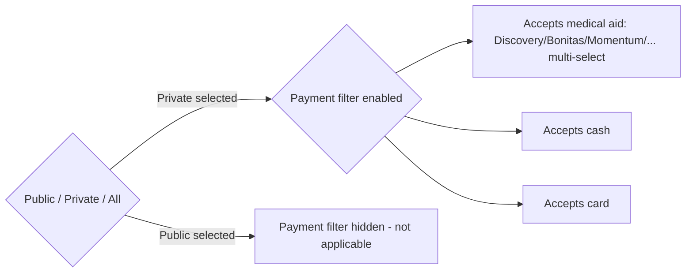

# 02 - Clinic discovery: geo-location, public/private toggle, payment filters

The original ClinicQ brief was queue management for one clinic. ClinicQ adds a **discovery layer**
in front of that: help a patient find *which* clinic to queue at in the first place, before joining the
queue itself ([03](03-booking-and-queue.md)).

## Discovery flow (geo-location "clinics near me")

**Fallback (no GPS permission / feature phone via USSD):** patient types or selects a suburb/area name
from a short list; the same PostGIS query runs against the area's centroid instead of a live GPS point.
This keeps discovery working identically across the PWA, USSD, and WhatsApp channels
([06](06-channels-app-ussd-whatsapp-web.md)).

## Public / private toggle

| Toggle state | Shows | Typical use |
|---------------|-------|--------------|
| **Public** | Government/municipal clinics and community health centres only | Patients using the public health system, no medical aid |
| **Private** | Private GP practices, private clinics, urgent-care centres | Patients with medical aid or paying cash/card |
| **All** (default) | Both, clearly badged | Browsing / comparing wait times regardless of sector |

This is a simple **directory filter on the `sites.sector` field** ([13](13-tech-implementation.md#3-core-data-model))
- no different login, no different queue engine. A clinic self-declares its sector at onboarding and it
never changes automatically.

## Payment / medical-aid filter (Phase 2 enhancement, private only)

**Not in the MVP.** Once a private clinic's onboarding form captures which payment types and medical aid
schemes it accepts, the discovery filter can narrow results further, **but only within "Private"**,
since public clinics operate on a different funding model entirely and do not take medical aid billing at
the point of care in the same way.

| Field (Phase 2) | Type | Notes |
|-------------------|------|-------|
| `accepts_cash` | boolean | Almost always true for private clinics; shown for completeness |
| `accepts_card` | boolean | Card machine at reception |
| `accepted_medical_aids` | list of scheme names/tags | Free-text tag list at first (e.g. "Discovery Health", "Bonitas", "Momentum Health", "Medihelp"); a **directory attribute self-reported by the clinic**, not a live eligibility check |
| `copay_notice` | short text (optional) | e.g. "Subject to plan type/network" - manages patient expectations without the platform doing claims logic |

**Why phase this out of the MVP:** verified medical-aid acceptance/eligibility checking is a real
integration project (each scheme has its own switch/API), and is easy to get wrong in a way that sends a
patient to the wrong clinic. Shipping a simple, honest, **self-reported** directory tag first (with a
clear "confirm with the clinic" disclaimer) gets 80% of the value at a fraction of the engineering and
compliance cost. Full integration is a realistic Stage 2+ item; see
[12-upscaling-24-months.md](12-upscaling-24-months.md).

## Data captured (discovery side)

| Table | Key fields |
|-------|-----------|
| `sites` | id, name, sector (public/private), location (PostGIS `geography(Point)`), address, hours, phone |
| `site_payment_profile` (Phase 2) | site_id, accepts_cash, accepts_card, accepted_medical_aids (array/tags), copay_notice |
| `site_queue_snapshot` | site_id, current_queue_length, average_wait_minutes, updated_at (cached for fast list rendering, see [13](13-tech-implementation.md)) |

Markdown cross-refs: queue-join flow lives in [03-booking-and-queue.md](03-booking-and-queue.md); full
combined schema in [13-tech-implementation.md](13-tech-implementation.md#3-core-data-model).
