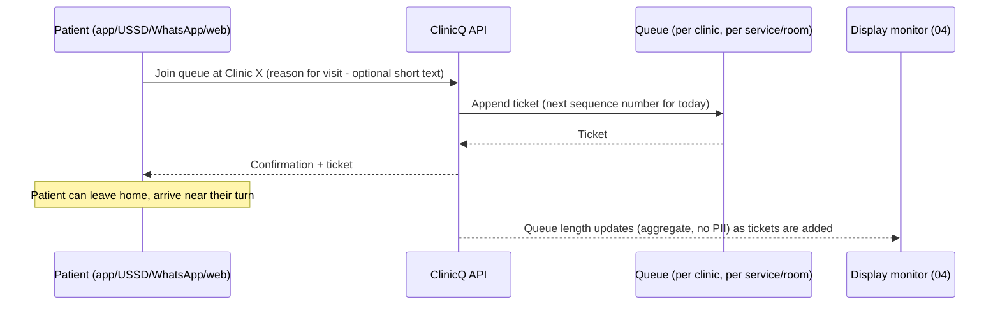
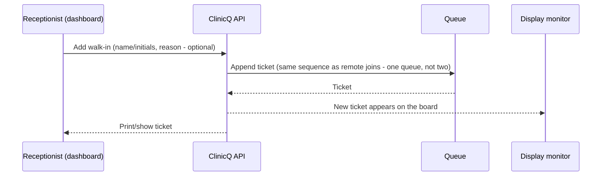
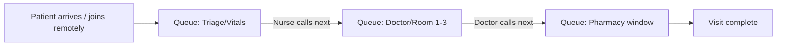
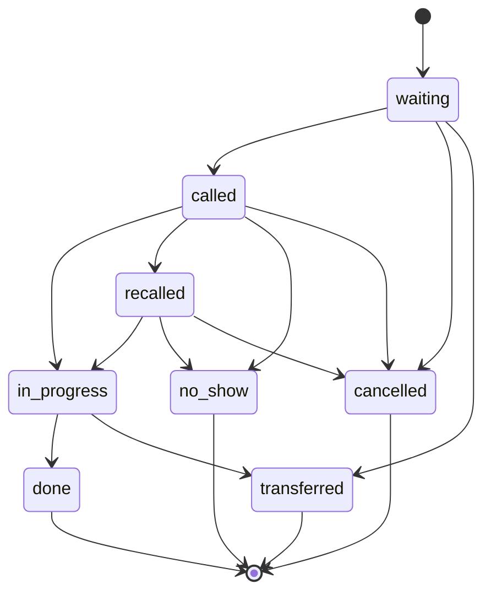

# 03: Booking & digital queue: join remotely or walk in, tickets, wait estimates

Once a clinic is chosen ([02](02-discovery-and-geolocation.md)), the core product is a **single shared
queue** that can be joined from four different doors ([06](06-channels-app-ussd-whatsapp-web.md)) and is
run from one dashboard ([05](05-clinic-dashboard.md)).

## Ways to get a ticket

| Method | Who uses it | Notes |
|--------|-------------|-------|
| **Join remotely** (app/USSD/WhatsApp/web, before leaving home) | Patients with a phone | Gets a ticket number and live position **before** travelling; can time arrival to reduce time spent physically waiting |
| **Walk-in** (reception issues ticket) | Patients with no phone, or who arrive without booking | Receptionist taps "add walk-in" on the dashboard; ticket appears on the display monitor exactly like a remote one |
| **Scheduled appointment** (optional, later) | Returning/chronic patients with a set slot | A booked time slot converts into a ticket automatically near the appointment time; see [12](12-upscaling-24-months.md) for phasing |

## Remote join sequence

**Estimated wait** starts as a simple rolling average (`average service time last N tickets x position in
queue`), shown as a range (e.g. "~15–25 min") rather than a false-precision single number; this mirrors
how well-run real-world queue systems (bank branches, DMV-style services) set expectations honestly.

## Walk-in intake (reception side)

**One queue, not two.** A common failure mode in simple queue apps is a separate "online" line that jumps
ahead of the physical line (or vice versa). ClinicQ deliberately keeps **one sequence per
clinic/room/service**, fair by arrival order regardless of channel, with staff able to manually reorder
for genuine triage/priority cases (elderly, visibly unwell, emergency) at their discretion.

## Multi-room / multi-service queues

Most clinics are not one single line: a patient might queue once for **triage/vitals**, then again for
the **doctor**, then again for the **pharmacy window**. ClinicQ models this as **multiple named queues
per clinic**, and a patient can be moved from one to the next by staff without re-joining from scratch:

Each queue has its own display feed ([04](04-display-monitor.md)) or they can share one multi-panel
screen if the clinic only has one monitor.

## Ticket lifecycle

A ticket's status changes in exactly one place, `transition_ticket()` in
`src/modules/queue/lifecycle.py`, and only along these arrows. Any other move is refused with `409`
and changes nothing. The four statuses with an arrow to the end never change again: a mistake is
corrected with a new ticket, not by reopening an old one. This diagram is checked against the
transition table by `tests/unit/queue/test_ticket_state_machine.py`, so it cannot drift from the code.

<!-- ticket-lifecycle:start -->

<!-- ticket-lifecycle:end -->

## No-show & recall handling

| Situation | Behaviour |
|-----------|-----------|
| Called, doesn't respond in X minutes | Ticket auto-moves to "recall" state, drops to end of active window (not deleted); staff can re-call once |
| Recalled twice, still absent | Ticket marked `no_show`, freeing the slot; patient (if remote) gets a notification explaining this and how to rejoin |
| Patient explicitly cancels remotely | Ticket marked `cancelled`, position recalculates for everyone behind them |

## Data captured (queue side)

| Table | Key fields |
|-------|-----------|
| `queues` | id, site_id, name (e.g. "Triage", "Doctor Room 2", "Pharmacy"), is_active |
| `ticket` | id, site_id, queue_id, patient_id (empty for a walk-in with no phone: no placeholder patient), service_day (the Johannesburg date), sequence (unique per queue and service day, allocated by the database), number (`A043`), reference_code (six characters with no 0/O or 1/I/L), source (web/ussd/whatsapp/walk_in), walk_in_name (the desk's name for a walk-in; a phone join is named by its patient record, behind consent), reason_text (optional, short), comment_consent, status (waiting/called/recalled/in_progress/done/no_show/cancelled/transferred), joined_at, called_at, started_at, completed_at |
| `ticket_sequence` | queue_id, service_day, last_value: the counter a ticket number comes from, one row per queue per day, so numbering restarts at Johannesburg midnight with nothing to reset |
| `patients` (optional link, if patient has an account) | id, phone/whatsapp_id, name, consent_flags |
| `wait_time_samples` | queue_id, ticket_id, actual_wait_minutes, recorded_at (feeds the rolling estimate) |

Markdown cross-refs: display rendering of `patient_display_name`/`reason_text` and privacy controls are in
[04-display-monitor.md](04-display-monitor.md); dashboard call-next mechanics in
[05-clinic-dashboard.md](05-clinic-dashboard.md); full combined schema in
[13-tech-implementation.md](13-tech-implementation.md#3-core-data-model).
