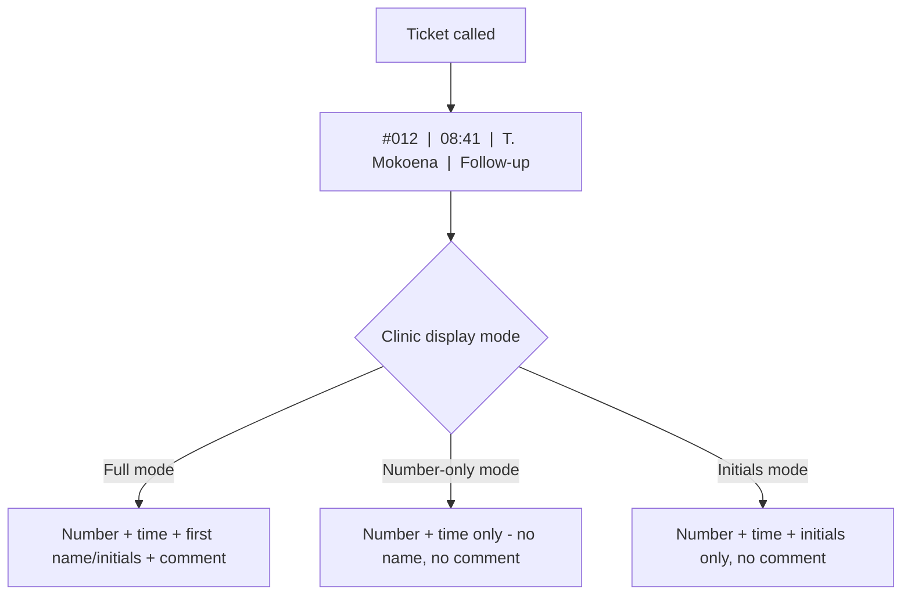
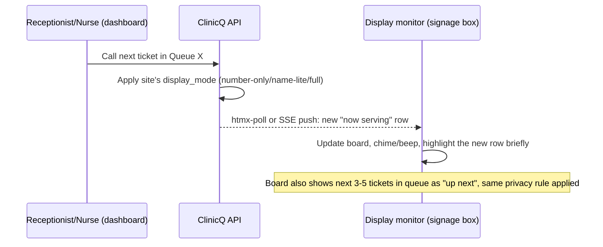

# 04: Waiting-room display monitor: number, time, name, comment

The brief asked for a **display monitor showing the queue**: number, time, and name, with a possible
short comment such as "headache", "frequent check-up", "stomach ache". This is the single most visible
part of the product (it's the screen every patient in the waiting room stares at), so it gets its own doc
covering both the **feature** and the **privacy design** around it.

## What's on screen

| Column | Always shown? | Notes |
|--------|-----------------|-------|
| **Ticket number** | Always | e.g. `#012`: the one thing every queue system needs at minimum |
| **Called time** | Always | e.g. `08:41`: reassures people the board is live, not stuck |
| **Name** | **Clinic-configurable** | Full first name, first name + last-initial, or initials only, or hidden entirely; see privacy note below |
| **Comment / reason** | **Clinic-configurable, off by default** | Short free-text the patient (or reception) entered when joining, e.g. "headache", "follow-up", "stomach ache" |

## Display modes (clinic picks one per site, changeable anytime)

| Mode | Number | Time | Name | Comment | Best for |
|------|--------|------|------|---------|----------|
| **Number-only** (recommended default) | Yes | Yes | No | No | Any clinic that wants zero identity/health info on a public screen, the safest default |
| **Name-lite** | Yes | Yes | First name + last-initial (e.g. "Thabo M.") | No | Smaller clinics where patients like hearing something more personal than a number, without full identification |
| **Full** (opt-in, requires explicit clinic + patient consent) | Yes | Yes | Full name or first name | Optional, only if patient ticked "show my reason for visit on the board" when joining | Small community clinics where everyone already knows everyone, and patients have explicitly said they don't mind |

**Recommendation for the capstone demo and for any real pilot:** ship with **Number-only** as the
hard default, and treat **Name-lite**/**Full** as an explicit, auditable clinic setting, never the
platform default, because of the safeguarding point below.

## Why the comment/name combo needs a privacy design (not just a feature toggle)

Putting a person's **name next to their symptom** ("stomach ache", "follow-up") on a screen that anyone
in the waiting room can read is **health information about an identifiable person, displayed
publicly**: this is squarely inside what POPIA calls "special personal information" (health data) once a
name is attached, even though the underlying intent (a friendlier queue board) is entirely benign.

- **Never show the comment next to a full name by default.** If a clinic wants comments visible at all,
  pair them only with the **ticket number** (no name), so the board still reads "#012 - follow-up"
  without identifying who #012 is to bystanders who don't already know them personally.
- **Get explicit, per-visit opt-in** if a clinic ever wants name + comment together (e.g. a small rural
  clinic where the board is genuinely just a friendly convenience and patients agree); the default is off.
- **Comment field is free text, not a diagnosis code.** It exists purely so staff (and, if enabled, the
  board) can show a human-friendly reason; it is never structured clinical data and is not retained
  beyond a short window after the visit (see retention note in [13](13-tech-implementation.md)).
- **This is exactly the same caution ElimuKadi applies to biometric face-recognition data for
  learners** (ElimuKadi 01): treat any optional feature that touches personal
  health/identity data as consent-gated and off-by-default, not a default convenience.

## Rendering flow (dashboard action -> board update)

## Hardware notes (kept short; full detail in [07](07-devices-and-bom.md))

The board is just a **browser tab in kiosk mode** on any TV/monitor connected to a small always-on box
(Raspberry Pi-class mini-PC or an old repurposed PC): no proprietary signage software or licence needed,
consistent with the project's "PWA + server-rendered pages" approach
([06](06-channels-app-ussd-whatsapp-web.md), [13](13-tech-implementation.md)).

## Data captured (display side; reuses ticket data from [03](03-booking-and-queue.md))

| Table | Key fields |
|-------|-----------|
| `sites` | ...existing fields..., `display_mode` (number_only/name_lite/full), `display_show_comment` (boolean) |
| `tickets` | ...existing fields from [03](03-booking-and-queue.md)..., `comment_consent` (boolean: patient explicitly agreed comment can be shown) |

Markdown: this is [04-display-monitor.md](04-display-monitor.md); ticket lifecycle in
[03-booking-and-queue.md](03-booking-and-queue.md); combined schema in
[13-tech-implementation.md](13-tech-implementation.md#3-core-data-model).
