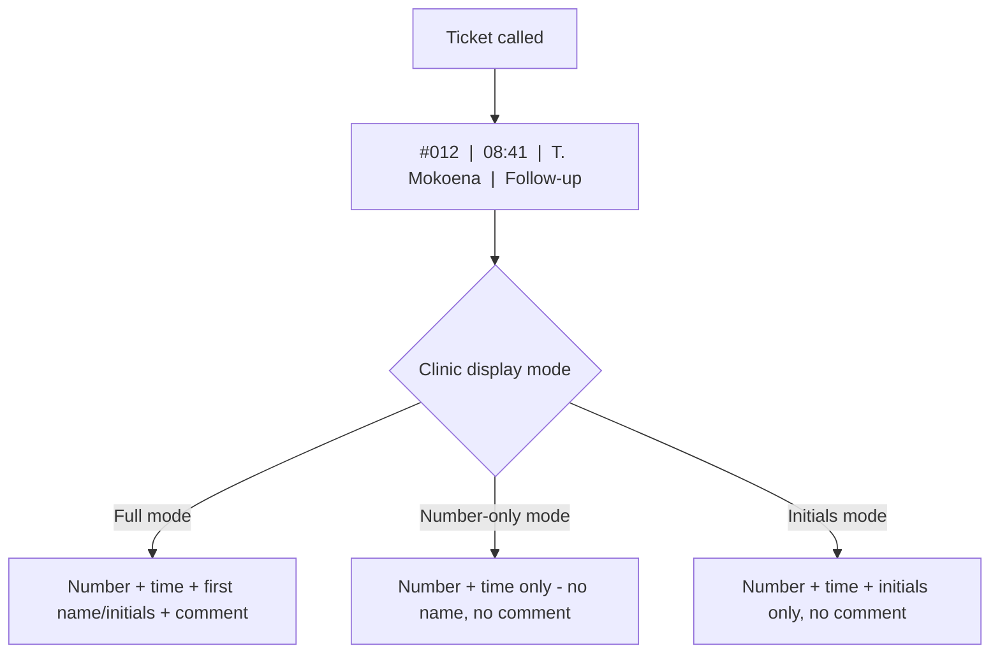
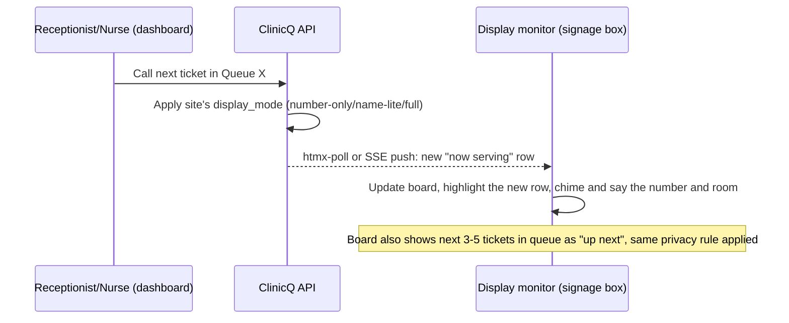

# 04: Waiting-room display monitor: number, time, name, comment

The brief asked for a **display monitor showing the queue**: number, time, and name, with a possible
short comment such as "headache", "frequent check-up", "stomach ache". This is the single most visible
part of the product (it's the screen every patient in the waiting room stares at), so it gets its own doc
covering both the **feature** and the **privacy design** around it.

## What's on screen

| Column | Always shown? | Notes |
|--------|-----------------|-------|
| **Ticket number** | Always | e.g. `#012`: the one thing every queue system needs at minimum |
| **Called time** | Always | e.g. `08:41`: reassures people the board is live, not stuck |
| **Name** | **Clinic-configurable** | Full first name, first name + last-initial, or initials only, or hidden entirely; see privacy note below |
| **Comment / reason** | **Clinic-configurable, off by default** | Short free-text the patient (or reception) entered when joining, e.g. "headache", "follow-up", "stomach ache" |

## Display modes (clinic picks one per site, changeable anytime)

| Mode | Number | Time | Name | Comment | Best for |
|------|--------|------|------|---------|----------|
| **Number-only** (recommended default) | Yes | Yes | No | No | Any clinic that wants zero identity/health info on a public screen, the safest default |
| **Name-lite** | Yes | Yes | First name + last-initial (e.g. "Thabo M.") | No | Smaller clinics where patients like hearing something more personal than a number, without full identification |
| **Full** (opt-in, requires explicit clinic + patient consent) | Yes | Yes | Full name or first name | Optional, only if patient ticked "show my reason for visit on the board" when joining | Small community clinics where everyone already knows everyone, and patients have explicitly said they don't mind |

**Recommendation for the capstone demo and for any real pilot:** ship with **Number-only** as the
hard default, and treat **Name-lite**/**Full** as an explicit, auditable clinic setting, never the
platform default, because of the safeguarding point below.

## Why the comment/name combo needs a privacy design (not just a feature toggle)

Putting a person's **name next to their symptom** ("stomach ache", "follow-up") on a screen that anyone
in the waiting room can read is **health information about an identifiable person, displayed
publicly**: this is squarely inside what POPIA calls "special personal information" (health data) once a
name is attached, even though the underlying intent (a friendlier queue board) is entirely benign.

- **Never show the comment next to a full name by default.** If a clinic wants comments visible at all,
  pair them only with the **ticket number** (no name), so the board still reads "#012 - follow-up"
  without identifying who #012 is to bystanders who don't already know them personally.
- **Get explicit, per-visit opt-in** if a clinic ever wants name + comment together (e.g. a small rural
  clinic where the board is genuinely just a friendly convenience and patients agree); the default is off.
- **Comment field is free text, not a diagnosis code.** It exists purely so staff (and, if enabled, the
  board) can show a human-friendly reason; it is never structured clinical data and is not retained
  beyond a short window after the visit (see retention note in [13](13-tech-implementation.md)).
- **This is exactly the same caution ElimuKadi applies to biometric face-recognition data for
  learners** (ElimuKadi 01): treat any optional feature that touches personal
  health/identity data as consent-gated and off-by-default, not a default convenience.

## Rendering flow (dashboard action -> board update)

## Hardware notes (kept short; full detail in [07](07-devices-and-bom.md))

The board is just a **browser tab in kiosk mode** on any TV/monitor connected to a small always-on box
(Raspberry Pi-class mini-PC or an old repurposed PC): no proprietary signage software or licence needed,
consistent with the project's "PWA + server-rendered pages" approach
([06](06-channels-app-ussd-whatsapp-web.md), [13](13-tech-implementation.md)).

## The board page (Issue 56)

`GET /display/{site_id}` is the page a kiosk box opens: full screen, no sign-in, no pointer, no scrollbars.
Its own stylesheet (`src/static/css/board.css`) and script (`src/static/js/board.js`) are separate from the
staff screens', and nothing is inline.

- **Header:** the clinic's initials and name (the branding slot), and a clock on the clinic's time.
- **One panel per open queue:** its name and room, the number **now serving** in large type with its
  status ("Please come in", "Called again", "Being seen"), any earlier calls on one line, the next numbers
  **up next**, and how many are waiting.
- **Layouts:** one queue fills the screen, two and three stand side by side, and four make a grid of two
  by two. A clinic with more queues shows four panels at a time and turns the page every 15 seconds, with
  "Page 1 of 2" in the corner.
- **A new call** is highlighted for 20 seconds: inverted colours, a heavy border and the words
  "▶ Called now", with a short pulse. Under reduced motion there is no pulse, and everything else stays.
  A call on a page that is not showing brings that page forward.
- **Footer:** one general health notice at a time (`BOARD_HEALTH_TICKER`), never scrolling.
- **Legibility:** on a 32-inch screen a number being served is at least 49 mm tall in every layout, and a
  number up next at least 22 mm, at 1080p or 720p alike. See `docs/OPS/BOARD_LEGIBILITY.md`.

## Accessibility and themes (Issue 59)

- **Three themes, one per clinic** (display settings, *Colours of the screen*; `sites.board_theme`):
  - `dim` (the default): light on dark, for a dim room;
  - `bright`: dark on light, for daylight;
  - `high_contrast`: white and yellow on black.

  Every theme passes WCAG 2.2 AA on every board state, and a change reaches open boards at once.
- **Status is never colour alone:** ● please come in, ▶ called now, ◆ called again, ■ being seen,
  ⟳ reconnecting, each with its words.
- **Reduced motion:** no pulse and no fade. The new-call highlight gains a still inner ring.
- **Evidence** for the accessibility audit (Issue 101), including what has not been checked:
  `docs/COMPLIANCE/ACCESSIBILITY_BOARD_EVIDENCE.md`.

## Kiosk screens (Issue 61)

- **A board is shown only on the clinic's own screens.** These are a paired kiosk box, or a signed-in
  staff member previewing. The address `/display/{site_id}` opened anywhere else shows a pairing code,
  so it can be neither guessed nor shared. Its JSON and stream answer `401`.
- **Pairing:**
  - every box opens `/display` and shows a six-character code;
  - a clinic manager types the code under **Clinic settings → Display boards**, with a name and,
    optionally, the queues that screen shows;
  - the box opens the board by itself.

  The box's credential is a long secret in an httpOnly, same-site cookie, stored only as its SHA-256
  (`display_device.token_hash`), like a refresh token.
- **Removal:** a removed screen is refused at once and goes back to a code within half a minute.
- **Watching:** the board reports every minute. A screen silent for 10 minutes alerts the team channel
  once, naming it and its clinic, and once more when back. Operators see every screen at
  `/admin/display-devices`.
- **Setting a box up:** `docs/OPS/KIOSK_SETUP.md`.

## Announcements (Issue 60)

- **A chime, then the number and the room**, in the clinic's language: *"Number A 0 1 2, please go to
  Room 4."* The number is spelled out so each character is heard.
- **Never a name.** What the board speaks is a sentence with two blanks, the number and the room, and the
  server refuses any other blank. The script that speaks is handed only those two values, whatever the
  screen shows under the clinic's display mode.
- **One at a time.** Calls made together are said in order, never over each other.
- **Per clinic:** *Announce each call aloud* (`sites.announce_audio`) and *Loudness of announcements*
  (`sites.announce_volume`, 0–100 %). Muted, the screen still highlights every call.
- **Languages:** English, isiZulu, isiXhosa, Afrikaans and Sesotho have their own sentence; the other
  board languages speak English. **No sentence has been checked by a fluent speaker yet.**
- **How it is said:** the browser's speech with a voice for the language; otherwise recorded clips of
  each letter and digit (`src/static/audio/numbers/<language>/`), none recorded yet; otherwise English
  speech; otherwise the chime alone.
- **Voices, recordings and the fluent-speaker record:** `docs/OPS/BOARD_AUDIO.md`.

## Live updates (Issue 57)

`GET /display/{site_id}/stream` is a server-sent events stream. It is read-only and unauthenticated, and
it uses the same envelope as the dashboard's stream (`type`, `site_id`, `at`, `queue_id`). Every event
except the heartbeat also carries `board`: the privacy projection, as the board may show it.

| Event | When | Carries |
|-------|------|---------|
| `board.state` | First, on every connection: a full resync | the whole board |
| `ticket.called` | A call, or a recall | the board after it |
| `queue.updated` | A join, a finish, a cancellation, a transfer, a reorder, or a consent answer from a patient on the board | the board after it |
| `board.config_changed` | The clinic changed what its board may show | the board after it |
| `heartbeat` | Every 15 seconds of silence | nothing |

- **On the screen** (`board-live.js`):
  - Two missed beats (30 s) show "⟳ Reconnecting to the clinic…".
  - Reconnection backs off from 1 to 30 seconds with jitter. After three failures the board also asks
    `/state` every 10 seconds. A reconnection's first event resyncs everything.
- **On the server:**
  - A clinic's streams share the per-instance limit of 100 (`503` with `Retry-After` beyond it).
  - A client that is gone is noticed at the next beat.
  - One projection is shared by every screen of a clinic for each change.
  - With `REDIS_URL`, events fan out to every instance through Redis pub/sub (`LIVE_EVENTS_FANOUT`).
  - `/metrics` shows `clinicq_live_streams_open`.

## What the server sends (Issue 58)

Every board response is built by one function, `project_board()` in
`src/modules/display/projection.py`. This covers the JSON at `GET /display/{site_id}/state`, the page
and its live stream. The rule is applied before anything is serialised:

| Mode | A ticket on the wire |
|------|----------------------|
| `number_only` | `{"number": "T004", "status": "called", "called_at": "…"}`: no `name` key and no `comment` key anywhere in the response |
| `name_lite` | adds `"name": "Thabo M."` for a patient who agreed to show their name; never a `comment` |
| `full` | adds `"name": "Thabo Mokoena"` for a patient who agreed. It adds `"comment"` only when the clinic switched reasons on **and** the patient agreed to show their reason, both in general and for this visit (`tickets.comment_consent`) |

- **Consent is read at render time** through `has_consent()`, so a withdrawal applies to the next response.
- **Only the clinic's own screens see a board.** A paired kiosk box, or signed-in staff of that clinic,
  see it under the clinic's mode. Since Issue 61 nobody else gets a board at all, because a first name
  agreed for the waiting room was not agreed for the internet. The projection still caps any other
  viewer at `number_only`, as a second lock.
- **A queue's name is `label` on the wire**, so a `name` key only ever belongs to a person.

## Data captured (display side; reuses ticket data from [03](03-booking-and-queue.md))

| Table | Key fields |
|-------|-----------|
| `sites` | ...existing fields..., `display_mode` (number_only/name_lite/full), `display_show_comment` (boolean) |
| `tickets` | ...existing fields from [03](03-booking-and-queue.md)..., `comment_consent` (boolean: patient explicitly agreed comment can be shown) |

Markdown: this is [04-display-monitor.md](04-display-monitor.md); ticket lifecycle in
[03-booking-and-queue.md](03-booking-and-queue.md); combined schema in
[13-tech-implementation.md](13-tech-implementation.md#3-core-data-model).
