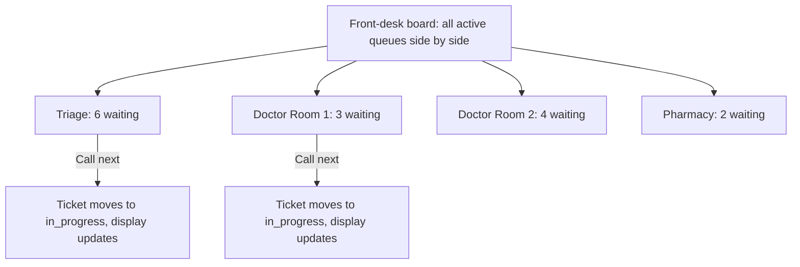
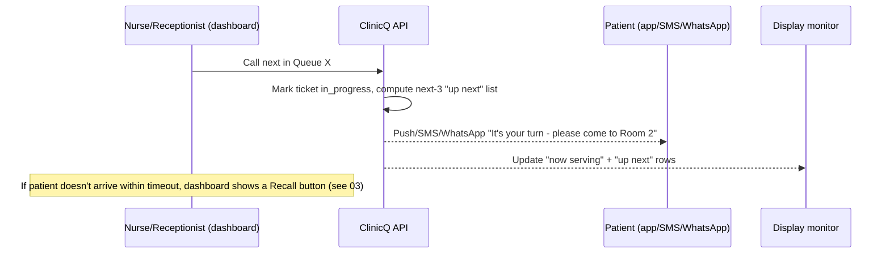

# 05: Clinic dashboard: call-next, per-room queues, walk-in intake, reporting

The dashboard is where reception, nurses, and the clinic manager actually run the day: every other
surface (patient app, USSD, WhatsApp, display monitor) is downstream of actions taken here.

## Dashboard views by role

| Role | View | Key actions |
|------|------|--------------|
| **Receptionist/clerk** | Front-desk queue view, all active queues at the clinic | Add walk-in, call next, mark arrived, cancel/no-show, print a paper ticket stub if needed |
| **Nurse/doctor** | Their own room/queue only | Call next, add a short visit note (private, not the same as the public comment; see [04](04-display-monitor.md)), mark done |
| **Clinic manager/admin** | Clinic profile + reports | Edit hours/sector/public-private flag, set display mode, view wait-time and no-show reports, manage staff accounts |
| **Platform admin** (ClinicQ operator) | Cross-clinic view (Phase 2+) | Onboarding, billing status, support tickets, aggregate uptime |

Which of these views a person gets is decided by their **grants at the clinic they are working in**,
not by their job title: the navigation is the RBAC nav registry evaluated with the roles they hold at
that clinic, and every page re-checks the same grant, so a screen missing from the menu also refuses
its URL. Someone who works at two clinics (a receptionist at one and the manager of another, say)
switches between them from the clinic name in the header without signing in again, and lands on the
same screen at the other clinic when it is theirs there. Every screen is keyboard-reachable (`g`
then a key, `?` for the list), and the frame fits a 1366×768 reception PC with no sideways scrolling.

## Front-desk queue view

Each queue card shows: current length, average wait so far today, oldest waiting ticket's wait time (a
quick "is anyone stuck?" signal), and a big **Call Next** button.

Each card also holds its **waiting line** in call order. Staff move a visibly unwell patient forward
by dragging them up the line or with the "Move forward" button beside them (the touch and keyboard
way to do the same thing); either way a prompt asks for a reason from a fixed list and an optional
note, and a move without a reason is not saved. A moved patient carries a **Priority** badge that only
staff screens show, the card lists the queue's overrides of the day, and the clinic manager reads every
override with counts per staff member (listed by name, never ranked) on the **Overrides** screen. A
role without the permission sees the same line with its controls switched off.

## Call-next sequence (ties dashboard, patient notification, and display together)

## Walk-in intake and reordering

- **Add walk-in**: name/initials (optional phone number for notifications), reason (optional, private
  note vs public comment; see [04](04-display-monitor.md)), joins the same sequence as remote tickets.
- **Manual reorder**: staff can drag a ticket up the queue for genuine clinical priority (visibly unwell,
  elderly, emergency); every reorder is logged with the staff member's id and a reason code, for
  audit/accountability (this is the human-override valve that keeps the "one fair queue" rule in
  [03](03-booking-and-queue.md) workable in the real world).

## Reporting & analytics

| Report | Shows | Why it matters |
|--------|-------|------------------|
| Average wait time (daily/weekly) | By queue/room, by hour of day | Staffing decisions, e.g. add a second doctor's queue on Monday mornings |
| No-show rate | % of remote-joined tickets that never arrive | High rate may mean the wait estimate is misleading patients, or notifications aren't landing |
| Channel mix | % joined via app / USSD / WhatsApp / walk-in | Tells the clinic (and ClinicQ) which channel to invest support/marketing in; see [06](06-channels-app-ussd-whatsapp-web.md) |
| Queue-length heatmap | Busiest hours/days | The single easiest "why should we buy this" chart for a clinic manager; mirrors the canteen queue-time story used in ElimuKadi's marketing |
| Public vs private discovery views | How many people viewed this clinic in discovery ([02](02-discovery-and-geolocation.md)) vs actually joined | Helps a clinic gauge whether its listing (hours, sector badge) is driving or losing footfall |

## Data captured (dashboard/reporting side)

| Table | Key fields |
|-------|-----------|
| `staff_users` | id, site_id, role (receptionist/nurse/doctor/manager/platform_admin), auth fields |
| `queue_reorders` | id, ticket_id, staff_id, reason_code, occurred_at |
| `visit_notes` (private, staff-only) | id, ticket_id, staff_id, note_text, created_at; **never shown on the display monitor** |
| `daily_queue_stats` | site_id, queue_id, date, avg_wait_minutes, no_show_count, ticket_count (pre-aggregated for fast dashboard charts) |

Markdown: this is [05-clinic-dashboard.md](05-clinic-dashboard.md); queue mechanics in
[03-booking-and-queue.md](03-booking-and-queue.md); combined schema in
[13-tech-implementation.md](13-tech-implementation.md#3-core-data-model).
