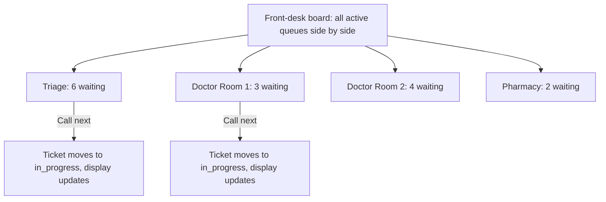
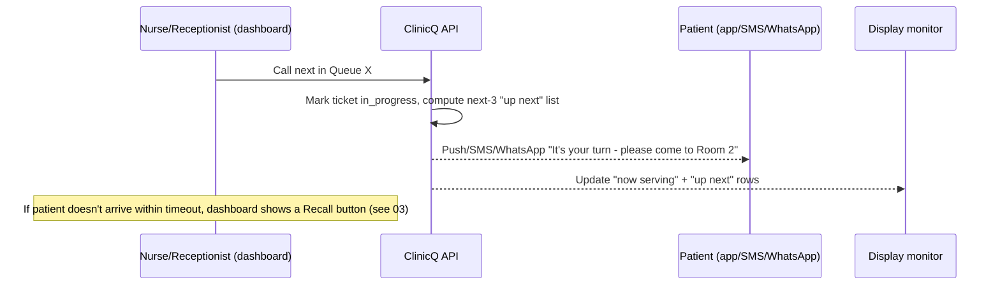

# 05: Clinic dashboard: call-next, per-room queues, walk-in intake, reporting

The dashboard is where reception, nurses, and the clinic manager actually run the day: every other
surface (patient app, USSD, WhatsApp, display monitor) is downstream of actions taken here.

## Dashboard views by role

| Role | View | Key actions |
|------|------|--------------|
| **Receptionist/clerk** | Front-desk queue view, all active queues at the clinic | Add walk-in, call next, mark arrived, cancel/no-show, print a paper ticket stub if needed |
| **Nurse/doctor** | Their own room/queue only | Call next, add a short visit note (private, not the same as the public comment; see [04](04-display-monitor.md)), mark done |
| **Clinic manager/admin** | Clinic profile + reports | Edit hours/sector/public-private flag, set display mode, view wait-time and no-show reports, manage staff accounts |
| **Platform admin** (ClinicQ operator) | Cross-clinic view (Phase 2+) | Onboarding, billing status, support tickets, aggregate uptime |

Which of these views a person gets is decided by their **grants at the clinic they are working in**,
not by their job title: the navigation is the RBAC nav registry evaluated with the roles they hold at
that clinic, and every page re-checks the same grant, so a screen missing from the menu also refuses
its URL. Someone who works at two clinics (a receptionist at one and the manager of another, say)
switches between them from the clinic name in the header without signing in again, and lands on the
same screen at the other clinic when it is theirs there.

The clinic manager runs their own clinic from **Clinic settings**, one tab per job: the profile (with a
map pin that patients' nearby search reads the moment it is saved), opening hours and public holidays
with a one-tap temporary closure, the queues and the services (add, rename, reorder, deactivate), the
staff (invitations, roles at this clinic, rooms, switching an account off) and the waiting-room screen,
whose privacy warning sits beside a live preview of what the screen would show. Every tab saves through
the same API as any other client, so every change is checked and recorded the same way; anything that
takes something away asks first, and another clinic's settings are simply not found. Every screen is keyboard-reachable (`g`
then a key, `?` for the list), and the frame fits a 1366×768 reception PC with no sideways scrolling.

## Front-desk queue view

Each queue card shows: current length, average wait so far today, oldest waiting ticket's wait time (a
quick "is anyone stuck?" signal), and a big **Call Next** button.

The board is **live**: a change made anywhere (a join from a phone, a call from a room) reaches it within
a second or two over a server-sent events stream, which carries only "this queue changed" and never a
patient's details. A queue whose longest wait has passed the clinic's threshold (45 minutes by default)
turns red with "Someone has waited N min". The line above the board always says whether it is **Live**,
**Reconnecting, data from HH:MM**, or **Updating every 5 seconds, data from HH:MM** when live updates are
unavailable, so a frozen board never passes for a current one, and nothing on it takes focus from a
receptionist in the middle of typing.

Each card also holds its **waiting line** in call order. Staff move a visibly unwell patient forward
by dragging them up the line or with the "Move forward" button beside them (the touch and keyboard
way to do the same thing); either way a prompt asks for a reason from a fixed list and an optional
note, and a move without a reason is not saved. A moved patient carries a **Priority** badge that only
staff screens show, the card lists the queue's overrides of the day, and the clinic manager reads every
override with counts per staff member (listed by name, never ranked) on the **Overrides** screen. A
role without the permission sees the same line with its controls switched off.

A nurse or doctor opens **My room**, built for a 10-inch tablet: only the queues they are assigned to,
a large **Call next**, and for each patient with them **Start**, **Done** and **Transfer**, all through
the queue engine. Beside the patient sits a short **visit note** box (up to 1,000 characters). A note is
encrypted where it is stored, shows its author and time, is kept for 30 days by default and then removed
by a nightly sweep, and never appears on the board, the display or anything a patient sees. Notes from a
patient's earlier visits show only when the patient agreed to share them. A clinician's buttons and API
calls reach only their own rooms: another room's queue answers as if it did not exist.

## Call-next sequence (ties dashboard, patient notification, and display together)

On every front-desk card and in every room, **Call next** is the largest button, with the number it will
call on it. Beside each patient with staff are the buttons the ticket's status allows: **Start**,
**Recall**, **No-show** (which asks first, because it ends the ticket) and **Done**, with how long the
patient has been called or in the room, counting as the screen stays open. A press changes the card at
once; if the clinic refuses it (someone else moved the patient, the nurse was moved to another room),
the card goes back to how it was and says why. A double tap, or a press repeated on a slow connection,
calls one patient, never two. A patient called by mistake can be put back **in the same place** with
**Undo call** for 30 seconds; the audit trail keeps both the call and its undoing.

## Walk-in intake and reordering

- **Add walk-in**: name/initials (optional phone number for notifications), reason (optional, private
  note vs public comment; see [04](04-display-monitor.md)), joins the same sequence as remote tickets.
  On the **Walk-in** screen the name field has focus and the queue last used is already chosen, so a
  walk-in is a name and the Enter key, in well under ten seconds and without a mouse. With a phone
  number, the desk reads out the consent sentence and ticks the patient's answer, which is recorded as
  their consent to messages about their turn. The number appears in large type to show the patient, and
  **Print stub** (Alt+P) prints it for a 58 mm thermal printer, with no name, phone or reason on the
  paper. The last walk-in the desk issued can be undone for two minutes while the patient still waits;
  the ticket is cancelled, audited, and its number is never given out again.
- **Manual reorder**: staff can drag a ticket up the queue for genuine clinical priority (visibly unwell,
  elderly, emergency); every reorder is logged with the staff member's id and a reason code, for
  audit/accountability (this is the human-override valve that keeps the "one fair queue" rule in
  [03](03-booking-and-queue.md) workable in the real world).

## Reporting & analytics

| Report | Shows | Why it matters |
|--------|-------|------------------|
| Average wait time (daily/weekly) | By queue/room, by hour of day | Staffing decisions, e.g. add a second doctor's queue on Monday mornings |
| No-show rate | % of remote-joined tickets that never arrive | High rate may mean the wait estimate is misleading patients, or notifications aren't landing |
| Channel mix | % joined via app / USSD / WhatsApp / walk-in | Tells the clinic (and ClinicQ) which channel to invest support/marketing in; see [06](06-channels-app-ussd-whatsapp-web.md) |
| Queue-length heatmap | Busiest hours/days | The single easiest "why should we buy this" chart for a clinic manager; mirrors the canteen queue-time story used in ElimuKadi's marketing |
| Public vs private discovery views | How many people viewed this clinic in discovery ([02](02-discovery-and-geolocation.md)) vs actually joined | Helps a clinic gauge whether its listing (hours, sector badge) is driving or losing footfall |

## Data captured (dashboard/reporting side)

| Table | Key fields |
|-------|-----------|
| `staff_users` | id, site_id, role (receptionist/nurse/doctor/manager/platform_admin), auth fields |
| `queue_reorders` | id, ticket_id, staff_id, reason_code, occurred_at |
| `visit_note` (private, staff-only) | id, site_id, queue_id, ticket_id, visit_id, patient_id, author_user_id, author, note_text (encrypted), created_at, expires_at; **never shown on the display monitor or to patients** |
| `daily_queue_stats` | site_id, queue_id, date, avg_wait_minutes, no_show_count, ticket_count (pre-aggregated for fast dashboard charts) |

Markdown: this is [05-clinic-dashboard.md](05-clinic-dashboard.md); queue mechanics in
[03-booking-and-queue.md](03-booking-and-queue.md); combined schema in
[13-tech-implementation.md](13-tech-implementation.md#3-core-data-model).
