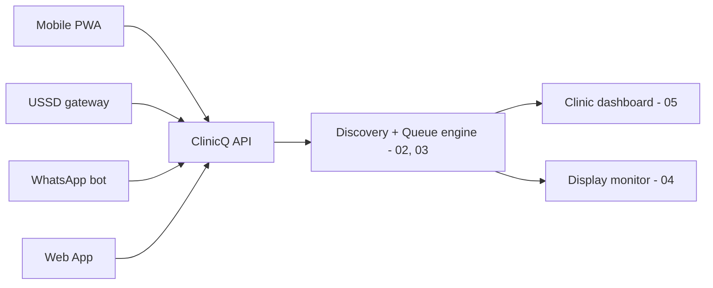
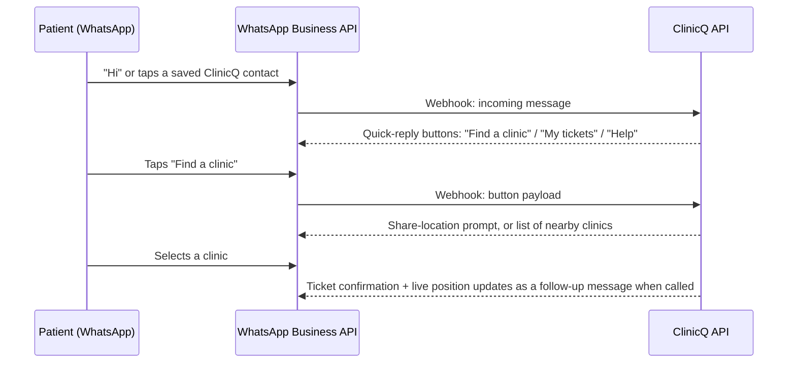

# 06 - Mobile PWA, USSD, WhatsApp bot, Web App - one engine, four doors

South Africa's phone landscape is split between smartphone-with-data users, feature-phone/no-data users,
and near-universal WhatsApp adoption on whatever phone people have. ClinicQ's discovery and queue engine
([02](02-discovery-and-geolocation.md), [03](03-booking-and-queue.md)) is exposed through **four
channels**, all calling the same underlying API - no channel gets special features the others lack in
terms of the core "find a clinic, get a ticket, get notified" loop.

## Channel comparison

| Channel | Needs | Best for | Notes |
|---------|-------|----------|-------|
| **Mobile PWA** | Smartphone + data (even patchy) | Richest experience: map view, live position, push notifications | Installable to home screen, no app-store review cycle - same pattern as ElimuKadi and UmojaNet |
| **USSD** (e.g. `*120*XXX#`) | Any phone, including feature phones, **no data/airtime needed to browse** | Patients with no smartphone or no data - the most inclusive channel | Menu-driven text flow; works on the cheapest phones and in low-signal areas where only USSD/SMS gets through |
| **WhatsApp bot** | Smartphone + WhatsApp (already installed by the vast majority of SA phone users) | Patients who already live in WhatsApp - lowest-friction channel for most people | Uses WhatsApp Business Cloud API (Meta) or a BSP like Twilio/Vonage; button-based menus (WhatsApp "quick reply" buttons) keep it simple |
| **Web App** | Any browser, desktop or mobile | Clinic-side discovery embed (e.g. a link shared on a clinic's Facebook page), or patients without a smartphone but with library/work PC access | Same server-rendered pages as the PWA, just without the installable/offline shell |

## Same engine, different front door



## USSD flow (menu sketch)

```text
*120*5551#
1. Find a clinic near me
2. My active tickets
3. Help

> 1
Detecting area... or reply with your suburb:
> Soweto

Public clinics near Soweto:
1. Baragwanath Community Clinic (0.8 km) - queue: 12
2. Jabulani Clinic (1.4 km) - queue: 4
3. See more

> 2
Ticket #041 issued at Jabulani Clinic.
You are #4. Estimated wait: 20-30 min.
Reply 9 to cancel.
```

USSD sessions are short-lived and stateless between taps, so the API keeps **session state server-side**
keyed by the USSD session id, replaying the current menu step on each request - the same idempotent,
short-request pattern used for UmojaNet's captive portal.

## WhatsApp bot flow (sketch)



## Notification delivery by channel

| Patient joined via | "You're next" delivered via |
|----------------------|-------------------------------|
| PWA | Web push (if granted) - falls back to SMS if push isn't available |
| USSD | SMS (USSD itself can't push - the phone number captured at join time is used) |
| WhatsApp | WhatsApp message (same thread) |
| Web App (no phone captured) | None automatic - patient is shown the live position on-screen and should refresh/return near their estimated turn |

This mirrors the **iOS PWA push gap workaround** already used in
ElimuKadi: whenever a push channel might not
land, fall back to SMS rather than leaving the patient with no notification at all.

## Why not a native app first

Same reasoning as ElimuKadi and UmojaNet: one
FastAPI + htmx codebase serves the PWA and the web app; USSD and WhatsApp are thin adapters calling the
same `/api/*` routes ([13](13-tech-implementation.md#5-api--route-surface-sketch)). A native app is a
later option only if patients strongly prefer an App Store presence for trust - the backend already
exposes JSON for that future client.

Markdown: this is [06-channels-app-ussd-whatsapp-web.md](06-channels-app-ussd-whatsapp-web.md).
