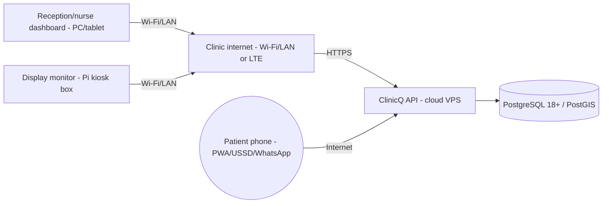
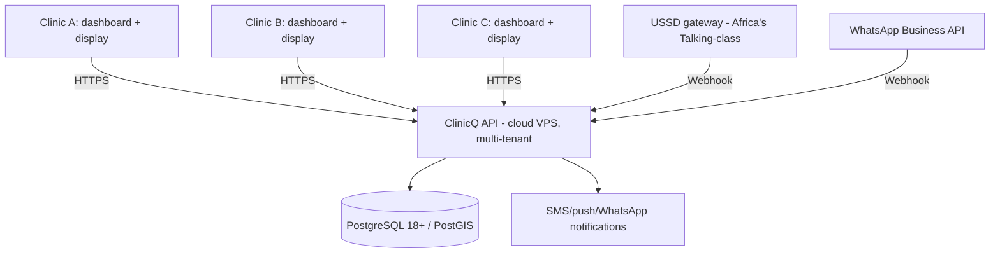
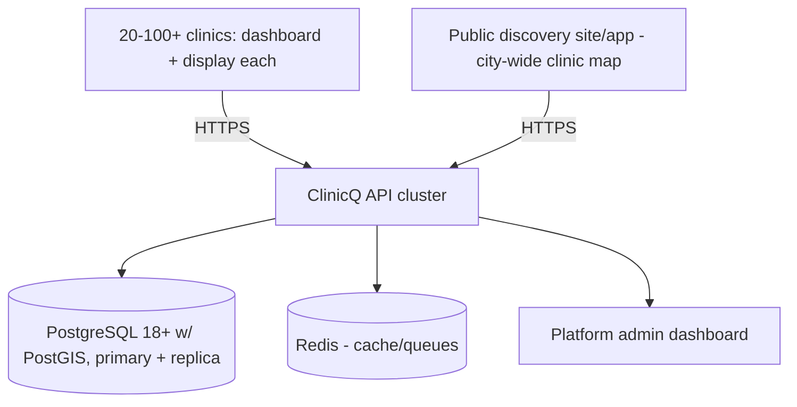
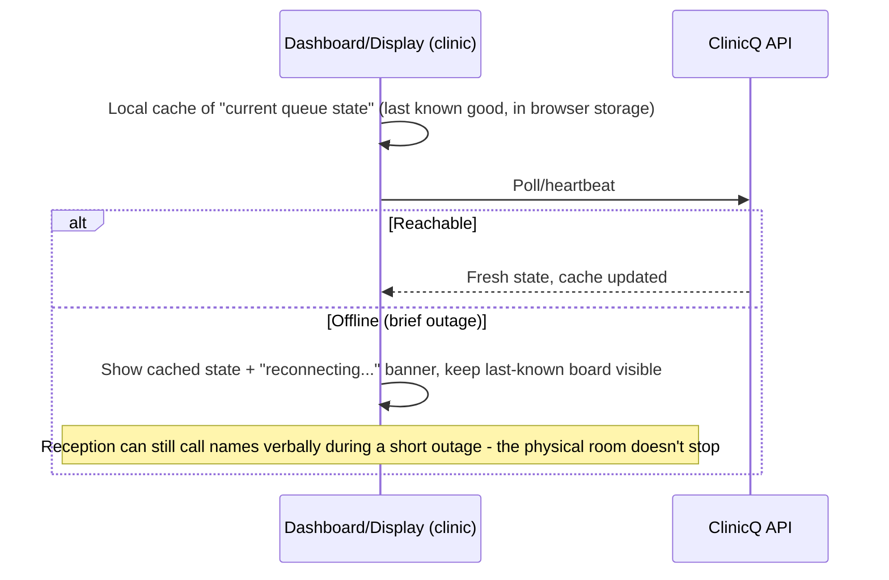

# 08 - System & network topology

Start with one clinic on its existing internet connection, then grow to many clinics reporting into one
shared platform, the same site-by-site growth model as
ElimuKadi's topology, but even lighter since there's no edge reader firmware to
maintain, just a browser-based signage box and dashboard.

## Phase 0 - one clinic, one display, one dashboard

Unlike ElimuKadi or
UmojaNet, ClinicQ's API is **cloud-hosted from
day one** (even for a single pilot clinic) since there's no local edge hardware that needs an on-site
gateway to function: a dashboard and a display box are just browser clients of a normal web API.

## Phase 1 - a few clinics, shared backend

## Phase 2 - metro-wide discovery + many clinics

At this scale, PostGIS geo-queries and the queue-length cache ([13](13-tech-implementation.md)) both live
behind Redis to keep the "clinics near me" search fast even as the clinic count grows into the hundreds.

## Resilience: internet outage at a clinic

Because the API is cloud-hosted (unlike the offline-first, load-shedding-tolerant edge design needed for
ElimuKadi's card readers),
ClinicQ's main resilience concern is simpler: **what happens to a clinic's queue if its internet drops
for a few minutes.**

A short outage degrades the **notification** and **remote discovery** experience (patients can't newly
join or get notified) but does not stop the clinic from running its physical queue verbally in the
meantime, a deliberately low-stakes failure mode compared to a payment-carrying system.

## Pros & cons

| | |
|---|---|
| **Pros** | Near-zero clinic hardware; cloud-hosted from day one (simple ops); one queue engine behind four patient-facing channels; PostGIS gives a real "clinics near me" experience cheaply |
| **Cons** | Fully dependent on internet reachability for remote-join/notifications (mitigated by verbal fallback in the room); USSD/WhatsApp gateway costs scale with message volume; discovery data (clinic hours, sector, payment tags) needs upkeep to stay trustworthy |

Markdown: this is [08-topology.md](08-topology.md); see wiring/hosting guidance in
[13-tech-implementation.md](13-tech-implementation.md#9-hosting-choice).
