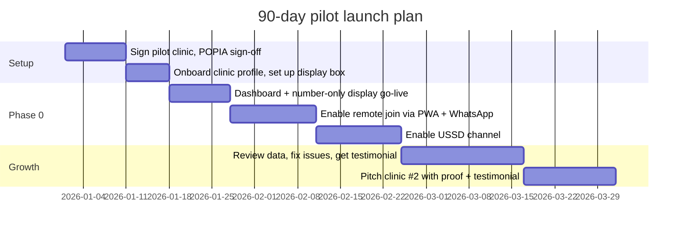

# 10 - Business plan

Prove one clinic end-to-end (discovery listing + queue + dashboard + display + at least two channels)
before selling to a second.

## 90-day launch plan

## Milestones

1. **Legal/consent check first**: confirm POPIA handling for patient names/health-adjacent comments on
   the display monitor ([04](04-display-monitor.md)) before enabling anything beyond number-only mode.
2. **Days 1-17**: sign one pilot clinic (a busy public clinic or a private GP practice with a visible
   waiting-room queue problem), set up the display box on an existing screen, run **dashboard +
   number-only display only** first - staff still call names verbally, the board just shows numbers.
3. **Days 18-41**: switch on **remote join** via the PWA and WhatsApp bot so patients can get a ticket
   before arriving; watch adoption (target 30%+ of daily tickets joined remotely within the first month).
4. **Days 42-55**: add **USSD** for feature-phone/no-data patients, closing the accessibility gap.
5. **Days 56-90**: fix friction (notification delivery, wait-time accuracy), collect a testimonial/case
   study (ideally a before/after "average time physically spent in the waiting room" number), and start
   selling clinic #2 using real numbers from clinic #1.
6. Scale clinic-by-clinic within one metro first (shared install/support effort), then expand, mirroring
   the "prove the unit, then replicate" pattern used in
   ElimuKadi's plan.

## KPIs to track from day one

| KPI | Why it matters |
|-----|------------------|
| % tickets joined remotely vs walk-in | Leading indicator of whether "join before you arrive" habit is forming |
| Average time physically spent in the waiting room (before vs after) | The single easiest "why should we buy this" story for a clinic manager |
| No-show rate on remote tickets | High rate may mean wait estimates are inaccurate or notifications aren't landing - see [06](06-channels-app-ussd-whatsapp-web.md) |
| Channel mix (app/USSD/WhatsApp/web/walk-in) | Tells ClinicQ which channel to invest support/marketing effort in |
| Discovery views -> queue joins conversion | Are people finding the clinic via geo-search ([02](02-discovery-and-geolocation.md)) and actually joining? |
| Support tickets per clinic per month | Should trend down after month 2-3 as clinic staff self-serve |

Sell the pilot on **shorter time physically spent in the waiting room + fewer
"where am I in the line?" interruptions to reception** first; let the clinic discover the reporting and
multi-channel reach as a bonus once the core queue is trusted - the same "lead with the pain point, not
the tech" ordering used in ElimuKadi's marketing.

Markdown: this is [10-business-plan.md](10-business-plan.md).
