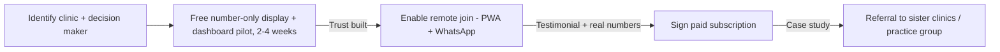

# 11: How to market this to clinics

Clinics buy on **manager trust + reception pain relief + patient satisfaction**, in that order, not on
"PostGIS" or "USSD gateway" jargon.

## Who to approach first

| Segment | Why first | Pitch angle |
|---------|-----------|---------------|
| **Busy private GP practices** | Faster decision-maker (practice owner), visible waiting-room pain, existing IT budget | "Cut time patients spend physically sitting in your waiting room; let them queue from their phone" |
| **Community health centres / public clinics with long queues** | High patient volume, real reputational/operational pain around wait times | "Free/low-cost number-only display + dashboard pilot, no patient data risk, immediate visible order in the waiting room" |
| **Multi-branch private practice groups** | One decision-maker, multiple sites: an efficient sales motion | "One dashboard across all your branches, compare wait times, one subscription" |
| **Urgent-care / walk-in clinics** | Queue volatility is their core operational challenge | "Smooth out walk-in spikes with remote join + accurate wait estimates" |

## Sales motion

Leading with a **free, low-risk number-only display + dashboard pilot** removes the two biggest
objections up front (cost, "are you exposing our patients' information") and lets the clinic experience
the operational win before any commercial or privacy conversation is needed.

## Channels

- **Practice-manager networks & WhatsApp groups**: South African clinic/practice managers share vendor
  recommendations by word of mouth, same dynamic as school principals in
  ElimuKadi's marketing.
- **Medical practice associations & healthcare expos** (e.g. regional GP association meetings).
- **District health office introductions** for public clinics: a district-level champion can open doors
  to several clinics at once.
- **Referral incentive**: 1 month free subscription for a clinic that refers a signed sister clinic/branch.
- **Honest live demo**: bring a tablet + a spare monitor to a practice meeting, simulate a few tickets
  live; concrete demos beat slide decks for this audience, same lesson as
  ElimuKadi's marketing.

## What NOT to lead with

- Do not open with "geo-location," "PostGIS," or technical channel names (USSD/API); lead with **"your
  patients queue from their phone, your waiting room runs itself."**
- Do not overpromise the medical-aid filter ([02](02-discovery-and-geolocation.md)) as live/verified on
  day one: it is an honest, self-reported directory tag, not a claims check; be explicit about this to
  avoid a clinic manager's disappointment later.
- Do not push name/comment display modes ([04](04-display-monitor.md)) as a default; offer number-only
  first and let the clinic explicitly opt into more, framing privacy as a *feature*, not a limitation,
  exactly as ElimuKadi frames its closed-loop wallet.
- Do not disparage existing hospital/clinic systems by name; position ClinicQ as a lightweight discovery/queue
  layer that sits in front of whatever a clinic already runs (or nothing at all), see
  [14-benchmark.md](14-benchmark.md).

Markdown: this is [11-marketing.md](11-marketing.md).
