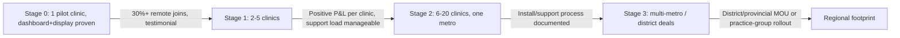

# 12: Upscaling journey over 24 months

Grow **clinic by clinic within one metro first**, then expand geographically and add channel/feature
depth; never oversell support capacity ahead of the small team, mirroring the discipline used in
ElimuKadi and UmojaNet.

## Coverage stages

| Stage | Clinics | Daily tickets (aggregate) | Channels live | Monthly revenue (R) |
|-------|---------|------------------------------|-------------------|------------------------|
| 0: Pilot | 1 | 20–80 | Dashboard + number-only display | R0–900 |
| 1: Prove it | 2–5 | 80–400 | + PWA + WhatsApp remote join | R900–5,000 |
| 2: Metro cluster | 6–20 | 400–1,800 | + USSD, name-lite display option | R5,000–22,000 |
| 3: Multi-metro/district | 20–60+ | 1,800–6,000+ | + medical-aid/payment filter (Phase 2), multi-site reporting | R22,000–70,000+ |

## Growth gates

## Naming decision (kept for the record)

The shortlist card called this **ClinicQueue**; the team shortened it to **ClinicQ** for the wordmark.
Earlier drafts explored regional-language names for a later multi-country rollout; that question is
parked until Stage 2+ and would be decided per market, not now. The repository, the product and every
document use **ClinicQ**.

## 24-month target (single growth line, blended across clinics)

| Month | Clinics | Daily tickets | Revenue (R) | Net (R) | Main action |
|-------|---------|-------------------|---------------|---------|----------------|
| 1 | 1 | 20–40 | 0 | -600 | Free pilot, number-only display + dashboard |
| 3 | 2 | 80–120 | 1,600 | +700 | Remote join (PWA + WhatsApp) live |
| 6 | 5 | 200–350 | 5,000 | +2,800 | USSD channel added |
| 12 | 12 | 500–900 | 13,000 | +8,000 | Hire first dedicated support/onboarding person |
| 18 | 20 | 900–1,500 | 22,000 | +14,000 | Second metro scouted, medical-aid/payment filter piloted |
| 24 | 35 | 1,500–2,800 | 40,000 | +26,000 | Multi-site/district conversations begin |

Spend first on **reliable notifications and accurate wait estimates**, second on
**onboarding/support capacity**, third on **a second metro**, and only then on the medical-aid/payment
filter or district-wide deals, the same "prove the unit, then replicate" discipline as
ElimuKadi's and UmojaNet's growth
plans.

## Where the extra revenue lines kick in later

- **Verified medical-aid/payment filter** ([02](02-discovery-and-geolocation.md)) as a premium directory
  feature once a handful of private clinics and schemes are willing to keep the data current.
- **Scheduled appointments** (not just walk-in/remote-join queueing) once clinics want a hybrid
  booking+queue model; see [03](03-booking-and-queue.md).
- **Multi-site/practice-group reporting add-on** once 3+ clinics under one manager want a combined view.
- **Public discovery advertising/placement** (clearly labelled, never affecting wait-order or medical
  priority) once the discovery surface ([02](02-discovery-and-geolocation.md)) has real metro-wide traffic.
- **District/provincial health-department dashboards** (aggregate, anonymised queue-length and wait-time
  trends across public clinics in an area) as a distinct, larger-scale public-sector revenue line.

Markdown: this is [12-upscaling-24-months.md](12-upscaling-24-months.md).
