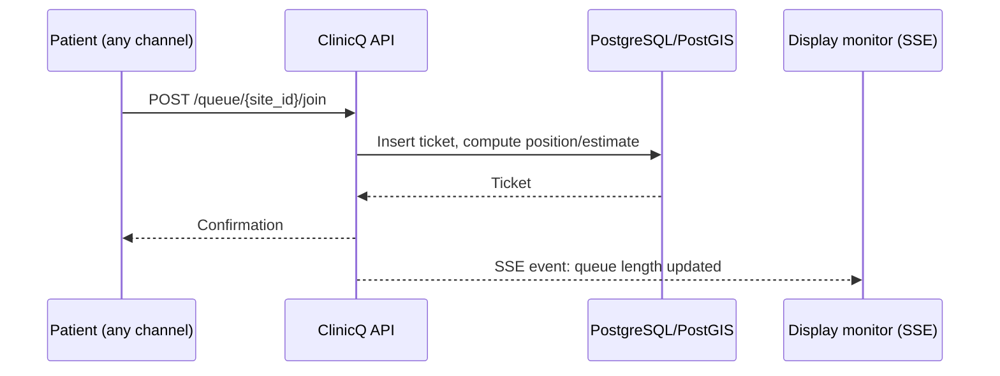
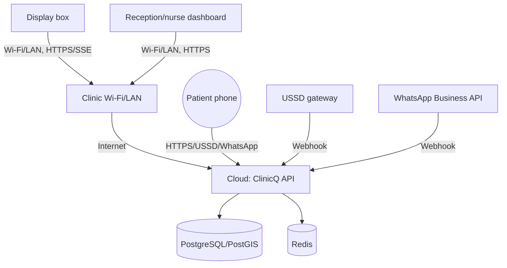

# 13: Tech implementation plan (dashboard, stack, rollout, device counts, wiring)

Engineering-facing plan: what to build, what to run it on, how many physical devices per stage, and how
the display/dashboard/channel wiring actually works.

## 1. Tech stack (chosen)

| Layer | Choice | Why |
|-------|--------|-----|
| Language / runtime | **Python 3.14** | One language across API, workers, and channel adapters (USSD/WhatsApp webhooks); modern typing, fast startup |
| Backend API + web app | **FastAPI** (ASGI, Uvicorn/Granian) | Async I/O for queue-position polling and webhook bursts; auto OpenAPI docs; Pydantic v2 models double as data contracts |
| Server-rendered pages | **Jinja2** templates | Patient discovery/queue pages, clinic dashboard, display-monitor board all rendered server-side, for a fast first paint on cheap devices |
| Interactivity | **htmx** (+ small **Alpine.js** for local UI state) | Live queue position/countdown, call-next button updating the display board, all via HTML fragment swaps or Server-Sent Events, no React/Vite/Node toolchain |
| Styling | **Tailwind CSS** (compiled once) | Consistent design system without a JS bundler in the critical path |
| PWA shell | `manifest.json` + hand-written **service worker** | Installable patient/clinic app; offline "view last known queue position" cache |
| Charts | **Chart.js** (CDN) | Wait-time trends, no-show rate, queue-length heatmap on the dashboard |
| Database | **PostgreSQL 18+** with **PostGIS** | Clinic locations + geo-radius search ([02](02-discovery-and-geolocation.md)), queue/ticket data with strong constraints |
| ORM / migrations | **SQLAlchemy 2.x (async)** + **Alembic** | Typed models, async sessions matching FastAPI, versioned schema per rollout |
| Cache / queues | **Redis** + `arq` workers | Queue-length cache for fast discovery lists, rate limiting, background jobs (notifications, daily stats aggregation) |
| USSD gateway | **Africa's Talking-class** (or Vonage/Onbufo-class) provider webhook | Thin adapter into the same booking/queue API; see [06](06-channels-app-ussd-whatsapp-web.md) |
| WhatsApp channel | **WhatsApp Business Cloud API** (Meta) or a BSP (Twilio/360dialog-class) | Webhook-based bot, quick-reply buttons |
| Notifications | SMS gateway (fallback) + Web Push + WhatsApp messages | "You're next" alerts across channels ([06](06-channels-app-ussd-whatsapp-web.md)) |
| Monitoring | **Uptime Kuma** (simple) or **Prometheus + Grafana** | API latency, webhook failures, display-box heartbeat |
| Deployment | **Docker Compose** on a small cloud VPS (Phase 0+) | Cloud-hosted from day one; see [08-topology.md](08-topology.md) |
| Package/env management | **uv**, pinned to Python 3.14 | Fast, reproducible installs; single `pyproject.toml` |
| CI/CD | **GitHub Actions** | Lint (ruff), type-check (mypy/pyright), test (pytest), build image, deploy on tag |
| Auth | JWT (short-lived access + refresh) in an httpOnly cookie; RBAC roles: `patient`, `receptionist`, `nurse_doctor`, `clinic_manager`, `platform_admin` | Simple, stateless, works with server-rendered + htmx pages |

### Why FastAPI + htmx instead of a separate JS frontend

One Python codebase (API, patient discovery/queue pages, clinic dashboard, display board) is easier for a
small capstone-sized team to build, debug, and support than an API plus a separate React/Node build.
Server-Sent Events (SSE) or short htmx polling intervals keep the display board and dashboard "live" feel
without a heavier WebSocket layer. If a richer native mobile client is ever needed
(see [06-channels-app-ussd-whatsapp-web.md](06-channels-app-ussd-whatsapp-web.md)), the same FastAPI
backend already exposes JSON under `/api/*`, the same pattern used in
ElimuKadi's and UmojaNet's stacks.

## 2. Repository layout (suggested)

See [REPO_README.md](REPO_README.md) for the suggested repo name and a ready-to-use project README (no
code or remote repository created yet; docs only, per project scope).

```text
clinicq/
  app/
    main.py             # FastAPI app factory, routers mounted here
    api/                # JSON endpoints (/api/*) - discovery, queue, webhooks
    web/                # HTML routes rendered with Jinja2 + htmx fragments
      discover/         # Clinic search/discovery pages (public/private toggle, map/list)
      queue/            # Patient ticket/position pages
      dashboard/        # Receptionist/nurse/manager dashboard pages
      display/          # Waiting-room display-monitor board page (kiosk mode)
    models/             # SQLAlchemy models (sites, queues, tickets, staff, patients)
    schemas/            # Pydantic schemas
    services/           # Business logic: geo-search, queue/ticket rules, notifications
    templates/          # Jinja2 templates (base layout, discover, queue, dashboard, display, fragments)
    static/             # Tailwind output CSS, htmx.min.js, manifest.json, service-worker.js, icons
  channels/
    ussd/               # USSD gateway webhook adapter + session-state handling
    whatsapp/           # WhatsApp Business API webhook adapter + quick-reply flows
  workers/
    notifications_worker.py  # SMS/push/WhatsApp queue consumer
    stats_worker.py          # Nightly daily_queue_stats aggregation
  migrations/           # Alembic versions
  infra/
    docker-compose.yml
    grafana-dashboards/ (optional)
  tests/
  scripts/
    simulate_ticket.py   # local dev: fake a patient joining a queue
    simulate_ussd.py     # local dev: fake a USSD session step
  pyproject.toml
  README.md
```

## 3. Core data model

| Table | Key fields |
|-------|-----------|
| `sites` | id, name, sector (public/private), location (PostGIS `geography(Point)`), address, hours, phone, display_mode, display_show_comment |
| `site_payment_profile` (Phase 2) | site_id, accepts_cash, accepts_card, accepted_medical_aids, copay_notice |
| `site_queue_snapshot` | site_id, current_queue_length, average_wait_minutes, updated_at |
| `queues` | id, site_id, name, is_active |
| `tickets` | id, queue_id, sequence_no, source (app/ussd/whatsapp/web/walkin), patient_display_name, reason_text, comment_consent, status, joined_at, called_at |
| `patients` | id, phone/whatsapp_id, name, consent_flags |
| `wait_time_samples` | queue_id, ticket_id, actual_wait_minutes, recorded_at |
| `staff_users` | id, site_id, role, auth fields |
| `queue_reorders` | id, ticket_id, staff_id, reason_code, occurred_at |
| `visit_notes` | id, ticket_id, staff_id, note_text, created_at (staff-only, never public) |
| `daily_queue_stats` | site_id, queue_id, date, avg_wait_minutes, no_show_count, ticket_count |

This combines the discovery model from [02](02-discovery-and-geolocation.md), the queue model from
[03](03-booking-and-queue.md), the display model from [04](04-display-monitor.md), and the dashboard model
from [05](05-clinic-dashboard.md) into one schema.

## 4. Dashboard views

1. **Front-desk/receptionist**: all active queues at a glance, call next, add walk-in, cancel/no-show
2. **Nurse/doctor**: their own room's queue only, call next, private visit note
3. **Clinic manager**: clinic profile (sector, hours, display mode), reports (wait time, no-show rate,
   channel mix, queue-length heatmap)
4. **Display monitor (public-facing)**: "now serving" + "up next", privacy-mode-aware ([04](04-display-monitor.md))
5. **Platform admin** (Phase 2+): cross-clinic onboarding, billing status, gateway health

## 5. API / route surface (sketch)

```text
# Discovery (server-rendered, htmx)
GET    /discover                        clinic search: geo/area, public/private toggle
GET    /discover/{site_id}              clinic detail: hours, current queue length, sector badge

# Patient queue (server-rendered, htmx)
POST   /queue/{site_id}/join            join a queue (reason_text optional)
GET    /queue/ticket/{ticket_id}        live position + estimated wait (poll or SSE)
POST   /queue/ticket/{ticket_id}/cancel patient-initiated cancel

# Dashboard (server-rendered, htmx, auth required)
GET    /dashboard/{site_id}             front-desk board, all active queues
POST   /dashboard/queue/{queue_id}/call-next
POST   /dashboard/queue/{queue_id}/walkin
POST   /dashboard/ticket/{ticket_id}/reorder
GET    /dashboard/{site_id}/reports

# Display monitor (public, no auth - read-only board)
GET    /display/{site_id}               waiting-room board (SSE stream for live updates)

# Channel webhooks
POST   /webhooks/ussd                   USSD gateway session step
POST   /webhooks/whatsapp               WhatsApp Business API incoming message/button

# JSON API (used by future native clients, channel adapters)
POST   /api/auth/login
GET    /api/me
GET    /api/clinics/nearby
POST   /api/tickets
GET    /api/tickets/{id}
```

### End-to-end remote-join flow (same as [03](03-booking-and-queue.md), engineering view)



## 6. Getting started: implementation roadmap

```mermaid
flowchart TB
  W1[Week 1-2: Repo, Python 3.14 + FastAPI skeleton, DB schema + PostGIS, auth, RBAC]
  W2[Week 3-4: Discovery module - geo search, public/private toggle, clinic listing pages]
  W3[Week 5-6: Queue module - join/walk-in, ticket lifecycle, wait estimate]
  W4[Week 7-8: Dashboard - call-next, reorder, walk-in intake, per-room queues]
  W5[Week 9-10: Display monitor board (SSE) + notifications (push/SMS)]
  W6[Week 11-12: USSD + WhatsApp channel adapters, PWA manifest/service worker, pilot launch]
  W1 --> W2 --> W3 --> W4 --> W5 --> W6
```

### Local development

1. `uv sync` (or `pip install -e .`) with **Python 3.14** to install FastAPI, SQLAlchemy, Jinja2, htmx
   assets, and dev tools.
2. `docker compose up` for Postgres (with PostGIS extension) and Redis alongside the API.
3. Mock channel adapters (`scripts/simulate_ticket.py`, `scripts/simulate_ussd.py`) that post fake
   join/USSD-step events instead of needing real gateway credentials on a dev machine.
4. Seed a handful of clinics (with real-looking coordinates), queues, and a test ticket flow.
5. Only after the software loop works end-to-end (join -> ticket -> dashboard call-next -> display update
   -> notification) wire up real USSD/WhatsApp gateway credentials.

### First real-site deployment

1. Deploy `api` + `notifications-worker` + `stats-worker` + Postgres/PostGIS + Redis on a small cloud VPS
   - see [9. Hosting choice](#9-hosting-choice).
2. Set up the display box (Raspberry Pi or reused PC) at the pilot clinic in kiosk-mode browser pointed at
   `/display/{site_id}`.
3. Confirm the dashboard works on the clinic's actual PC/tablet and internet connection before onboarding
   real patients.
4. Turn on USSD/WhatsApp channels only after the PWA/web remote-join flow has been tested for a few days.

## 7. Device counts per stage

Quantities needed of each **device type**, matching the coverage stages in
[12-upscaling-24-months.md](12-upscaling-24-months.md):

| Device type | Stage 0 (1 clinic, pilot) | Stage 1 (2–5 clinics) | Stage 2 (6–20 clinics) | Stage 3 (20–60+ clinics) |
|-------------|------------------------------|--------------------------|----------------------------|------------------------------|
| Display signage box (Pi or reused PC) | 1 | 2–5 | 6–20 | 20–60+ |
| Display screen (if not already on-site) | 0–1 | 0–3 | 2–8 | 5–20 |
| Reception dashboard device (reused PC/tablet) | 1 | 2–5 | 6–20 | 20–60+ |
| Small UPS/battery backup | 0–1 | 1–3 | 3–10 | 10–30 |
| Thermal ticket printer (optional) | 0–1 | 0–3 | 2–8 | 5–20 |

These are planning quantities, not exact bills of materials; always confirm with a real site check (see
[07-devices-and-bom.md](07-devices-and-bom.md) for model-level pricing).

## 8. How the connections are done (physical + logical)

### Physical chain per site

```text
Display box (Pi/PC, kiosk browser) --- Wi-Fi/LAN (clinic's existing network) ---\
Reception dashboard (PC/tablet)    --- Wi-Fi/LAN (clinic's existing network) ----> Internet
                                                                                     |
                                                                          Cloud VPS: ClinicQ API
                                                                          + PostgreSQL/PostGIS + Redis
                                                                                     |
                                          Patient phone (PWA/USSD/WhatsApp/Web) --- Internet
```

### Logical / network design



| Segment | Purpose | Who is on it |
|---------|---------|--------------|
| Clinic Wi-Fi/LAN (existing) | Display box + dashboard traffic out to the internet | Display box, dashboard PC/tablet; reuse the existing network, no new SSID needed |
| Cloud VPS | Runs the API, database, cache, workers | Platform only |
| Patient/public internet | PWA, USSD gateway, WhatsApp Business API | Patients, gateway webhooks |

### Practical wiring rules

- Reuse the clinic's existing Wi-Fi/LAN: no special network build needed, since there's no edge reader
  hardware like ElimuKadi's NFC readers.
- Mount the display box behind or beside the screen, out of casual reach, with its `site_id`/URL
  configured once and never touched again (kiosk auto-launch on boot).
- Keep a small UPS on the display box so short outages (load-shedding) don't blank the waiting-room
  screen mid-queue; the dashboard should show a clear "reconnecting" state rather than silently freezing
  (see [08-topology.md](08-topology.md#resilience-internet-outage-at-a-clinic)).
- Never store patient health-adjacent comment text ([04](04-display-monitor.md)) longer than necessary -
  purge `reason_text`/`visit_notes` on a short retention window after the visit is marked done, per POPIA
  data-minimisation principles.

## 9. Hosting choice

| Option | When to use |
|--------|-------------|
| Shared cloud VPS (multi-tenant) from day one | **Recommended for all stages**: there's no local edge hardware requiring an on-site gateway, unlike ElimuKadi/UmojaNet |
| Regional cloud region closest to South Africa | Keeps API latency low for dashboard/display polling and SSE streams |
| Managed Postgres w/ PostGIS extension enabled | Simplifies ops vs self-managing PostGIS on a bare VPS, worth it once past Stage 1 |

Markdown: this is [13-tech-implementation.md](13-tech-implementation.md).
