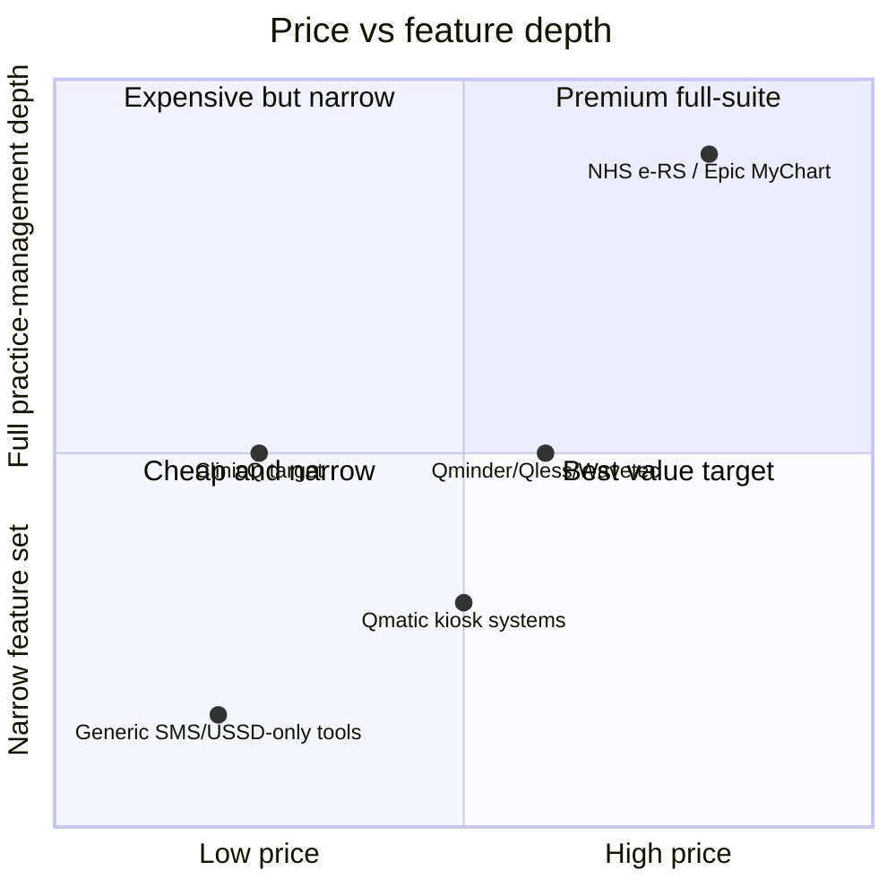

# 14 - Tech used by global queue/appointment systems - extra features & monetisation vs incumbents

Retail and government services abroad have run digital queue-management systems for over a decade
(Qminder, Qless, Wavetec); healthcare-specific queueing and e-referral systems exist in the UK, US, and EU
too. **Most South African clinics, especially public ones, still run paper-and-shout queues** - that gap
is exactly what ClinicQ targets, in the same spirit as
ElimuKadi targeting the school-card gap and
UmojaNet targeting the community-Wi-Fi gap.

## What's already used elsewhere

| Region/sector | System / vendor | What it does |
|-----------------|-------------------|----------------|
| Retail/bank/government (global) | **Qminder**, **Qless**, **Wavetec**, **Q-nomy** | Digital queue tickets, SMS/app notifications, staff dashboards, analytics - the general pattern ClinicQ adapts for clinics |
| UK healthcare | **NHS e-Referral Service (e-RS)**, **NHS App** booking | Online GP/specialist appointment booking, national scale, integrated with patient records |
| UK healthcare (queue-specific) | Many NHS trusts' in-house "check-in kiosk + waiting-room screen" systems | Kiosk check-in, called-name display boards in outpatient departments |
| US healthcare | **Solv**, **QueueDoc**, practice-management suites (e.g. Epic MyChart check-in) | Online scheduling + virtual waiting room + text "you're up next" |
| EU (municipal services) | **Qmatic**-class kiosk ticket systems | Physical ticket kiosk + numbered call display, common in municipal offices and some clinics |
| Africa (fintech/telco-adjacent) | **Africa's Talking**, **Vonage**, **Twilio** (USSD/SMS infrastructure) | Not queue systems themselves, but the exact channel infrastructure ClinicQ's USSD/SMS layer is built on ([06](06-channels-app-ussd-whatsapp-web.md)) |
| Global (WhatsApp-first) | WhatsApp Business API-based booking bots (various regional deployments) | Booking/reminders entirely inside WhatsApp - validates ClinicQ's WhatsApp-channel bet for markets where WhatsApp dominates |

## Why this gap exists in South African clinics specifically

- **Public clinics** are high-volume and budget-constrained - commercial queue systems (Qminder-class)
  are typically priced and packaged for retail/corporate use cases, not sized or priced for a public
  primary-care clinic.
- **Private GP practices** often have practice-management software (billing, scheduling) but **not** a
  patient-facing discovery-and-queue layer - ClinicQ's discovery module ([02](02-discovery-and-geolocation.md))
  is closer to a "Google Maps for clinics with a live queue attached" than a practice-management system.
- **Multi-channel access (USSD)** is largely absent from global queue vendors, who assume smartphone +
  app as the default - a gap that matters a great deal in the South African/regional market, where
  feature-phone and low-data usage remains significant.

## Extra features worth adding to ClinicQ's roadmap (in rough priority order)

1. **Scheduled appointments** (not just remote-join/walk-in queueing) - converts to a ticket automatically
   near the appointment time, closing the gap with NHS e-RS-style booking without needing full EMR depth.
2. **Verified medical-aid/payment filter** ([02](02-discovery-and-geolocation.md)) - already planned as a
   Phase 2 directory enhancement; a real integration with scheme switches is the natural next step once
   demand is proven.
3. **Kiosk check-in** at the clinic door (a tablet where walk-ins tap "I'm here" against their name) -
   mirrors Qmatic/Qless-style kiosks, reduces receptionist workload for busy clinics.
4. **District/provincial aggregate dashboards** - anonymised queue-length/wait-time trends across public
   clinics in an area, useful for health-department resource planning (see
   [12-upscaling-24-months.md](12-upscaling-24-months.md)).
5. **Chronic/repeat-visit reminders** - for clinics managing chronic medication pick-ups, a WhatsApp/SMS
   reminder tied to a recurring queue-join, without becoming a full EMR.
6. **Multi-language USSD/WhatsApp menus** - isiZulu, isiXhosa, Afrikaans, Sesotho alongside English,
   given how much reach USSD/WhatsApp channels have precisely because they don't require app-store
   English-only onboarding.
7. **Full practice-management integration path** (billing, EMR) - only once the discovery+queue core is
   proven across many clinics; the long-term convergence point with practice-management suites, but
   reached bottom-up and cheaper, the same growth logic as
   ElimuKadi's path toward full school-MIS.

## How ClinicQ monetises vs incumbents

| Revenue model | Used by | ClinicQ's version |
|-----------------|---------|------------------------|
| Per-location/per-seat enterprise licence (often priced for retail/corporate budgets) | Qminder, Qless, Wavetec, Qmatic | Per-clinic **monthly** SaaS fee, priced for clinic-scale budgets, not corporate retail budgets - see [09](09-pricing-and-budget.md) |
| Kiosk hardware + integration fees | Qmatic-class kiosk vendors | Near-zero hardware (reused screen/PC + a $45-80 Pi) instead of proprietary kiosk hardware - see [07](07-devices-and-bom.md) |
| National-scale government contract (single large deployment) | NHS e-RS, NHS App | ClinicQ grows clinic-by-clinic/metro-by-metro first, with district-level deals as a later Stage 3 item, not the entry point - see [12](12-upscaling-24-months.md) |
| Per-message/session channel cost passed to enterprise client | Twilio/Vonage-class infra resellers | Same idea, folded into the per-clinic subscription tier rather than billed separately in the MVP - see [09](09-pricing-and-budget.md) |
| Directory/listing placement fees (search/maps products generally) | Google Maps-class local-business platforms | Optional, clearly labelled placement in discovery results ([02](02-discovery-and-geolocation.md)) as a later revenue line, never affecting queue order or medical priority |

## Positioning

Win by being the **first affordable, multi-channel (app + USSD + WhatsApp),
geo-aware discovery-and-queue layer** for clinics in South Africa and the wider region - a category that
exists at retail/corporate scale and in a handful of national health systems abroad, but not yet at
ordinary public/private-clinic scale locally.

Markdown: this is [14-benchmark.md](14-benchmark.md).
