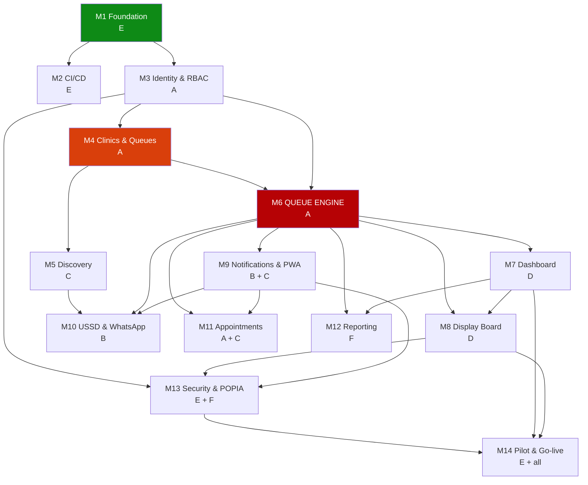
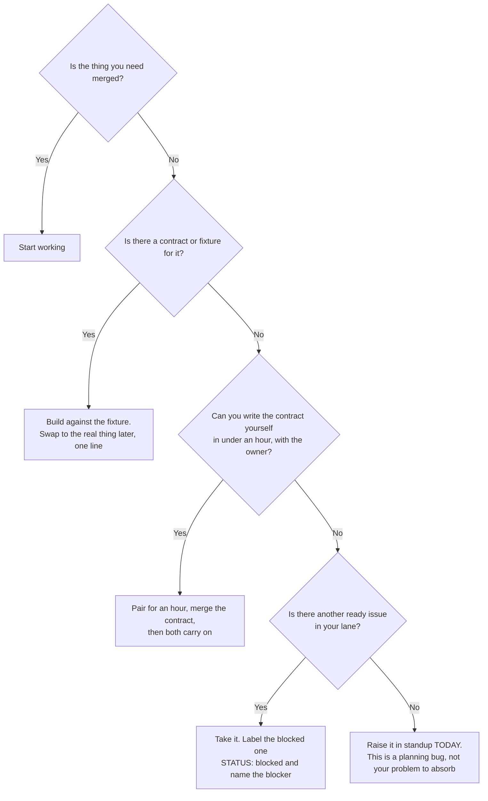

# ClinicQ: Workload Split, Ownership & Blocking Analysis

**Six people. One codebase. Twenty-eight weeks.**

This document answers four questions the team will otherwise argue about in week 6:

1. Who owns what?
2. What order does the work have to happen in?
3. **Whose work blocks whose, and on which day does that blocking bite?**
4. What do you do when the thing you need is not finished yet?

> Read this together in week 1, then again at the start of each sprint. The
> [milestone docs](../GITHUB/MILESTONES/) say *what* to build; this says *who*, *when*, and *what to
> do while waiting*.

---

## 1. The six roles

| Code | Role | Owns | Primary milestones |
|------|------|------|--------------------|
| **A** | **Backend Lead** | Domain core: identity, clinics, queues, **the queue engine**, appointments. Reviews every migration. | M3, M4, **M6**, M11 |
| **B** | **Backend / Integrations Dev** | Everything that talks to the outside world: notifications, SMS, push, WhatsApp, USSD, i18n plumbing. | M9, M10 |
| **C** | **Frontend / Patient Dev** | Everything a patient touches: discovery, map, ticket page, PWA, kiosk check-in, accessibility. | M5, M9 (UI), M11 (UI), M13 (a11y) |
| **D** | **Frontend / Clinic Dev** | Everything staff touch: the dashboard and the waiting-room display board. | M7, M8 |
| **E** | **DevOps / QA Lead** | Repo, CI/CD, environments, test infrastructure, security, production, monitoring, the pilot rollout. | M1, M2, M13, M14 |
| **F** | **Data & Research Lead** | Analytics, reporting, POPIA/compliance research, translations, benchmarking, UAT, capstone deliverables. | M12, M13 (compliance), M14 (docs) |

**Fill in real names before sprint 1.** The role, not the person, is what the CODEOWNERS file and every
issue's "Owner role" field refer to.

| Code | Name | GitHub handle | Backup for |
|------|------|---------------|-----------|
| A | | | B |
| B | | | A |
| C | | | D |
| D | | | C |
| E | Billy Katalayi | Billykat7 | F |
| F | | | E |

**Every role has a named backup**: the person who reviews their PRs when the owner is unavailable and
who picks up their issue if they are ill for a week. Pairs are chosen so the backup already understands
the area: the two backend developers back each other, the two frontend developers back each other, and
DevOps and Research back each other.

---

## 2. Ownership map (CODEOWNERS)

```text
/app/core/            @backend-lead
/app/database/        @backend-lead                  # every migration goes through A
/app/services/queue*  @backend-lead                  # the critical path: A only
/app/services/notif*  @backend-integrations
/app/services/discovery*  @backend-lead @frontend-patient
/app/services/report*  @data-research
/channels/            @backend-integrations
/app/web/discover/    @frontend-patient
/app/web/queue/       @frontend-patient
/app/web/kiosk/       @frontend-patient
/app/web/dashboard/   @frontend-clinic
/app/web/display/     @frontend-clinic
/app/templates/       @frontend-patient @frontend-clinic
/app/static/          @frontend-patient @frontend-clinic
/workers/             @backend-integrations @data-research
/infra/               @devops-qa
/.github/             @devops-qa
/tests/load/          @devops-qa
/tests/a11y/          @frontend-patient
/docs/PRODUCT/        @data-research
/docs/CAPSTONE/       @data-research
```

**Why this matters for blocking:** a pull request routes automatically to one named reviewer who
already knows that area. Nobody has to ask in the group chat who should look at it, and nobody's PR
sits for three days waiting on whoever happens to be free.

**Review SLA: 24 hours on a weekday.** If the code owner has not reviewed in 24 hours, the backup
reviewer may approve and merge. This rule exists specifically so one busy teammate cannot become a
bottleneck for five others.

---

## 3. Sprint-by-sprint lanes

Fourteen two-week sprints, **all of them in semester 2**. Every column is a person, and no column is
ever empty: that is the whole design goal. Issue numbers in brackets.

### Where we are

| Sprint | Weeks | Milestones | Status |
|--------|-------|------------|--------|
| **1** | 1–2 | M1 | ✅ done |
| **2** | 3–4 | M1 · M2 | ✅ done |
| **3** | 5–6 | M3 | ✅ done |
| **4** | 7–8 | M3 · M4 | ✅ done — M3 closed, tag `v0.3.0` |
| **5** | 9–10 | M4 · M5 | ✅ done — M4 closed, tag `v0.4.0` to follow; M5 delivered with it |
| **6** | 11–12 | M5 · M6 | 🚧 in progress — M5 delivered (issues 31–38, tag `v0.5.0` to follow); M6 not started |
| **7** | 13–14 | M6 ⚠️ | 📋 planned |
| **8** | 15–16 | M7 | 📋 planned |
| **9** | 17–18 | M7 · M8 · M9 | 📋 planned |
| **10** | 19–20 | M9 · M10 | 📋 planned |
| **11** | 21–22 | M10 · M11 | 📋 planned |
| **12** | 23–24 | M11 · M12 · M13 | 📋 planned |
| **13** | 25–26 | M13 · M14 | 📋 planned |
| **14** | 27–28 | M14 | 📋 planned |

**5 of 14 sprints done** 🟩🟩🟩🟩⬜⬜⬜⬜⬜⬜ **36%**, carrying milestones M1–M5 (issues 1–38) and
tags `v0.1.0`–`v0.5.0`, the last two cut after their pull requests merge. **Sprint 6 is under way, not
done:** its M5 half is delivered (issues 31–38), its M6 half has not started — and by the rule below a
sprint is ticked only when *every* issue its lanes deliver is closed. Sprint 5 and M5 are only true
once the stacked M5 pull requests (#147–#153 and Issue 38's) have merged.

A sprint is **done** when every issue its lanes *deliver* is closed. That is marked by hand, not
generated, because a lane also names issues it works **against** — a contract stub, a fixture, a
forward reference such as `[→95]` — and those belong to a later sprint's delivery. The milestone bars
in [the milestone index](../GITHUB/README.md#milestone-summary) are generated; these are not.

### The lanes

| Sprint | A: Backend Lead | B: Integrations | C: Frontend/Patient | D: Frontend/Clinic | E: DevOps/QA | F: Data & Research |
|--------|------------------|------------------|----------------------|---------------------|---------------|---------------------|
| ✅ **1** wk 1–2 | Shared kernel [4], SQLAlchemy + Alembic [3] | *Learning the stack;* channel provider research (Africa's Talking, Meta), no code yet | UI shell, design tokens, htmx [5] | Pairs with C on [5]; dashboard wireframes | Repo scaffold [1], Docker stack [2], logging [6] | Requirements write-up, benchmark research (NHS, Solv, Qminder), POPIA reading |
| ✅ **2** wk 3–4 | Staff auth core [15] | Notification provider spike; sandbox accounts | Wireframes for discovery & ticket pages | Wireframes for board & dashboard | `ci-local` [7], factories & seed [8], CI [9], GHCR [10] | Data map draft [→95], translation sourcing, area/suburb dataset for [34] |
| ✅ **3** wk 5–6 | Sign-in & sessions [16], patient OTP [17] | Notification service skeleton against the **contract stub** [63] | Discovery UI against **fixture data** [32] | Dashboard shell [48] against fixtures | CD [11], env matrix [12], **CODEOWNERS & workflow [13]**, monitoring [14] | Consent model & wording [21], services catalogue seed data [→26] |
| ✅ **4** wk 7–8 | **RBAC [18] + site scoping [19] land by day 3**, audit [20], invitations [22] | Notification templates [66] | Map view [33], area search UI | Dashboard nav & settings scaffolding | Test harness for cross-tenant [19], CI tuning | Clinic onboarding flow [29], holiday dataset [→24] |
| **5** wk 9–10 | **`sites` [23] + `queues` [25] land by day 3**, hours [24], services [26], display settings [27], assignments [28] | Web push [64], SMS adapter [65] | Nearby search UI [31/32] wired to the real API, clinic detail [35] | Board layout [56] against fixtures | Contract drift-test harness [30] | Payment profile [37], sites contract review [30] |
| **6** wk 11–12 | **Queue engine: tickets [39], join [40], lifecycle [41]** | Preferences & quiet hours [67] | Snapshot cache UI, discovery analytics [38] | Front-desk board [49] against the **queue contract** | Concurrency test harness [→47], load-test skeleton | Discovery contract [38], wait-estimate methodology |
| **7** wk 13–14 | **Queue engine: estimates [42], timers [43], cancel [44], transfer [45], priority [46], contract [47]** | Adapter framework [72], simulators [78] | Ticket page [68], PWA shell [69] | Call-next actions [50], walk-in intake [51] | Concurrency & load tests [47], mid-project review | Sprint review pack, mid-project report section |
| **8** wk 15–16 | Appointment slots [80] | USSD menu tree [73] | QR ticket [70], patient polish | Reorder UI [52], room view [53] | Security hardening [97] | i18n framework & translations [77] |
| **9** wk 17–18 | Booking & auto-ticket [81] | USSD sessions & security [74] | Kiosk check-in [83] | Manager settings [54], **board SSE [57] + privacy [58]** | Encryption & PII [98] | Stats worker [88] |
| **10** wk 19–20 | Proxy booking [84], virtual waiting room [86] | WhatsApp webhook [75], templates [76] | Accessibility audit [101] | Board a11y [59], audio [60], resilience [62] | Kiosk device registry [61], monitoring | Reports UI [89], KPIs [90] |
| **11** wk 21–22 | Chronic reminders (with B) [85] | Reminders [82], parity tests [79] | Dashboard/board offline tests with D [55/62] | Dashboard offline [55] | Notification contract [71], pen-test prep [100] | Exports [91], district dashboard [92] |
| **12** wk 23–24 | Retention & purge [95], audit chain [99] | Notification failure paths [71] | Feedback UI [87] | Board & dashboard polish, bug fixes | **Pen test [100]** + remediation | No-show analysis [93], reporting contract [94] |
| **13** wk 25–26 | DSAR [96], bug fixes from UAT | Bug fixes from UAT | Bug fixes from UAT, a11y remediation | Bug fixes from UAT | Prod infra [102], backups [103], monitoring [104], load test [105] | Pilot kit [106], support process [107] |
| **14** wk 27–28 | UAT support, demo rehearsal | UAT support | UAT support | UAT support | **Go-live**, on-call, incident support | **UAT [108]**, **capstone deliverables [109]** |

**Two hard rules in this schedule:**

- **Sprint 5, day 3 and sprint 4, day 3 are commitments, not aspirations.** Issues 23 + 25 (`sites` and
  `queues`) and issues 18 + 19 (RBAC and site scoping) unblock four other people. A delivers those
  first, in a small PR, before finishing the rest of the milestone.
- **Nobody is idle in sprint 1.** B has no code to write in sprint 1 because notifications need a queue
  that does not exist. That time goes into provider research, sandbox accounts and the adapter design,
  which is why sprint 3's notification skeleton is possible at all.

---

## 4. What blocks what

### Milestone dependency graph



### The critical path

```text
M1 → M3 → M4 → M6 → M7 → M8 → M14
 E     A     A     A     D     D     E
```

**Twenty-two weeks of the twenty-eight are on this path.** Two consequences:

- **A (Backend Lead) sits on three consecutive critical-path milestones (M3, M4, M6).** That is the
  single largest scheduling risk in the project. It is mitigated by giving A no frontend, infrastructure
  or documentation work at all in sprints 3–7, and by moving the appointment work (M11) later so A is
  not doing two things at once during M6.
- **A day lost in M6 is a day lost for the project**, not just for A. A day lost in M12 costs nothing
  downstream, which is why the reporting work is scheduled where it is.

### Blocking matrix, who waits on whom

| Blocked person | Waits on | For what | Bites at | How they keep working meanwhile |
|----------------|----------|----------|----------|---------------------------------|
| **Everyone** | E | Repo, database, CI (M1) | Week 1 | Nothing to mitigate: this is why M1 is two weeks and E has help on it |
| **A** | E | Migrations runnable, test database | Week 2 | A writes models against a local Postgres by hand if compose slips |
| **C** | A | `sites` [23] + nearby search [31] | **Sprint 5** | Builds the entire discovery UI against **fixture JSON** in sprints 3–4 |
| **D** | A | Queue engine [39–41] | **Sprint 6** | Builds the dashboard shell and board layout against **the queue contract** [47] in sprints 4–5 |
| **B** | A | Queue engine + patient identity | **Sprint 6** | Notification service against a **stub queue event** in sprint 3; provider sandboxes in sprints 1–2 |
| **B** | C, A | Discovery service for the USSD menu | Sprint 8 | Discovery service ships in sprint 5, well ahead, no real block |
| **F** | A, D | Real ticket data to aggregate | **Sprint 9** | Compliance research, translations, datasets, benchmarking fill sprints 1–8 |
| **E** | A, B, C, D | Something worth pen-testing | Sprint 12 | Infrastructure, security scanning and test harnesses fill everything before that |
| **D** | B | Notification hooks on call-next | Sprint 9 | Call-next fires a **domain event**; B subscribes to it later without touching D's code |

### The three chokepoints, in order of danger

1. **A → everyone, sprints 5–7.** Four people wait on the queue engine.
   *Mitigation:* the contract [47] is written **before** the implementation, in sprint 5. B, C and D
   build against `contracts/queue.yaml` and fixtures, then swap to the real service in a one-line change.
2. **A → C and D, sprint 4–5.** `sites` and `queues` gate discovery, the dashboard and the board.
   *Mitigation:* issues 23 and 25 ship as their own small PRs on day 3 of their sprints, ahead of the
   rest of M4.
3. **E → everyone, sprints 1–2.** No repo, no work.
   *Mitigation:* M1 is deliberately generous at two weeks, C pairs with E on the UI shell, and A starts
   on models the moment the database is up rather than waiting for CI.

---

## 5. How to not block each other

Six practices, in the order they matter.

### 5.1 Contract first, implementation second

**The rule:** whenever one person's work will be consumed by another's, the *contract* is a separate,
earlier, smaller pull request than the implementation.

That means: the OpenAPI file, the Pydantic schemas, the service function signature and a fixture of
example responses land **first**. The consumer builds against them immediately. The producer then fills
in the body without the consumer ever waiting.

This is why every module milestone ends with a contract issue ([30], [38], [47], [71], [79], [94]), but
in practice the contract is drafted at the *start* of the milestone and merely finalised at the end.

### 5.2 Fixtures and stubs, not waiting

Nobody is ever blocked "waiting for the API". If the endpoint does not exist:

- Use the fixture JSON committed alongside the contract.
- Or use the seed data from Issue 8, which is real database rows.
- Or use a stub service that returns canned responses behind a settings flag.

If you find yourself with nothing to do because someone else has not finished, **that is a planning
bug: raise it in standup the same day**, not at the end of the sprint.

### 5.3 Small pull requests, merged daily

A PR that touches forty files blocks everyone who touches any of those forty files. The team's rule:

- **One issue, one PR, merged within 3 days of starting.**
- If an issue is bigger than 3 days, split it; the issue specs are already sized for this.
- Never let a branch live longer than a week. Rebase onto `main` daily.

### 5.4 Events, not direct calls, at the seams

The dashboard's Call Next does not call the notification service. It emits a domain event; the
notification worker subscribes. This means D can finish and merge Call Next in sprint 7 while B's
notification work lands in sprint 9, **without either of them editing the other's file**.

Apply this at every seam between two owners: queue → notifications, queue → board, queue → reporting.

### 5.5 Feature flags for anything half-finished

Merge behind a flag rather than holding a branch open. A dark-launched feature that nobody can see is
still merged code that will not conflict tomorrow. Flags used in this plan: the medical-aid filter [37],
the virtual waiting room [86], the district dashboard [92].

### 5.6 Two integration checkpoints per sprint

- **Mid-sprint (day 5):** 30 minutes, everyone merges to `main` and the team runs the full suite
  together. Catches contract drift while it is cheap.
- **End of sprint (day 10):** demo on staging. If it is not on staging, it is not done.

---

## 6. Meeting rhythm

| When | What | How long | Purpose |
|------|------|----------|---------|
| Daily | Async standup in the team channel | 5 min | Yesterday / today / **blocked by whom**: the third one is the only one that matters |
| Sprint day 1 | Sprint planning | 60 min | Assign issues, confirm dependencies are merged, agree the sprint goal |
| Sprint day 5 | Integration checkpoint | 30 min | Everyone merges, full suite runs, contract drift caught |
| Sprint day 10 | Demo + retro | 60 min | Demo on staging; one thing to keep, one to change |
| Weekly | Backend Lead + DevOps sync | 20 min | Migration review, critical-path check |
| Monthly | Supervisor review | 45 min | Progress against the plan, risks, scope decisions |

**The standup rule that keeps this project moving:** if you say "blocked", you must name the person and
the issue. "Blocked on the API" is not a status; "blocked on Issue 31, waiting on A" is, and it gets
resolved that day.

**WIP limit: two issues in progress per person.** A third means something is stuck and should be
labelled `STATUS: blocked` with a comment saying why.

---

## 7. Risk register

| # | Risk | Likelihood | Impact | Owner | Mitigation |
|---|------|-----------|--------|-------|-----------|
| R1 | **M6 slips** and takes M7–M11 with it | Medium | **Critical** | A | Contract-first (5.1); A has no other work in sprints 6–7; M11 is descoped first if needed |
| R2 | A single person is the only one who understands a module | High | High | All | Named backup per role; backup reviews every PR in that area; no solo-owned module without a second reader |
| R3 | A teammate becomes unavailable (illness, exams, withdrawal) | Medium | High | E | Backup pairs (§1); the sprint lanes have deliberate slack in sprints 8 and 12 |
| R4 | USSD/WhatsApp gateway approval takes longer than expected | **High** | Medium | B | Simulators [78] mean all channel work proceeds with no gateway account; real credentials only needed for the pilot |
| R5 | No pilot clinic agrees to participate | Medium | High | F | Start clinic outreach in **sprint 3**, not sprint 12; have two candidate sites; a staged demo is the documented fallback |
| R6 | SMS costs run away | Low | Medium | B | Hard per-site and per-patient caps plus a kill switch [65]; sandbox mode by default |
| R7 | Privacy failure: a name or symptom leaks onto the public board | Low | **Critical** | D + F | Server-side privacy projection [58]; `number_only` default [27]; guard tests; pen test [100] |
| R8 | Scope creep: the team keeps adding features | High | Medium | All | M11 and M12 are the agreed cut lines; the backlog folder is where new ideas go, not the sprint |
| R9 | Everything is left to the final two weeks (report, video, demo) | **High** | High | F | [109] is scheduled work with 5 days allocated; the report is written incrementally each sprint |
| R10 | Merge conflicts and long-lived branches | Medium | Medium | E | 3-day PR rule; daily rebase; CODEOWNERS routing; integration checkpoints |

---

## 8. If you have to cut scope

Cut in this order. Everything above the line is required for a defensible capstone; everything below is
a genuine enhancement.

| Cut order | What | Consequence |
|-----------|------|-------------|
| 1st | **M12 district dashboard [92], no-show model [93]** | Loses some analytical depth; core reporting survives |
| 2nd | **M11 virtual waiting room [86], proxy booking [84], chronic reminders [85]** | Loses three differentiators; appointments still work |
| 3rd | **M10 WhatsApp [75–76]** (keep USSD) | Loses the most-used channel; USSD still proves the multi-channel claim |
| 4th | **M11 entirely** | Product becomes walk-in/remote-join queueing only, but still a complete, coherent system |
| --- | **do not cut below this line** | |
| never | M6 queue engine, M7 dashboard, M8 board, M13 privacy, M14 pilot | These are the product. Without any one of them there is no ClinicQ |

---

## 9. Individual contribution evidence

A group capstone is marked individually as well as collectively. Every person's contribution must be
**traceable from the repository**, not asserted in a report:

- Each issue has one owner; each PR has one author.
- Commit messages start with `Issue N:` so a person's work maps to specific specifications.
- `docs/CAPSTONE/CONTRIBUTIONS.md` [109] is maintained **each sprint**, not written at the end.
- Pairing is allowed and encouraged: record it as a co-author trailer on the commit so both people get
  credit.

**Rough parity check.** The plan gives each person 17–20 issues:

| Person | Issues owned | Weight |
|--------|-------------|--------|
| A: Backend Lead | 15, 16, 18, 19, 20, 22, 23, 24, 25, 26, 27, 28, 39–47, 80, 81, 84, 86, 99 | ~28 (**highest**; deliberately given no secondary work) |
| B: Integrations | 63–67, 71, 72–79, 82, 85 | ~17 |
| C: Frontend/Patient | 5, 32, 33, 35, 68, 69, 83, 101 + UI on 34, 37, 87 | ~15 |
| D: Frontend/Clinic | 48–62 | ~15 |
| E: DevOps/QA | 1, 2, 6, 7, 8, 9–14, 61, 97, 98, 100, 102–105, 107 | ~22 |
| F: Data & Research | 17 (consent), 21, 29, 37, 77, 87–96, 106, 108, 109 | ~19 |

A's count is the highest because the domain core is genuinely the biggest piece. If A is at risk, the
first work to redistribute is M11 (issues 80, 81, 84, 86) to C and B.

---

## 10. Quick reference: am I blocked?



---

**Related:** [Implementation plan](../PLAN/IMPLEMENTATION_PLAN.md) ·
[Milestones](../GITHUB/MILESTONES/) · [Issues](../GITHUB/ISSUES/) ·
[Product docs](../PRODUCT/README.md) · [Demo page](../DEMO/index.html)
